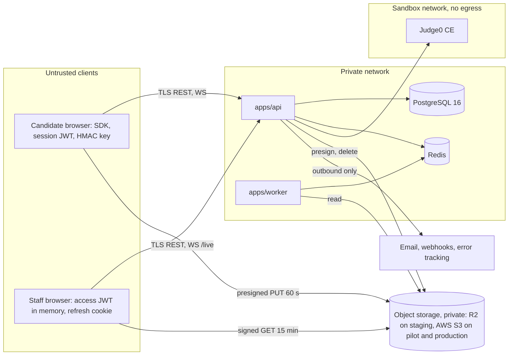

# ADR 0001: Overall system architecture

| Field   | Value                                                                                                                                                                                                                                                                                                                                                                                                                                                                                                                                                                                                                                                                                                          |
| ------- | -------------------------------------------------------------------------------------------------------------------------------------------------------------------------------------------------------------------------------------------------------------------------------------------------------------------------------------------------------------------------------------------------------------------------------------------------------------------------------------------------------------------------------------------------------------------------------------------------------------------------------------------------------------------------------------------------------------- |
| Status  | **Accepted** 2026-10-01 by Harsh Trivedi (project owner). Decisions taken at acceptance are in section 11 and in status.md section 9 (D-01..D-09). **Amended 2026-10-01:** D-05 revised (AuraFace replaces InsightFace); D-10 and D-11 applied (sections 2, 2.1, 8, 9, 11); model licence table added (section 12). After ADRs 0002 to 0008 were accepted (D-16), the open issues and cross-cutting notes they settle were marked decided, with no change to this ADR's decisions. **Amendment proposed 2026-10-05, for the owner to accept:** licence flags F-2 and F-3 become accepted risks owned by the owner (C-10, docs/compliance/decisions.md, PR #44; status.md R-16, PR #38); section 12.1 and OI-8. |
| Date    | 2026-09-30                                                                                                                                                                                                                                                                                                                                                                                                                                                                                                                                                                                                                                                                                                     |
| Author  | architect                                                                                                                                                                                                                                                                                                                                                                                                                                                                                                                                                                                                                                                                                                      |
| Scope   | Records the architecture the docs already define. It is not a redesign. Where the docs conflict, section 9 lists the conflict and does not resolve it.                                                                                                                                                                                                                                                                                                                                                                                                                                                                                                                                                         |
| Serves  | BR-03..BR-06, BR-13, BR-14; FR-103, FR-105, FR-503, FR-505, FR-701, FR-703, FR-704, FR-801; NFR-01..NFR-05, NFR-09; BO-5                                                                                                                                                                                                                                                                                                                                                                                                                                                                                                                                                                                       |
| Related | /docs/adr/review-2026-09-30-plan-and-schema.md (A-01..A-31). The ARC-01 schema ADRs move to 0002 to 0008 (review A-15).                                                                                                                                                                                                                                                                                                                                                                                                                                                                                                                                                                                        |

## 1. Context

CodeProctor has to produce hiring-grade test results that can be trusted (brd.md §1, §2). The docs planned the build and pilot on free tiers (BO-5, brd.md §8); hosting moved to AWS at acceptance (D-04), and the system must meet NFR-01 (API p95 under 300 ms, code run under 5 s), NFR-02 (200 concurrent candidates), NFR-04 (ASVS L2) and NFR-05 (privacy). architecture.md sets the shape: "a modular monolith API with separate workers, so it runs on one free-tier VM for the pilot and splits into services later without a rewrite". It also says "Heavy media never passes through the API". No code exists yet. Before ARC-01..ARC-05 and DB-02 start, the agents need one reference for boundaries and cross-cutting rules.

## 2. Decision: components

| Component            | Responsibility                                                                                                                                                                                                                                                                                                                                                                                  | Tech (from the docs)                                                                                                                                                                  | Owner                                                                               |
| -------------------- | ----------------------------------------------------------------------------------------------------------------------------------------------------------------------------------------------------------------------------------------------------------------------------------------------------------------------------------------------------------------------------------------------- | ------------------------------------------------------------------------------------------------------------------------------------------------------------------------------------- | ----------------------------------------------------------------------------------- |
| apps/web             | One Next.js app with route groups `(candidate)` `/t/[token]/*`, `(staff)` `/admin/*` and `(public)`. The candidate side covers consent, checks, ID and room scan, and the Monaco editor with the SDK. The staff side covers questions, tests, invitations, review, live view and reports.                                                                                                       | Next.js App Router, Tailwind, shadcn/ui, TanStack Query, openapi-fetch                                                                                                                | frontend-engineer                                                                   |
| apps/api             | The only writer of business state. Handles auth, RBAC, org scope, audit, grading orchestration, presigned URLs, the WebSocket hub, and BullMQ producers and Node consumers. `SessionStateService` is the only code that writes `sessions.status`.                                                                                                                                               | NestJS, Prisma, Socket.IO with Redis adapter                                                                                                                                          | backend-engineer; integrity-engineer for the events, keystroke and identity modules |
| apps/worker          | Face match (FR-403) behind a swappable face-matching interface, server audio VAD, keystroke analytics, similarity and risk score (FR-802..FR-805). Reads media from object storage and hands results to the API; the mechanism is open (OI-1).                                                                                                                                                  | Python 3.12, FastAPI, onnxruntime, AuraFace recognition model (`glintr100.onnx` only), MediaPipe (face detection and alignment), Silero VAD, OpenCV (D-05; model files in section 12) | integrity-engineer                                                                  |
| packages/proctor-sdk | Browser monitors and detectors (in a Web Worker), signed event batches, heartbeat, and chunked recording with an IndexedDB buffer                                                                                                                                                                                                                                                               | TS, MediaPipe, TF.js, MediaRecorder, Web Crypto                                                                                                                                       | proctor-sdk-engineer                                                                |
| packages/shared      | The single source for zod schemas, `events.ts`, the permission matrix, the transition map and constants                                                                                                                                                                                                                                                                                         | TS, zod                                                                                                                                                                               | architect                                                                           |
| Judge0 CE            | Sandboxed execution with CPU, wall-time and memory limits and no network                                                                                                                                                                                                                                                                                                                        | Docker, with its own Postgres and Redis and privileged workers                                                                                                                        | backend-engineer (BE-05)                                                            |
| PostgreSQL 16        | All relational data, JSONB for event payloads, object keys only                                                                                                                                                                                                                                                                                                                                 | 31 tables, 20 enums (after ADR 0008, 2026-10-01; was 24 and 13)                                                                                                                       | db-engineer (the architect owns the schema)                                         |
| Redis                | Queues, rate limits, pub/sub on `live:{orgId}`, the Socket.IO adapter                                                                                                                                                                                                                                                                                                                           | Redis 8.8, used under its AGPLv3 licence option (D-09)                                                                                                                                | backend-engineer                                                                    |
| Object storage       | Recordings, ID and selfie images, room scans, evidence, report PDFs, backups. Staging uses Cloudflare R2 with synthetic data only. Pilot and production use AWS S3 (D-10, D-11). Storage stays behind one S3-compatible interface, so only configuration differs between environments (section 2.1). Buckets are private and reachable only through presigned PUT (60 s) and GET (15 min) URLs. | S3 API only, AWS SDK v3                                                                                                                                                               | backend-engineer (BE-09)                                                            |
| infra                | Docker Compose for local and staging; Caddy with automatic TLS on staging. The pilot runs on its own stack (D-10); its layout is decided in ARC-05 and built by the proposed pilot stack task (PA-07).                                                                                                                                                                                          | Compose, Caddy                                                                                                                                                                        | db-engineer (DB-01); deploy owner TBD                                               |
| apps/lockdown        | Phase 3 Electron kiosk client. It stays an empty placeholder until Q-41 is decided.                                                                                                                                                                                                                                                                                                             | Electron                                                                                                                                                                              | TBD                                                                                 |

The prompts name several external services that architecture.md does not list: Resend or Brevo, Sentry, a secrets vault, Cloudflare Pages, Supabase or Neon, and GHCR. D-11 records Cloudflare Pages for the web front end and allows Supabase or Neon for staging only. The others are not part of the architecture until they are recorded (OI-12).

In this ADR, "object storage" means the store reached through that one S3-compatible interface: Cloudflare R2 on staging (synthetic data only), AWS S3 on pilot and production (D-11). The flows and rules are the same on both. "R2" appears only where a fact is specific to Cloudflare R2.

### 2.1 Object storage portability (D-11)

Storage stays behind one S3-compatible interface, so only configuration differs between environments. The rules below keep one code path working on Cloudflare R2 (staging, synthetic data only) and AWS S3 (pilot and production). They were checked against Cloudflare and AWS documentation on 2026-10-01.

<<<<<<< HEAD
| ID   | Rule                                                                                                                                                                   | Why                                                                                                                                                                                                                                                                                      |
| ---- | ---------------------------------------------------------------------------------------------------------------------------------------------------------------------- | ---------------------------------------------------------------------------------------------------------------------------------------------------------------------------------------------------------------------------------------------------------------------------------------- |
| ST-1 | Use the S3 API through AWS SDK v3 only. No R2 Workers bindings and no S3-only features. Endpoint, region, path style and bucket names come from environment variables. | One StorageService for every environment. R2 needs region `auto` and endpoint `https://<account>.r2.cloudflarestorage.com`. AWS S3 uses its real region and default endpoint.                                                                                                            |
| ST-2 | Uploads use presigned PUT only, never presigned POST, including on AWS S3.                                                                                             | R2 presigned URLs support GET, HEAD, PUT and DELETE; "POST ... is not currently supported" (review A-20). AWS S3 supports POST policies (`content-length-range`), but using them would split the code.                                                                                   |
| ST-3 | Sign Content-Type on every PUT. Also sign Content-Length, and confirm each upload with HEAD (size and type) before `media_chunks` is marked uploaded.                  | Both stores reject a mismatched signed Content-Type with 403. Whether a signed Content-Length is enforced is not verified on either store, so HEAD is the real size check (BE-09 spike).                                                                                                 |
| ST-4 | Set `requestChecksumCalculation` and `responseChecksumValidation` to `WHEN_REQUIRED` on the S3 client.                                                                 | Since v3.729.0, the AWS JS SDK adds a default checksum to PutObject. In presigned PUT URLs that becomes the checksum of an empty body, and real uploads fail on S3 and on R2. AWS documents `WHEN_REQUIRED` as the switch. The Python worker's SDK has a similar setting (not verified). |
| ST-5 | On AWS S3, sign with the EC2 instance role, not static keys.                                                                                                           | URLs signed with instance-role credentials expire when those credentials do (about 6 hours at most). That is fine for 60-second and 15-minute URLs, and it keeps long-lived keys out of the environment.                                                                                 |
| ST-6 | Rely on bucket default encryption. Presign code sends no server-side-encryption headers.                                                                               | AWS S3 encrypts every new object with SSE-S3 (AES-256) by default since 2023-01-05. R2 encrypts every object at rest with AES-256-GCM by default. ARC-05 decides SSE-S3 versus SSE-KMS; SSE-KMS adds KMS permissions to the signing role.                                                |
| ST-7 | Presigned URLs use the S3 API hostname, never a custom domain. The CSP `connect-src` and the bucket CORS rules are per environment.                                    | R2 presigned URLs "cannot be used with custom domains". The browser PUTs cross-origin on both stores, so CORS is set in DEP-01 (staging) and in the pilot stack task (PA-07).                                                                                                            |
| ST-8 | Turn off S3 bucket versioning on media buckets, or expire noncurrent versions within days.                                                                             | A versioned bucket keeps a deleted object as a noncurrent version, so the retention and erasure jobs (FR-704, NFR-05) would not really delete it. ARC-05 sets this with the other AWS S3 settings.                                                                                       |
=======
| ID | Rule | Why |
| --- | --- | --- |
| ST-1 | Use the S3 API through AWS SDK v3 only. No R2 Workers bindings and no S3-only features. Endpoint, region, path style and bucket names come from environment variables. | One StorageService for every environment. R2 needs region `auto` and endpoint `https://<account>.r2.cloudflarestorage.com`. AWS S3 uses its real region and default endpoint. |
| ST-2 | Uploads use presigned PUT only, never presigned POST, including on AWS S3. | R2 presigned URLs support GET, HEAD, PUT and DELETE; "POST ... is not currently supported" (review A-20). AWS S3 supports POST policies (`content-length-range`), but using them would split the code. |
| ST-3 | Sign Content-Type on every PUT. Also sign Content-Length, and confirm each upload with HEAD (size and type) before `media_chunks` is marked uploaded. | Both stores reject a mismatched signed Content-Type with 403. Whether a signed Content-Length is enforced is not verified on either store, so HEAD is the real size check (BE-09 spike). |
| ST-4 | Set `requestChecksumCalculation` and `responseChecksumValidation` to `WHEN_REQUIRED` on the S3 client. | Since v3.729.0, the AWS JS SDK adds a default checksum to PutObject. In presigned PUT URLs that becomes the checksum of an empty body, and real uploads fail on S3 and on R2. AWS documents `WHEN_REQUIRED` as the switch. The Python worker's SDK has a similar setting (not verified). |
| ST-5 | On AWS S3, sign with the EC2 instance role, not static keys. | URLs signed with instance-role credentials expire when those credentials do (about 6 hours at most). That is fine for 60-second and 15-minute URLs, and it keeps long-lived keys out of the environment. |
| ST-6 | Rely on bucket default encryption. Presign code sends no server-side-encryption headers. | AWS S3 encrypts every new object with SSE-S3 (AES-256) by default since 2023-01-05. R2 encrypts every object at rest with AES-256-GCM by default. ARC-05 decides SSE-S3 versus SSE-KMS; SSE-KMS adds KMS permissions to the signing role. |
| ST-7 | Presigned URLs use the S3 API hostname, never a custom domain. The CSP `connect-src` and the bucket CORS rules are per environment. | R2 presigned URLs "cannot be used with custom domains". The browser PUTs cross-origin on both stores, so CORS is set in DEP-01 (staging) and in the pilot stack task (PA-07). |
| ST-8 | Turn off S3 bucket versioning on media buckets, or expire noncurrent versions within days (*proposed amendment, ADR 0004 §9.2: within 1 day, checked by RetentionService*). | A versioned bucket keeps a deleted object as a noncurrent version, so the retention and erasure jobs (FR-704, NFR-05) would not really delete it. ARC-05 sets this with the other AWS S3 settings. |
>>>>>>> origin/main

## 3. Trust boundaries

| ID   | Boundary                   | Rule                                                                                                                                                                                                                                            |
| ---- | -------------------------- | ----------------------------------------------------------------------------------------------------------------------------------------------------------------------------------------------------------------------------------------------- |
| TB-1 | Candidate to API           | All client input is untrusted, including detector output, timestamps and HMAC-signed batches, because the key is in the browser (R-04). Server time is the only clock (FR-505, TC-047). The candidate token scopes each request to one session. |
| TB-2 | Staff to API               | 15-minute access JWT plus a rotated refresh cookie (FR-104). TOTP for SUPER_ADMIN and REVIEWER (FR-102). Every route has deny-by-default RBAC and an org scope check (CLAUDE.md).                                                               |
| TB-3 | Browsers to object storage | Presigned URLs only. The API never proxies media.                                                                                                                                                                                               |
| TB-4 | API to Judge0              | Candidate code is hostile. Judge0 has a private network, no egress and per-submission limits (FR-503, TC-042..TC-044). Only the API can call it.                                                                                                |
| TB-5 | App to data stores         | Private network only. The app connects as `app_user`, which cannot UPDATE or DELETE `audit_logs` (architecture.md Security).                                                                                                                    |
| TB-6 | Worker and API             | Internal and service-authenticated. The worker never writes `sessions.status` (backend.md Step 7). The mechanism is open (OI-1).                                                                                                                |
| TB-7 | API to third parties       | Outbound only. Webhooks are HMAC-signed and SSRF-guarded (backend.md Steps 14, 15). Tokens, OTPs and media keys are never sent to email or error tracking.                                                                                      |

## 4. Main data flows

| Flow                     | Path                                                                                                                                                                                                                                                                                                                                                                                                          | IDs                                                                                            |
| ------------------------ | ------------------------------------------------------------------------------------------------------------------------------------------------------------------------------------------------------------------------------------------------------------------------------------------------------------------------------------------------------------------------------------------------------------- | ---------------------------------------------------------------------------------------------- |
| F1 Staff auth            | Argon2id password (15-minute lock after 5 failures), then TOTP, then an access JWT in memory and a hashed refresh cookie that is rotated and revoked by family. Then guarded routes and audit.                                                                                                                                                                                                                | FR-101..FR-105; TC-001..TC-006                                                                 |
| F2 Candidate session     | Invitation token (only the SHA-256 is stored) plus email OTP gives a candidate JWT. Then the signed consent document (D-17; or decline, which ends the session), checks, ID and selfie, and room scan. At start, the server sets `deadline_at` with accommodations, assigns variants and issues the HMAC key. Heartbeat every 10 s. Every status change goes through SessionStateService following fsd.md §3. | FR-106, FR-303, FR-305, FR-401..FR-406, FR-505, FR-609; TC-021, TC-022, TC-024, TC-030, TC-047 |
| F3 Run and submit        | API rate limit of 1 run per 5 s, then a Judge0 batch with per-question limits, then normalized results. Hidden tests, reference solutions and variant params never leave the API. After SUBMITTED, a `grade-session` job computes the weighted score.                                                                                                                                                         | FR-502..FR-506, NFR-01; TC-011, TC-040..TC-048, TC-091                                         |
| F4 Events and keystrokes | Batches (events every 5 s, keystrokes every 2 s) carry HMAC-SHA256 and a monotonic sequence. The API verifies them and stores `proctor_events` and `keystroke_batches`. HIGH events go to Redis `live:{orgId}` and then to /live.                                                                                                                                                                             | FR-601..FR-610, FR-801; TC-050..TC-065                                                         |
| F5 Media                 | 10 s MediaRecorder chunks. The API presigns a PUT, the browser uploads straight to object storage and confirms, and the API writes `media_chunks`. An IndexedDB buffer (200 MB) holds failed uploads. Playback uses 15-minute GET URLs, and the retention job deletes objects.                                                                                                                                | FR-701..FR-704, NFR-08; TC-063, TC-070..TC-072                                                 |
| F6 Analysis              | After SUBMITTED, `grade-session` runs, then `analyze-session` (the worker reads audio from object storage, plus keystrokes, events and submissions). Results go to the API, and SessionStateService moves the session to UNDER_REVIEW (MEDIUM or HIGH) or COMPLETED.                                                                                                                                          | FR-802..FR-805; TC-073..TC-076; order open (Q-22)                                              |
| F7 Review and live       | Reviewer with TOTP opens the queue, then an audited review bundle, decides flags, and sets a verdict once every HIGH flag is decided. Appeals go to another reviewer. /live uses Socket.IO with the Redis adapter, and pause and message reach the candidate.                                                                                                                                                 | FR-901..FR-904; TC-077..TC-080; candidate channel open (Q-20)                                  |
| F8 Reporting             | PDF stored in object storage with a signed link, SQL dashboard aggregates, HMAC-signed webhooks retried through BullMQ, CSV export                                                                                                                                                                                                                                                                            | FR-1001..FR-1003; TC-081                                                                       |

## 5. Cross-cutting decisions

- **C-1 Org scoping.** database.md Data rules: "every API query filters by the caller's org_id". CLAUDE.md requires an org-scope check on every route. Enforcement is a Prisma client extension plus a request-scoped OrgContext that throws when there is no org (database prompt Step 5). A cross-org read returns 404 (TC-008). Candidate routes scope through the token's session, and jobs through the job's session. `@Public` routes are listed in the matrix. Child tables without `org_id` and cross-parent writes are decided in ADR 0006 (accepted, D-16).
- **C-2 RBAC.** The roles are SUPER_ADMIN, RECRUITER, AUTHOR and REVIEWER (FR-103), plus a CANDIDATE pseudo-role and an internal SERVICE caller, all in the shared matrix. A global guard denies by default, and a test fails if any route is missing from the matrix (backend.md Step 3). The web app hides UI from the same matrix, but only the API enforces permissions.
- **C-3 Audit.** Every staff read or change of candidate data writes `audit_logs` with who, what, when and IP (FR-105, BR-14, TC-006). That includes review bundles, playlists, exports, reports and /live subscriptions. Jobs write rows with a null actor. The table is append-only for `app_user`. _Proposed rule (A-08):_ metadata holds only IDs and action names, never names, emails, tokens or media keys, because the app can never erase these rows.
- **C-4 Secrets and keys.** Secrets are environment variables loaded from a vault (NFR-04; the vault is still to be chosen, OI-5). Passwords use Argon2id. Invitation and refresh tokens are stored only as SHA-256 hashes. TOTP secrets and session HMAC keys are encrypted with AES-256-GCM under an environment key (`totp_secret_enc`, `hmac_key_enc`). Staff and candidate JWTs use separate secrets. Object-storage credentials exist only in the api and worker (on AWS, the instance role, section 2.1 ST-5), and there are no secrets in the web bundle.
- **C-5 Never log** (CLAUDE.md Rules; backend-engineer.md). This covers passwords, JWTs, refresh, invitation and OTP values, TOTP secrets and recovery codes, HMAC keys, presigned URLs, object keys of candidate media, ID and selfie images, and embeddings. It is enforced by pino `redact` and serializers in BE-01, and by not logging bodies on `/auth` and `/candidate`. Edge logs must exclude the invitation token (A-13), and error tracking scrubs the same fields. BullMQ jobs that carry an OTP or raw token are removed when they finish (A-31). A test asserts the redaction. The rule also covers fixtures, snapshots and commits.
- **C-6 Time and state.** Server time is the only clock (FR-505). fsd.md §3 is the state machine. Its transition map lives in packages/shared, and SessionStateService is its only writer. Q-01 and A-06 are decided in ADR 0002 (accepted, D-16); Q-22 (GRADED ordering) is still open for ARC-04.
- **C-7 Async.** Long work runs in BullMQ jobs, not request handlers. The queues implied by the prompts are email, validate, grade-session, analyze-session, face-match, retention (daily), disconnect check and webhooks. Redis runs with `noeviction`. Interactive jobs such as face-match get their own priority or queue.
- **C-8 Contracts.** packages/shared holds the schemas, events, matrix and transition map. REST is code-first OpenAPI from NestJS, and /docs/api-contract.md is authoritative until BE-01 exists (ARC-02 confirms). Any change to `prisma/`, packages/shared or the API shape needs an ADR listing the affected agents.
- **C-9 Observability (NFR-09).** Structured pino logs carry a per-request trace ID, plus the session ID on candidate routes and jobs as the per-session correlation key. Errors use RFC 7807. Error tracking is in place, and uptime checks hit `/health`.
- **C-10 Privacy and retention** (BR-13, NFR-05, brd.md §7). Nothing touches a device or uploads before the consent document is signed (FR-401, TC-030, D-17). The DB stores only object keys. Retention uses `retention_days` (7..730, default 90): it deletes the objects, nulls the keys and writes an audit row (TC-072). Erasure finishes within 30 days (TC-094), but waits while a review or appeal is open (D-19, provisional). Backups are kept 14 days, so erased data leaves the backups within that limit. Retention scope, anchor, hold and erasure are decided in ADR 0004 (accepted, D-16; amended by D-19).
- **C-11 Testing.** Test titles start with the TC ID, then the FR ID, for example `TC-002 FR-101 locks account after 5 failures` (CLAUDE.md; build-plan §7).
  - **No TC.** The test names its FR or NFR. TC-065 uses `TC-065 NFR-04` until Q-30 is decided.
  - **pytest.** Hyphens are not allowed in function names, so tests use `test_tc073_fr802_<behaviour>` plus a marker holding the hyphenated IDs (A-25).
  - **Levels.** Vitest or Jest for unit tests, Jest with Supertest and Testcontainers for integration, Playwright for end to end, and /docs/manual-tests.md for manual cases.
  - **CI.** CI fails on any P1 failure.
  - **Judge0.** Judge0 tests run on Linux x86 (OI-5).

## 6. Alternatives considered

| Option                                       | Why it was not chosen                                                                                                                                          |
| -------------------------------------------- | -------------------------------------------------------------------------------------------------------------------------------------------------------------- |
| Microservices from day one                   | They do not fit one free VM (BO-5) and add hops against NFR-01. The monolith splits later along the api, worker and Judge0 lines.                              |
| Uploading media through the API              | About 600 concurrent streams on one VM (NFR-02). architecture.md rules it out.                                                                                 |
| Hosted execution API or a home-built sandbox | Paid per call (BO-5), candidate code leaves our control, and a home-built sandbox is risky (FR-503). Judge0 CE is self-hosted, GPL-3.0, and called over HTTP.  |
| Server-side analysis of every video frame    | Too much CPU. The docs choose browser detectors (FR-606) plus server re-checks of audio and keystrokes (FR-607, FR-802), and accept the tampering risk (R-04). |
| Postgres-only queue                          | Redis is needed anyway for Socket.IO, rate limits and pub/sub, and BullMQ has a Python client.                                                                 |
| Separate candidate and staff apps            | The layout has one apps/web. Revisit if CSP or bundle size start to conflict.                                                                                  |

## 7. Consequences

**Positive**

- One API and one worker fit the pilot host and can split later without a rewrite.
- Direct-to-storage media keeps API latency independent of media volume.
- The shared contracts let the web, SDK and API lanes build in parallel against mocks.

**Negative and accepted risks**

- **Availability.** One VM is a single point of failure, so NFR-03 (99.5%) rests on monitoring and fast restore.
- **Judge0 host.** Judge0 needs x86, privileged containers and, per its Ubuntu 22.04 guide, cgroup v1 (`systemd.unified_cgroup_hierarchy=0`).
  - macOS cannot run the sandbox tests.
  - Oracle Always Free offers only 1 GB x86 micro VMs and ARM Ampere VMs, so hosting moves to AWS (D-04). BO-5's "piloted on free tiers" no longer holds for hosting.
  - ARC-05 must choose an x86 instance and an OS image on which Judge0's sandbox runs (cgroup v1 or a verified alternative), and size it for R-13.
- **Integrity limit.** Browser detectors and a browser-held HMAC key stop transport tampering, replay and forgery by third parties. They do not stop a determined candidate. Server re-checks and human review compensate (brd.md §7: flags are "evidence, never verdicts").
- **Two languages.** TypeScript and Python share the queues and object storage, and possibly the DB, where Python cannot use Prisma.
- **Recording playback.** Only the first MediaRecorder timeslice blob has the WebM header. Playback and analysis must reassemble each segment in order (A-04).
- **Load.** About 300 requests per second at 200 candidates (R-02), plus the latency of a remote managed DB, put NFR-01 at risk. Batching (ARC-02) and DB placement (ARC-05) decide it.

## 8. External facts: verification status (checked 2026-09-30)

| Fact                                                                                                                                                                                                                                                                                                       | Status                                                                                                                                                                                                                                                                        |
| ---------------------------------------------------------------------------------------------------------------------------------------------------------------------------------------------------------------------------------------------------------------------------------------------------------- | ----------------------------------------------------------------------------------------------------------------------------------------------------------------------------------------------------------------------------------------------------------------------------- |
| Judge0 CE is GPL-3.0; its Ubuntu 22.04 guide requires cgroup v1                                                                                                                                                                                                                                            | Verified (judge0 repo and guide)                                                                                                                                                                                                                                              |
| InsightFace code is MIT; its pretrained models are "non-commercial research purposes only"                                                                                                                                                                                                                 | Verified (insightface README; rechecked 2026-10-01). **No longer used:** D-05 was revised on 2026-10-01 because the company's own hiring is commercial use. Four InsightFace model files ship inside the AuraFace repository and must never be loaded (section 12, flag F-1). |
| AuraFace `glintr100.onnx`: Apache 2.0; input float32 [N, 3, 112, 112], output float32 [1, 512]                                                                                                                                                                                                             | Verified 2026-10-01 (model card, repo LICENSE.md, and the ONNX graph read directly). Training data is not disclosed (section 12, flag F-2).                                                                                                                                   |
| R2 free tier: 10 GB-month, 1M Class A and 10M Class B operations. Presign supports GET, HEAD, PUT and DELETE; "POST ... is not currently supported". Presigned URLs do not work on custom domains; region is `auto`.                                                                                       | Verified (Cloudflare docs; presign facts rechecked 2026-10-01)                                                                                                                                                                                                                |
| R2 encrypts every object and its metadata at rest with AES-256-GCM by default                                                                                                                                                                                                                              | Verified 2026-10-01 (Cloudflare R2 data-security docs)                                                                                                                                                                                                                        |
| AWS S3 encrypts every new object with SSE-S3 (AES-256) by default since 2023-01-05. Presigned URLs last up to 7 days, but URLs signed with EC2 instance-role credentials expire with those credentials (about 6 hours at most).                                                                            | Verified 2026-10-01 (AWS S3 user guide)                                                                                                                                                                                                                                       |
| AWS SDK for JavaScript v3.729.0 and later add a default checksum to S3 PutObject; `WHEN_REQUIRED` turns it off                                                                                                                                                                                             | Verified 2026-10-01 (aws-sdk-js-v3 announcement issue #6810). Effect on presigned PUT URLs to R2 and S3 is from community reports; BE-09 confirms.                                                                                                                            |
| `redis:7` is 7.4.x under RSALv2/SSPLv1. Redis 8 adds AGPLv3. Valkey is BSD-3.                                                                                                                                                                                                                              | Verified (redis.io). Docker Hub has `redis:8.8` (8.8.3); 8.10.2 is the newest 8.x (checked 2026-10-01).                                                                                                                                                                       |
| BullMQ Python works with Node queues but supports only a subset of features                                                                                                                                                                                                                                | Verified (docs.bullmq.io)                                                                                                                                                                                                                                                     |
| `@cloudflare/next-on-pages` is deprecated; OpenNext targets Workers                                                                                                                                                                                                                                        | Verified (repo archived September 2025)                                                                                                                                                                                                                                       |
| Oracle Always Free: x86 micro (1/8 OCPU, 1 GB) plus Ampere ARM                                                                                                                                                                                                                                             | Verified. The reported 2026 A1 cut is not verified.                                                                                                                                                                                                                           |
| Neon free suspends after about 5 minutes idle; Supabase free pauses after 7 days                                                                                                                                                                                                                           | Secondary sources only                                                                                                                                                                                                                                                        |
| Only the first MediaRecorder timeslice blob has the WebM header                                                                                                                                                                                                                                            | Verified (W3C mediacapture-record)                                                                                                                                                                                                                                            |
| Model licences of MediaPipe, COCO-SSD, Silero VAD and vad-web                                                                                                                                                                                                                                              | Checked 2026-10-01; results and flags in section 12 (COCO-SSD weights: **Not verified**)                                                                                                                                                                                      |
| Managed Postgres offers PG 16, citext and pgcrypto (`CREATE ROLE` is now verified for RDS and Neon and partly verified for Supabase: ADR 0006 section 7); CSP needs `'wasm-unsafe-eval'`; BullMQ's default retention of completed jobs; whether R2 and S3 enforce a signed Content-Length on presigned PUT | **Not verified**                                                                                                                                                                                                                                                              |

## 9. Open issues (conflicts that affect the overall architecture)

| ID    | Issue                                                                                                                                                                                                                                                                                                                                                                                                                                                                                                                                                                                                                | Refs                         | Decided in                |
| ----- | -------------------------------------------------------------------------------------------------------------------------------------------------------------------------------------------------------------------------------------------------------------------------------------------------------------------------------------------------------------------------------------------------------------------------------------------------------------------------------------------------------------------------------------------------------------------------------------------------------------------- | ---------------------------- | ------------------------- |
| OI-1  | How the worker integrates (BullMQ Python or internal HTTP), whether it touches the DB, who writes `risk_score`, and when GRADED happens                                                                                                                                                                                                                                                                                                                                                                                                                                                                              | Q-21, Q-22                   | ARC-04                    |
| OI-2  | Candidate push channel for pause and message within 2 s (heartbeat is 10 s)                                                                                                                                                                                                                                                                                                                                                                                                                                                                                                                                          | Q-20                         | ARC-02                    |
| OI-3  | HMAC key lifecycle, canonical JSON and the threat model. (Key column and replay storage decided in ADRs 0002 and 0005, D-16.)                                                                                                                                                                                                                                                                                                                                                                                                                                                                                        | Q-02, Q-26, R-04, A-10       | ARC-03                    |
| OI-4  | Token binding and fingerprint, and auth for the STRICT second device. (Single-use link versus resume, Q-23, moved to ARC-01 ADR 0002 by D-08.)                                                                                                                                                                                                                                                                                                                                                                                                                                                                       | Q-25, Q-42                   | ARC-03                    |
| OI-5  | Hosting is AWS (D-04). **Decided (D-11):** pilot and production keep the database and recordings in AWS alongside the compute, with recordings on AWS S3. The web front end stays on Cloudflare Pages. Staging uses Cloudflare R2 with synthetic data only, and may use Supabase or Neon. **Still open:** instance type and OS image for Judge0; RDS versus Postgres on EC2; AWS S3 bucket settings (encryption key type, versioning, Block Public Access, CORS, lifecycle; section 2.1 ST-6 and ST-8); region; where pilot and production backups go; Next.js on Cloudflare Pages (R-08); cookie site (Q-44); vault | R-01, R-08, R-13, Q-15, Q-44 | ARC-05 + human            |
| OI-6  | **Resolved (D-10):** the pilot gets its own stack (instance, database, storage bucket), and staging holds synthetic data only. The pilot stack is built by DEP-03 (PA-07, approved by D-16).                                                                                                                                                                                                                                                                                                                                                                                                                         | A-14                         | —                         |
| OI-7  | **Resolved:** child-table org scoping and cross-tenant foreign keys (ADR 0006, accepted D-16)                                                                                                                                                                                                                                                                                                                                                                                                                                                                                                                        | Q-10, A-07                   | —                         |
| OI-8  | **Face model decided (D-05, revised 2026-10-01):** AuraFace `glintr100.onnx` with MediaPipe detection and alignment, behind a swappable interface; never an automatic rejection. **AI reference solutions decided (D-12):** storage proposed in ADR 0005. Storage accepted (ADR 0005, D-16; languages and assistants D-20). F-1 rule approved (D-16). F-2 and F-3: accepted risks owned by the owner (C-10; proposed amendment 2026-10-05). Still open: the worker integration (interface, model pinning, use of AI solutions) in ARC-04                                                                             | Q-07, Q-27                   | ARC-04                    |
| OI-9  | Recording segments and playback reassembly. (Segment column decided in ADR 0004, D-16; key layout and player details remain.)                                                                                                                                                                                                                                                                                                                                                                                                                                                                                        | A-04                         | ARC-03                    |
| OI-10 | **Resolved** (D-07): the code-reviewer rule now allows the FR-702 IndexedDB upload buffer. ARC-03 still decides whether tokens or keys may persist for reload.                                                                                                                                                                                                                                                                                                                                                                                                                                                       | A-12                         | —                         |
| OI-11 | Invitation token in the URL path versus the never-log rule                                                                                                                                                                                                                                                                                                                                                                                                                                                                                                                                                           | A-13                         | ARC-03                    |
| OI-12 | External SaaS not in architecture.md. (Redis licence resolved: Redis 8.8 under AGPLv3, D-09.)                                                                                                                                                                                                                                                                                                                                                                                                                                                                                                                        | A-29                         | ARC-05 + human            |
| OI-13 | Whether the lockdown client is in scope, and its attestation design                                                                                                                                                                                                                                                                                                                                                                                                                                                                                                                                                  | Q-41, A-30                   | ADR after go/no-go        |
| OI-14 | The architecture.md overview diagram is an embedded placeholder and not in the repo                                                                                                                                                                                                                                                                                                                                                                                                                                                                                                                                  | A-29                         | architect, after approval |

## 10. Agents affected

- **All agents.** Cite C-IDs in PRs where they apply.
- **architect.** Resolve OI-1..OI-11 in ARC-01..ARC-05, then add a text diagram and an external-services table to architecture.md.
- **backend-engineer.** BE-01 implements C-5, C-9, C-1 and C-2.
- **db-engineer.** DB-02 follows freeze list 0008 (accepted 2026-10-01).
- **frontend-engineer and proctor-sdk-engineer.** FE-01 waits for OI-5 and OI-11. FE-06 and FE-07 wait for OI-3.
- **integrity-engineer.** BE-08 and BE-12 wait for OI-1 and OI-8.
- **qa-engineer.** Use C-11 in QA-01A.
- **project-manager.** Add this ADR to the plan and the decision log, and apply the renumbering.

## 11. Decisions taken at acceptance (2026-10-01)

| ID   | Decision                                                                                                                                                                                                                                                                                                                                                                                                                                                                                                                                                                                                                                                                                                                                                                                                                                                                                                                                                                                                                                         | Effect                                                                                                                                                                                                                                                                                                                   |
| ---- | ------------------------------------------------------------------------------------------------------------------------------------------------------------------------------------------------------------------------------------------------------------------------------------------------------------------------------------------------------------------------------------------------------------------------------------------------------------------------------------------------------------------------------------------------------------------------------------------------------------------------------------------------------------------------------------------------------------------------------------------------------------------------------------------------------------------------------------------------------------------------------------------------------------------------------------------------------------------------------------------------------------------------------------------------ | ------------------------------------------------------------------------------------------------------------------------------------------------------------------------------------------------------------------------------------------------------------------------------------------------------------------------ |
| D-01 | This ADR is accepted.                                                                                                                                                                                                                                                                                                                                                                                                                                                                                                                                                                                                                                                                                                                                                                                                                                                                                                                                                                                                                            | Agents cite C-IDs in PRs.                                                                                                                                                                                                                                                                                                |
| D-02 | The ARC-01 ADRs are numbered 0002 to 0007 and the schema freeze list is 0008. ARC-02..ARC-05 ADRs take 0009 onward. _Note 2026-10-02:_ 0009 became the toolchain ADR (D-31, D-32), so ARC-02..ARC-05 ADRs take 0010 onward.                                                                                                                                                                                                                                                                                                                                                                                                                                                                                                                                                                                                                                                                                                                                                                                                                      | briefs/ARC-01.md and briefs/DB-02.md updated.                                                                                                                                                                                                                                                                            |
| D-03 | ARC-01 covers the review's schema findings (review section 5). The variant model (A-01) and per-section timing (A-03) are decided before DB-02.                                                                                                                                                                                                                                                                                                                                                                                                                                                                                                                                                                                                                                                                                                                                                                                                                                                                                                  | build-plan.md and briefs/ARC-01.md updated.                                                                                                                                                                                                                                                                              |
| D-04 | Hosting is on AWS. It replaces Oracle Always Free. Refined by D-10 and D-11: pilot and production keep candidate data (database and recordings) in AWS alongside the compute, with recordings on AWS S3. The web front end stays on Cloudflare Pages. Staging uses Cloudflare R2 with synthetic data only, and may use Supabase or Neon. The pilot runs on its own stack.                                                                                                                                                                                                                                                                                                                                                                                                                                                                                                                                                                                                                                                                        | architecture.md Deployment has Local, Staging, Pilot and Production rows. RDS versus Postgres on EC2 and the AWS S3 settings are decided in ARC-05.                                                                                                                                                                      |
| D-05 | **Revised 2026-10-01; replaces the earlier decision to keep InsightFace.** CodeProctor will be used for the company's own hiring, which is commercial use. Face recognition uses AuraFace (fal/AuraFace-v1, Apache 2.0), and only its recognition model `glintr100.onnx`; no InsightFace pretrained model file is loaded. MediaPipe (Apache 2.0) detects the face and aligns it to the 112x112 crop AuraFace expects. A failed or low-confidence match always goes to manual reviewer comparison and is never an automatic rejection. The match threshold is configurable. **Pilot entry criterion:** the threshold is tuned on a demographically diverse test set before any real candidate is face-matched. **Pilot exit criterion:** before production, review the pilot's false-match and false-non-match rates and how many identity checks went to manual review, broken down across groups where that can lawfully be done, and adjust the threshold if needed. Face matching sits behind an interface so the model can be swapped later. | Q-27 updated. Model licence table and flags in section 12. ADR 0002 §6 and ADR 0004 §1 carry "never an automatic rejection" into the state machine and `identity_checks`. ARC-04 defines the interface and model pinning. backend.md Step 8 face-model text amended. build-plan.md DEP-02 lists both threshold criteria. |
| D-06 | OTP comes before consent in the candidate stepper, matching fsd.md section 3 and section 4.                                                                                                                                                                                                                                                                                                                                                                                                                                                                                                                                                                                                                                                                                                                                                                                                                                                                                                                                                      | frontend.md Step 9 amended.                                                                                                                                                                                                                                                                                              |
| D-07 | The code-reviewer privacy rule allows the FR-702 IndexedDB upload buffer.                                                                                                                                                                                                                                                                                                                                                                                                                                                                                                                                                                                                                                                                                                                                                                                                                                                                                                                                                                        | .claude/agents/code-reviewer.md amended.                                                                                                                                                                                                                                                                                 |
| D-08 | The pause and resume policy (Q-23, Q-24) and a retention hold during review and appeals (A-09) are decided now, in ARC-01 (ADRs 0002 and 0004).                                                                                                                                                                                                                                                                                                                                                                                                                                                                                                                                                                                                                                                                                                                                                                                                                                                                                                  | Moved out of ARC-03.                                                                                                                                                                                                                                                                                                     |
| D-09 | Redis 8.8 under its AGPLv3 licence option replaces `redis:7`.                                                                                                                                                                                                                                                                                                                                                                                                                                                                                                                                                                                                                                                                                                                                                                                                                                                                                                                                                                                    | prompts/database.md Step 1, briefs/DB-01.md, build-plan.md DB-01 updated.                                                                                                                                                                                                                                                |

## 12. Model licence table (checked 2026-10-01)

This table covers every model file the worker loads, plus the browser SDK models named in frontend.md Step 8, because the same commercial-use question applies to them. It was checked against primary sources on 2026-10-01: model cards, repository LICENSE files and package metadata. For AuraFace the files themselves were also checked. Every file is self-hosted and pinned by SHA-256. FE-08 already requires self-hosting, and the worker downloads by hash, never from a "latest" URL.

### 12.1 Flags (read first)

| ID  | Level                                                                                                                                                                                               | Flag                                                                                                                                                                                                                                                                                                                                                                                                                                                                                                                                                                                                                 | Required action                                                                                                                                                                                                                                                                                                                                                                                                                                                                                                                                                                     |
| --- | --------------------------------------------------------------------------------------------------------------------------------------------------------------------------------------------------- | -------------------------------------------------------------------------------------------------------------------------------------------------------------------------------------------------------------------------------------------------------------------------------------------------------------------------------------------------------------------------------------------------------------------------------------------------------------------------------------------------------------------------------------------------------------------------------------------------------------------- | ----------------------------------------------------------------------------------------------------------------------------------------------------------------------------------------------------------------------------------------------------------------------------------------------------------------------------------------------------------------------------------------------------------------------------------------------------------------------------------------------------------------------------------------------------------------------------------- |
| F-1 | **High. Rule approved by D-16.**                                                                                                                                                                    | The fal/AuraFace-v1 repository is labelled Apache 2.0, but four of its files are InsightFace's antelopev2 models: `scrfd_10g_bnkps.onnx`, `2d106det.onnx`, `1k3d68.onnx` and `genderage.onnx`. InsightFace licenses these for non-commercial research only. Verified: three files match InsightFace's own release archive (`antelopev2.zip`, release v0.7) on CRC32 and size, and all four match two independent mirrors on SHA-256. The repository's README example (`insightface.app.FaceAnalysis(name="auraface")`) loads every model in the folder, these four included.                                         | Download `glintr100.onnx` alone, by SHA-256. Never `snapshot_download` the repository, never use `FaceAnalysis`, and never download InsightFace model packs. BE-08 adds a test that fails if any other ONNX file is in the worker image.                                                                                                                                                                                                                                                                                                                                            |
| F-2 | **Medium. Accepted risk, owned by the owner (owner decision C-10; status.md R-16).** Earlier: accepted as a documented risk (D-28). Under C-15 the owner approves; no external review is a blocker. | AuraFace's training data is not disclosed. The model card says "a commercial dataset comprising face images from various sources" and "commercially and publicly available data sources". `glintr100` is InsightFace's name for a ResNet100 trained on Glint360K. The AuraFace file is a different file from InsightFace's `glintr100.onnx` (different SHA-256 and size) and scores lower on benchmarks. That fits fal's statement that the model was retrained, but the provenance cannot be verified from public sources. The licence itself (Apache 2.0, one licence for code and weights) allows commercial use. | Accepted (owner decision C-10). The file stays pinned by SHA-256, and the model licence gate (ADR 0013, PR #39) lets exactly this pinned file through, citing C-10 and D-28 (section 12.4). Revisit before production (status.md R-16). Asking fal for a written statement on the training data remains optional (architect detail).                                                                                                                                                                                                                                                |
| F-3 | **Medium. Accepted risk, owned by the owner (owner decision C-10; status.md R-16).** Earlier: accepted as a documented risk (D-28). Under C-15 the owner approves; no external review is a blocker. | COCO-SSD weights have no stated licence. The code is Apache 2.0, but the hosted weights carry no licence file. They come from the TensorFlow Object Detection API (Apache 2.0) and were trained on COCO, whose images "must abide by the Flickr Terms of Use" (annotations CC BY 4.0).                                                                                                                                                                                                                                                                                                                               | The licence is still **not verified**; the risk is accepted (owner decision C-10). Object detection stays on in the pilot (owner decision C-10). The licence gate lets exactly the pinned COCO-SSD model through, as one named unit (the `model.json` manifest and every weight shard, each by SHA-256; section 12.4), citing C-10 and D-28. Every other model file without a verified licence still fails (owner decision C-10). Switching to a detector with explicitly licensed weights stays the fallback (ADR 0013 swap-out path). Revisit before production (status.md R-16). |
| F-4 | Low                                                                                                                                                                                                 | The MediaPipe model cards are Apache 2.0. The BlazeFace card lists "any form of surveillance or identity recognition" as out of scope, and the BlazeFace and Face Mesh cards both say "not intended for human life-critical decisions". These are intended-use statements, not licence terms. The worker uses BlazeFace and Face Mesh only to find and align the face; AuraFace does the recognition.                                                                                                                                                                                                                | Awareness. Hiring is a consequential decision; the manual-review rule (D-05) addresses it.                                                                                                                                                                                                                                                                                                                                                                                                                                                                                          |
| F-5 | Low                                                                                                                                                                                                 | Silero VAD's LICENSE is MIT, and its README says "Published under permissive license (MIT)". A README badge's alt text still reads "CC BY-NC 4.0".                                                                                                                                                                                                                                                                                                                                                                                                                                                                   | The LICENSE file governs. Pin the version and keep a copy of LICENSE with the model file.                                                                                                                                                                                                                                                                                                                                                                                                                                                                                           |
| F-6 | Note                                                                                                                                                                                                | The AuraFace card says its efficacy "may vary on the basis of ethnicity" and that its training data "may not extensively cover all ethnicities".                                                                                                                                                                                                                                                                                                                                                                                                                                                                     | Supports the two threshold criteria and the manual-review rule in D-05.                                                                                                                                                                                                                                                                                                                                                                                                                                                                                                             |

**Weights licensed differently from code:**

- InsightFace: code MIT, models non-commercial (F-1).
- COCO-SSD: code Apache 2.0, weights unstated (F-3).
- vad-web: package ISC, bundled weights MIT.
- AuraFace, MediaPipe and Silero VAD: one licence covers both.

### 12.2 Worker (apps/worker)

| Model file                                                                                                                                                                                                                                                                 | Purpose                                                                                                   | Source                                                                                                                                                                                                                                                                                                                                                                                                                                                                               | Licence                                                                                                 | Commercial use clearly allowed?                                                                      | Checked    |
| -------------------------------------------------------------------------------------------------------------------------------------------------------------------------------------------------------------------------------------------------------------------------- | --------------------------------------------------------------------------------------------------------- | ------------------------------------------------------------------------------------------------------------------------------------------------------------------------------------------------------------------------------------------------------------------------------------------------------------------------------------------------------------------------------------------------------------------------------------------------------------------------------------ | ------------------------------------------------------------------------------------------------------- | ---------------------------------------------------------------------------------------------------- | ---------- |
| `glintr100.onnx`, AuraFace v1 (260,694,151 bytes; SHA-256 `a7933ea5330113b01c9b60351d8f4c33003f145d8470ac5f0e52ee2effe25c60`)                                                                                                                                              | Face embedding: input 3×112×112, output 512 float32                                                       | [huggingface.co/fal/AuraFace-v1](https://huggingface.co/fal/AuraFace-v1)                                                                                                                                                                                                                                                                                                                                                                                                             | Apache 2.0 (model card metadata and repository LICENSE.md)                                              | Licence: yes. Training-data provenance: not verifiable (F-2); accepted risk (C-10)                   | 2026-10-01 |
| `scrfd_10g_bnkps.onnx`, `2d106det.onnx`, `1k3d68.onnx`, `genderage.onnx`, all in the AuraFace repository                                                                                                                                                                   | Not used                                                                                                  | Same repository; identical to [InsightFace antelopev2](https://github.com/deepinsight/insightface/tree/master/model_zoo)                                                                                                                                                                                                                                                                                                                                                             | InsightFace: "non-commercial research purposes only"                                                    | **No. Never load (F-1)**                                                                             | 2026-10-01 |
| `face_landmarker.task` (3,758,596 bytes; SHA-256 `64184e229b263107bc2b804c6625db1341ff2bb731874b0bcc2fe6544e0bc9ff`). Bundles `face_detector.tflite` (BlazeFace short range), `face_landmarks_detector.tflite` (Face Mesh V2, 478 landmarks) and `face_blendshapes.tflite` | Face detection, and the landmarks for 5-point alignment to 112×112 (eye centres, nose tip, mouth corners) | [MediaPipe Face Landmarker](https://developers.google.com/edge/mediapipe/solutions/vision/face_landmarker). Model cards: [BlazeFace short range](<https://storage.googleapis.com/mediapipe-assets/MediaPipe%20BlazeFace%20Model%20Card%20(Short%20Range).pdf>), [Face Mesh V2](https://storage.googleapis.com/mediapipe-assets/Model%20Card%20MediaPipe%20Face%20Mesh%20V2.pdf), [Blendshape V2](https://storage.googleapis.com/mediapipe-assets/Model%20Card%20Blendshape%20V2.pdf) | Apache 2.0 (each card: "Licensed under Apache License, Version 2.0"). The framework is also Apache 2.0. | Yes (see F-4 on intended use)                                                                        | 2026-10-01 |
| `blaze_face_short_range.tflite` (229,746 bytes; SHA-256 `b4578f35940bf5a1a655214a1cce5cab13eba73c1297cd78e1a04c2380b0152f`), only if the detector runs on its own                                                                                                          | Face count on the ID image and the selfie (NO_FACE, MULTIPLE_FACES)                                       | [MediaPipe Face Detector](https://developers.google.com/edge/mediapipe/solutions/vision/face_detector)                                                                                                                                                                                                                                                                                                                                                                               | Apache 2.0 (model card)                                                                                 | Yes (F-4)                                                                                            | 2026-10-01 |
| `silero_vad.onnx`, Silero VAD v6.2.3, released 2026-09-23 (2,327,524 bytes; SHA-256 `1a153a22f4509e292a94e67d6f9b85e8deb25b4988682b7e174c65279d8788e3`)                                                                                                                    | Server-side voice activity (FR-607, BE-12)                                                                | [github.com/snakers4/silero-vad](https://github.com/snakers4/silero-vad), `src/silero_vad/data/`                                                                                                                                                                                                                                                                                                                                                                                     | MIT (repository LICENSE; the weights are in the same repository)                                        | Yes (F-5)                                                                                            | 2026-10-01 |
| None (OpenCV)                                                                                                                                                                                                                                                              | Image decoding and the alignment warp                                                                     | [github.com/opencv/opencv](https://github.com/opencv/opencv)                                                                                                                                                                                                                                                                                                                                                                                                                         | Apache 2.0 (library)                                                                                    | Yes. OpenCV loads no model file. Any OpenCV DNN or cascade model added later needs its own row here. | 2026-10-01 |

- **Runtimes, not models:** onnxruntime (MIT) and the mediapipe Python package (Apache 2.0).
- **No model needed:** the speaker-change heuristic and the code-similarity step load no model. A speaker-embedding model, if one is added later, needs a row here first.

**Notes for BE-08:**

- BlazeFace short range expects a face at least 20% of the image side, within about 2 m (model card). An ID card held up to a webcam is small. FE-09's framing guide must crop to the card, or BE-08 tests the full-range detector (`blaze_face_full_range.tflite`, Apache 2.0 per its model card).
- BlazeFace returns 6 keypoints with a single "mouth" point, so the 5-point alignment uses Face Mesh landmarks.
- The AuraFace ONNX output has a fixed batch size of 1.

### 12.3 Browser SDK (packages/proctor-sdk, FE-08)

| Model file                                                                                                                                             | Purpose                              | Source                                                                                                                                                                   | Licence                                                                                                                                                                                                                                        | Commercial use clearly allowed?              | Checked    |
| ------------------------------------------------------------------------------------------------------------------------------------------------------ | ------------------------------------ | ------------------------------------------------------------------------------------------------------------------------------------------------------------------------ | ---------------------------------------------------------------------------------------------------------------------------------------------------------------------------------------------------------------------------------------------- | -------------------------------------------- | ---------- |
| `blaze_face_short_range.tflite`, through `@mediapipe/tasks-vision` 1.0.1                                                                               | NO_FACE, MULTIPLE_FACES              | As in 12.2                                                                                                                                                               | Apache 2.0 (model card and npm package)                                                                                                                                                                                                        | Yes                                          | 2026-10-01 |
| `face_landmarker.task`, through `@mediapipe/tasks-vision`                                                                                              | GAZE_AWAY; liveness prompts in FE-09 | As in 12.2                                                                                                                                                               | Apache 2.0                                                                                                                                                                                                                                     | Yes                                          | 2026-10-01 |
| COCO-SSD graph model `ssdlite_mobilenet_v2` (the default base `lite_mobilenet_v2`), npm `@tensorflow-models/coco-ssd` 2.2.3, last published 2023-11-10 | PHONE_DETECTED, BOOK_DETECTED        | [tfjs-models/coco-ssd](https://github.com/tensorflow/tfjs-models/tree/master/coco-ssd); weights at `storage.googleapis.com/tfjs-models/savedmodel/ssdlite_mobilenet_v2/` | Code Apache 2.0. Weights: no licence stated where they are hosted. Upstream [TF Object Detection API](https://github.com/tensorflow/models) is Apache 2.0. Trained on [COCO](https://cocodataset.org/#termsofuse) (images under Flickr terms). | **Not verified (F-3).** Accepted risk (C-10) | 2026-10-01 |
| `silero_vad_v5.onnx` (also `_legacy` and `_v6`), bundled in npm `@ricky0123/vad-web` 0.0.31                                                            | Browser SPEECH_DETECTED (FR-607)     | [github.com/ricky0123/vad](https://github.com/ricky0123/vad)                                                                                                             | Package ISC. The bundled weights are Silero VAD, MIT.                                                                                                                                                                                          | Yes                                          | 2026-10-01 |

- **Runtimes, not models:** `@tensorflow/tfjs` (Apache 2.0) and `onnxruntime-web` (MIT).

### 12.4 Proposed amendment 2026-10-05: F-2 and F-3 accepted (C-10)

**Status: Proposed. The owner accepts or amends.** Source: docs/compliance/decisions.md C-10 (PR #44). The risk register entry is status.md R-16, and the decision-log entry is D-28, "Updated 2026-10-05 by C-10". D-28's own text still says "Legal reviews both before the pilot"; C-15 supersedes that, because the owner approves. So every reference cites **C-10 and D-28 together**.

| Item                                                    | Rule                                                                                                                                                                                                                                                                                                                                                                                                                                                                                                                                               | Marker              |
| ------------------------------------------------------- | -------------------------------------------------------------------------------------------------------------------------------------------------------------------------------------------------------------------------------------------------------------------------------------------------------------------------------------------------------------------------------------------------------------------------------------------------------------------------------------------------------------------------------------------------- | ------------------- |
| F-2 (AuraFace training data) and F-3 (COCO-SSD weights) | Accepted risks, owned by the owner. Both go into the risk register (R-16), and their automatic deployment block is lifted                                                                                                                                                                                                                                                                                                                                                                                                                          | owner decision C-10 |
| Object detection                                        | Stays on in the pilot (PHONE_DETECTED, BOOK_DETECTED)                                                                                                                                                                                                                                                                                                                                                                                                                                                                                              | owner decision C-10 |
| Licence gate                                            | Lets exactly these two pinned models through, by SHA-256. Every other model file without a verified licence is still blocked                                                                                                                                                                                                                                                                                                                                                                                                                       | owner decision C-10 |
| Override unit                                           | AuraFace is one file, `glintr100.onnx` (SHA-256 in 12.2). COCO-SSD is a tfjs graph model: a `model.json` manifest plus weight shards, with no single hash in 12.3. The override unit is therefore **one named model**: the manifest and every shard, each listed as `name@sha256`. The gate passes the unit only if the set of files matches exactly; an extra, missing or changed file fails                                                                                                                                                      | architect detail    |
| The list the gate reads                                 | The fenced `licence-acceptances` block in status.md §9 is the single list the gate reads (ADR 0013). Its format takes one decision id per line, `<decision-id> <model> <file-name>@<sha256>`, and that id is **`D-28`** for every file of both units. The §9 row for D-28 notes "Updated by C-10". The block lists the exact `name@sha256` of every file in both units. **Request to the Delivery Lead**, who owns status.md (this PR does not edit it). The hashes come from `packages/proctor-sdk/models.lock.json` and the worker lock (ARC-04) | architect detail    |
| Everything else                                         | Any model file that is not in that entry, and has no verified licence, fails the gate in pilot and production                                                                                                                                                                                                                                                                                                                                                                                                                                      | owner decision C-10 |
| Legal review                                            | The "Legal reviews before the pilot (B-05)" step is replaced. C-15 makes the owner the approver, and professional review is recommended before production (R-17)                                                                                                                                                                                                                                                                                                                                                                                   | owner decision C-15 |
| Revisit                                                 | Before production, together with R-17                                                                                                                                                                                                                                                                                                                                                                                                                                                                                                              | architect detail    |

**How protected the allowlist is (architect detail).** ADR 0013's control 0, a separate agent identity, is not adopted (C-33; status.md R-20). Agents act as the owner's GitHub account, so the allowlist (the `licence-acceptances` block in status.md §9 and the lock files) is only as protected as CODEOWNERS and branch protection on `main`. An administrator can bypass both, and that includes any session running under the owner's account. The owner checks the `licence-acceptances` block, the lock-file diff and the gate workflow before each pilot or production deploy (ADR 0013).

**Follow-through (not edited here):**

- ADR 0013 licence gate (PR #39): its `licence-acceptances` lines name each file of the unit, and the gate rejects a partial unit.
- Deploy config (backend, DEP-01 and DEP-03): **no override exists in deploy config.** There is no GitHub Environment variable and no other second channel; the gate reads only the `licence-acceptances` block (ADR 0013).
