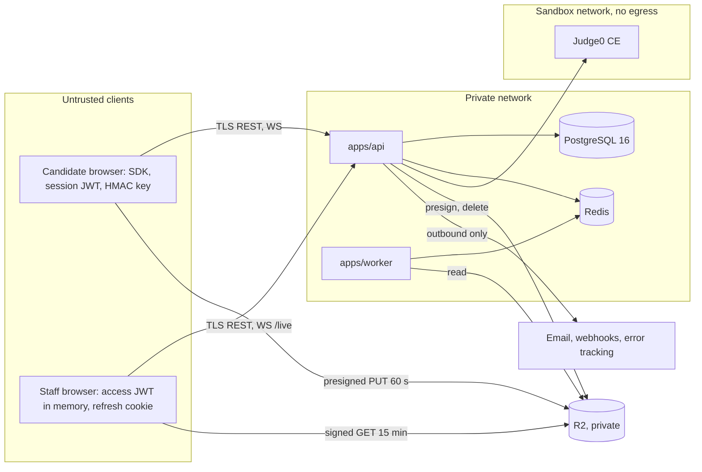

# ADR 0001: Overall system architecture

| Field | Value |
| --- | --- |
| Status | **Accepted** 2026-10-01 by Harsh Trivedi (project owner). Decisions taken at acceptance are in section 11 and in status.md section 9 (D-01..D-09). |
| Date | 2026-09-30 |
| Author | architect |
| Scope | Records the architecture the docs already define. It is not a redesign. Where the docs conflict, section 9 lists the conflict and does not resolve it. |
| Serves | BR-03..BR-06, BR-13, BR-14; FR-103, FR-105, FR-503, FR-505, FR-701, FR-703, FR-704, FR-801; NFR-01..NFR-05, NFR-09; BO-5 |
| Related | /docs/adr/review-2026-09-30-plan-and-schema.md (A-01..A-31). The ARC-01 schema ADRs move to 0002 to 0008 (review A-15). |

## 1. Context

CodeProctor has to produce hiring-grade test results that can be trusted (brd.md §1, §2). The docs planned the build and pilot on free tiers (BO-5, brd.md §8); hosting moved to AWS at acceptance (D-04), and the system must meet NFR-01 (API p95 under 300 ms, code run under 5 s), NFR-02 (200 concurrent candidates), NFR-04 (ASVS L2) and NFR-05 (privacy). architecture.md sets the shape: "a modular monolith API with separate workers, so it runs on one free-tier VM for the pilot and splits into services later without a rewrite". It also says "Heavy media never passes through the API". No code exists yet. Before ARC-01..ARC-05 and DB-02 start, the agents need one reference for boundaries and cross-cutting rules.

## 2. Decision: components

| Component | Responsibility | Tech (from the docs) | Owner |
| --- | --- | --- | --- |
| apps/web | One Next.js app with route groups `(candidate)` `/t/[token]/*`, `(staff)` `/admin/*` and `(public)`. The candidate side covers consent, checks, ID and room scan, and the Monaco editor with the SDK. The staff side covers questions, tests, invitations, review, live view and reports. | Next.js App Router, Tailwind, shadcn/ui, TanStack Query, openapi-fetch | frontend-engineer |
| apps/api | The only writer of business state. Handles auth, RBAC, org scope, audit, grading orchestration, presigned URLs, the WebSocket hub, and BullMQ producers and Node consumers. `SessionStateService` is the only code that writes `sessions.status`. | NestJS, Prisma, Socket.IO with Redis adapter | backend-engineer; integrity-engineer for the events, keystroke and identity modules |
| apps/worker | Face match (FR-403), server audio VAD, keystroke analytics, similarity and risk score (FR-802..FR-805). Reads media from R2 and hands results to the API; the mechanism is open (OI-1). | Python 3.12, FastAPI, Silero VAD, OpenCV | integrity-engineer |
| packages/proctor-sdk | Browser monitors and detectors (in a Web Worker), signed event batches, heartbeat, and chunked recording with an IndexedDB buffer | TS, MediaPipe, TF.js, MediaRecorder, Web Crypto | proctor-sdk-engineer |
| packages/shared | The single source for zod schemas, `events.ts`, the permission matrix, the transition map and constants | TS, zod | architect |
| Judge0 CE | Sandboxed execution with CPU, wall-time and memory limits and no network | Docker, with its own Postgres and Redis and privileged workers | backend-engineer (BE-05) |
| PostgreSQL 16 | All relational data, JSONB for event payloads, object keys only | 24 tables, 13 enums | db-engineer (the architect owns the schema) |
| Redis | Queues, rate limits, pub/sub on `live:{orgId}`, the Socket.IO adapter | Redis 8.8, used under its AGPLv3 licence option (D-09) | backend-engineer |
| Cloudflare R2 | Recordings, ID and selfie images, room scans, evidence, report PDFs, backups. Buckets are private and reachable only through presigned PUT (60 s) and GET (15 min) URLs. | S3 API, AWS SDK v3 | backend-engineer (BE-09) |
| infra | Docker Compose for local and staging; Caddy with automatic TLS on staging | Compose, Caddy | db-engineer (DB-01); deploy owner TBD |
| apps/lockdown | Phase 3 Electron kiosk client. It stays an empty placeholder until Q-41 is decided. | Electron | TBD |

The prompts name several external services that architecture.md does not list: Resend or Brevo, Sentry, a secrets vault, Cloudflare Pages, Supabase or Neon, and GHCR. None of them is part of the architecture until it is recorded (OI-12).

## 3. Trust boundaries

| ID | Boundary | Rule |
| --- | --- | --- |
| TB-1 | Candidate to API | All client input is untrusted, including detector output, timestamps and HMAC-signed batches, because the key is in the browser (R-04). Server time is the only clock (FR-505, TC-047). The candidate token scopes each request to one session. |
| TB-2 | Staff to API | 15-minute access JWT plus a rotated refresh cookie (FR-104). TOTP for SUPER_ADMIN and REVIEWER (FR-102). Every route has deny-by-default RBAC and an org scope check (CLAUDE.md). |
| TB-3 | Browsers to R2 | Presigned URLs only. The API never proxies media. |
| TB-4 | API to Judge0 | Candidate code is hostile. Judge0 has a private network, no egress and per-submission limits (FR-503, TC-042..TC-044). Only the API can call it. |
| TB-5 | App to data stores | Private network only. The app connects as `app_user`, which cannot UPDATE or DELETE `audit_logs` (architecture.md Security). |
| TB-6 | Worker and API | Internal and service-authenticated. The worker never writes `sessions.status` (backend.md Step 7). The mechanism is open (OI-1). |
| TB-7 | API to third parties | Outbound only. Webhooks are HMAC-signed and SSRF-guarded (backend.md Steps 14, 15). Tokens, OTPs and media keys are never sent to email or error tracking. |

## 4. Main data flows

| Flow | Path | IDs |
| --- | --- | --- |
| F1 Staff auth | Argon2id password (15-minute lock after 5 failures), then TOTP, then an access JWT in memory and a hashed refresh cookie that is rotated and revoked by family. Then guarded routes and audit. | FR-101..FR-105; TC-001..TC-006 |
| F2 Candidate session | Invitation token (only the SHA-256 is stored) plus email OTP gives a candidate JWT. Then consent, checks, ID and selfie, and room scan. At start, the server sets `deadline_at` with accommodations, assigns variants and issues the HMAC key. Heartbeat every 10 s. Every status change goes through SessionStateService following fsd.md §3. | FR-106, FR-303, FR-305, FR-401..FR-406, FR-505, FR-609; TC-021, TC-022, TC-024, TC-030, TC-047 |
| F3 Run and submit | API rate limit of 1 run per 5 s, then a Judge0 batch with per-question limits, then normalized results. Hidden tests, reference solutions and variant params never leave the API. After SUBMITTED, a `grade-session` job computes the weighted score. | FR-502..FR-506, NFR-01; TC-011, TC-040..TC-048, TC-091 |
| F4 Events and keystrokes | Batches (events every 5 s, keystrokes every 2 s) carry HMAC-SHA256 and a monotonic sequence. The API verifies them and stores `proctor_events` and `keystroke_batches`. HIGH events go to Redis `live:{orgId}` and then to /live. | FR-601..FR-610, FR-801; TC-050..TC-065 |
| F5 Media | 10 s MediaRecorder chunks. The API presigns a PUT, the browser uploads straight to R2 and confirms, and the API writes `media_chunks`. An IndexedDB buffer (200 MB) holds failed uploads. Playback uses 15-minute GET URLs, and the retention job deletes objects. | FR-701..FR-704, NFR-08; TC-063, TC-070..TC-072 |
| F6 Analysis | After SUBMITTED, `grade-session` runs, then `analyze-session` (the worker reads R2 audio, keystrokes, events and submissions). Results go to the API, and SessionStateService moves the session to UNDER_REVIEW (MEDIUM or HIGH) or COMPLETED. | FR-802..FR-805; TC-073..TC-076; order open (Q-22) |
| F7 Review and live | Reviewer with TOTP opens the queue, then an audited review bundle, decides flags, and sets a verdict once every HIGH flag is decided. Appeals go to another reviewer. /live uses Socket.IO with the Redis adapter, and pause and message reach the candidate. | FR-901..FR-904; TC-077..TC-080; candidate channel open (Q-20) |
| F8 Reporting | PDF stored in R2 with a signed link, SQL dashboard aggregates, HMAC-signed webhooks retried through BullMQ, CSV export | FR-1001..FR-1003; TC-081 |

## 5. Cross-cutting decisions

- **C-1 Org scoping.** database.md Data rules: "every API query filters by the caller's org_id". CLAUDE.md requires an org-scope check on every route. Enforcement is a Prisma client extension plus a request-scoped OrgContext that throws when there is no org (database prompt Step 5). A cross-org read returns 404 (TC-008). Candidate routes scope through the token's session, and jobs through the job's session. `@Public` routes are listed in the matrix. Still open: how child tables without `org_id` are filtered, and cross-parent writes (Q-10, A-07).
- **C-2 RBAC.** The roles are SUPER_ADMIN, RECRUITER, AUTHOR and REVIEWER (FR-103), plus a CANDIDATE pseudo-role and an internal SERVICE caller, all in the shared matrix. A global guard denies by default, and a test fails if any route is missing from the matrix (backend.md Step 3). The web app hides UI from the same matrix, but only the API enforces permissions.
- **C-3 Audit.** Every staff read or change of candidate data writes `audit_logs` with who, what, when and IP (FR-105, BR-14, TC-006). That includes review bundles, playlists, exports, reports and /live subscriptions. Jobs write rows with a null actor. The table is append-only for `app_user`. *Proposed rule (A-08):* metadata holds only IDs and action names, never names, emails, tokens or media keys, because the app can never erase these rows.
- **C-4 Secrets and keys.** Secrets are environment variables loaded from a vault (NFR-04; the vault is still to be chosen, OI-5). Passwords use Argon2id. Invitation and refresh tokens are stored only as SHA-256 hashes. TOTP secrets and session HMAC keys are encrypted with AES-256-GCM under an environment key (`totp_secret_enc`, `hmac_key_enc`). Staff and candidate JWTs use separate secrets. R2 credentials exist only in the api and worker, and there are no secrets in the web bundle.
- **C-5 Never log** (CLAUDE.md Rules; backend-engineer.md). This covers passwords, JWTs, refresh, invitation and OTP values, TOTP secrets and recovery codes, HMAC keys, presigned URLs, R2 keys of candidate media, ID and selfie images, and embeddings. It is enforced by pino `redact` and serializers in BE-01, and by not logging bodies on `/auth` and `/candidate`. Edge logs must exclude the invitation token (A-13), and error tracking scrubs the same fields. BullMQ jobs that carry an OTP or raw token are removed when they finish (A-31). A test asserts the redaction. The rule also covers fixtures, snapshots and commits.
- **C-6 Time and state.** Server time is the only clock (FR-505). fsd.md §3 is the state machine. Its transition map lives in packages/shared, and SessionStateService is its only writer. The gaps are open (Q-01, Q-22, A-06).
- **C-7 Async.** Long work runs in BullMQ jobs, not request handlers. The queues implied by the prompts are email, validate, grade-session, analyze-session, face-match, retention (daily), disconnect check and webhooks. Redis runs with `noeviction`. Interactive jobs such as face-match get their own priority or queue.
- **C-8 Contracts.** packages/shared holds the schemas, events, matrix and transition map. REST is code-first OpenAPI from NestJS, and /docs/api-contract.md is authoritative until BE-01 exists (ARC-02 confirms). Any change to `prisma/`, packages/shared or the API shape needs an ADR listing the affected agents.
- **C-9 Observability (NFR-09).** Structured pino logs carry a per-request trace ID, plus the session ID on candidate routes and jobs as the per-session correlation key. Errors use RFC 7807. Error tracking is in place, and uptime checks hit `/health`.
- **C-10 Privacy and retention** (BR-13, NFR-05, brd.md §7). Nothing touches a device or uploads before consent is logged (FR-401, TC-030). The DB stores only object keys. Retention uses `retention_days` (7..730, default 90): it deletes the objects, nulls the keys and writes an audit row (TC-072). Erasure finishes within 30 days (TC-094). Backups are kept 14 days, so erased data leaves the backups within that limit. Retention scope is open (Q-06, Q-11, A-02, A-09).
- **C-11 Testing.** Test titles start with the TC ID, then the FR ID, for example `TC-002 FR-101 locks account after 5 failures` (CLAUDE.md; build-plan §7).
  - **No TC.** The test names its FR or NFR. TC-065 uses `TC-065 NFR-04` until Q-30 is decided.
  - **pytest.** Hyphens are not allowed in function names, so tests use `test_tc073_fr802_<behaviour>` plus a marker holding the hyphenated IDs (A-25).
  - **Levels.** Vitest or Jest for unit tests, Jest with Supertest and Testcontainers for integration, Playwright for end to end, and /docs/manual-tests.md for manual cases.
  - **CI.** CI fails on any P1 failure.
  - **Judge0.** Judge0 tests run on Linux x86 (OI-5).

## 6. Alternatives considered

| Option | Why it was not chosen |
| --- | --- |
| Microservices from day one | They do not fit one free VM (BO-5) and add hops against NFR-01. The monolith splits later along the api, worker and Judge0 lines. |
| Uploading media through the API | About 600 concurrent streams on one VM (NFR-02). architecture.md rules it out. |
| Hosted execution API or a home-built sandbox | Paid per call (BO-5), candidate code leaves our control, and a home-built sandbox is risky (FR-503). Judge0 CE is self-hosted, GPL-3.0, and called over HTTP. |
| Server-side analysis of every video frame | Too much CPU. The docs choose browser detectors (FR-606) plus server re-checks of audio and keystrokes (FR-607, FR-802), and accept the tampering risk (R-04). |
| Postgres-only queue | Redis is needed anyway for Socket.IO, rate limits and pub/sub, and BullMQ has a Python client. |
| Separate candidate and staff apps | The layout has one apps/web. Revisit if CSP or bundle size start to conflict. |

## 7. Consequences

**Positive**
- One API and one worker fit the pilot host and can split later without a rewrite.
- Direct-to-R2 media keeps API latency independent of media volume.
- The shared contracts let the web, SDK and API lanes build in parallel against mocks.

**Negative and accepted risks**
- **Availability.** One VM is a single point of failure, so NFR-03 (99.5%) rests on monitoring and fast restore.
- **Judge0 host.** Judge0 needs x86, privileged containers and, per its Ubuntu 22.04 guide, cgroup v1 (`systemd.unified_cgroup_hierarchy=0`).
  - macOS cannot run the sandbox tests.
  - Oracle Always Free offers only 1 GB x86 micro VMs and ARM Ampere VMs, so hosting moves to AWS (D-04). BO-5's "piloted on free tiers" no longer holds for hosting.
  - ARC-05 must choose an x86 instance and an OS image on which Judge0's sandbox runs (cgroup v1 or a verified alternative), and size it for R-13.
- **Integrity limit.** Browser detectors and a browser-held HMAC key stop transport tampering, replay and forgery by third parties. They do not stop a determined candidate. Server re-checks and human review compensate (brd.md §7: flags are "evidence, never verdicts").
- **Two languages.** TypeScript and Python share the queues and R2, and possibly the DB, where Python cannot use Prisma.
- **Recording playback.** Only the first MediaRecorder timeslice blob has the WebM header. Playback and analysis must reassemble each segment in order (A-04).
- **Load.** About 300 requests per second at 200 candidates (R-02), plus the latency of a remote managed DB, put NFR-01 at risk. Batching (ARC-02) and DB placement (ARC-05) decide it.

## 8. External facts: verification status (checked 2026-09-30)

| Fact | Status |
| --- | --- |
| Judge0 CE is GPL-3.0; its Ubuntu 22.04 guide requires cgroup v1 | Verified (judge0 repo and guide) |
| InsightFace code is MIT; its pretrained models are "non-commercial research purposes only" | Verified (insightface README). Accepted by the owner on the basis that CodeProctor is non-commercial (D-05). |
| R2 free tier: 10 GB-month, 1M Class A and 10M Class B operations. Presign supports GET, HEAD, PUT and DELETE; "POST ... is not currently supported". | Verified (Cloudflare docs) |
| `redis:7` is 7.4.x under RSALv2/SSPLv1. Redis 8 adds AGPLv3. Valkey is BSD-3. | Verified (redis.io). Docker Hub has `redis:8.8` (8.8.3); 8.10.2 is the newest 8.x (checked 2026-10-01). |
| BullMQ Python works with Node queues but supports only a subset of features | Verified (docs.bullmq.io) |
| `@cloudflare/next-on-pages` is deprecated; OpenNext targets Workers | Verified (repo archived September 2025) |
| Oracle Always Free: x86 micro (1/8 OCPU, 1 GB) plus Ampere ARM | Verified. The reported 2026 A1 cut is not verified. |
| Neon free suspends after about 5 minutes idle; Supabase free pauses after 7 days | Secondary sources only |
| Only the first MediaRecorder timeslice blob has the WebM header | Verified (W3C mediacapture-record) |
| R2 encrypts at rest by default (FR-703); managed Postgres offers PG 16, citext, pgcrypto and `CREATE ROLE`; licences of MediaPipe, COCO-SSD, Silero VAD and vad-web; CSP needs `'wasm-unsafe-eval'`; BullMQ's default retention of completed jobs | **Not verified** |

## 9. Open issues (conflicts that affect the overall architecture)

| ID | Issue | Refs | Decided in |
| --- | --- | --- | --- |
| OI-1 | How the worker integrates (BullMQ Python or internal HTTP), whether it touches the DB, who writes `risk_score`, and when GRADED happens | Q-21, Q-22 | ARC-04 |
| OI-2 | Candidate push channel for pause and message within 2 s (heartbeat is 10 s) | Q-20 | ARC-02 |
| OI-3 | HMAC key lifecycle, canonical JSON, replay sequence storage and the threat model | Q-02, Q-26, R-04, A-10 | ARC-01, ARC-03 |
| OI-4 | Token binding and fingerprint, and auth for the STRICT second device. (Single-use link versus resume, Q-23, moved to ARC-01 ADR 0002 by D-08.) | Q-25, Q-42 | ARC-03 |
| OI-5 | Hosting is AWS (D-04). Still open: instance type and OS image for Judge0, whether web, Postgres and media storage move to AWS services or stay on Cloudflare Pages, Supabase/Neon and R2, cookie site, vault | R-01, R-08, R-13, Q-15, Q-44 | ARC-05 + human |
| OI-6 | Staging is also the pilot environment and would hold real candidate data | A-14 | ARC-05 + human |
| OI-7 | Child-table org scoping and cross-tenant foreign keys | Q-10, A-07 | ADR 0006 |
| OI-8 | Face model: InsightFace stays (D-05). Still open: the source of AI reference solutions | Q-07 | ARC-04 + human |
| OI-9 | Recording segments and playback reassembly | A-04 | ARC-01, ARC-03 |
| OI-10 | **Resolved** (D-07): the code-reviewer rule now allows the FR-702 IndexedDB upload buffer. ARC-03 still decides whether tokens or keys may persist for reload. | A-12 | — |
| OI-11 | Invitation token in the URL path versus the never-log rule | A-13 | ARC-03 |
| OI-12 | External SaaS not in architecture.md. (Redis licence resolved: Redis 8.8 under AGPLv3, D-09.) | A-29 | ARC-05 + human |
| OI-13 | Whether the lockdown client is in scope, and its attestation design | Q-41, A-30 | ADR after go/no-go |
| OI-14 | The architecture.md overview diagram is an embedded placeholder and not in the repo | A-29 | architect, after approval |

## 10. Agents affected

- **All agents.** Cite C-IDs in PRs where they apply.
- **architect.** Resolve OI-1..OI-11 in ARC-01..ARC-05, then add a text diagram and an external-services table to architecture.md.
- **backend-engineer.** BE-01 implements C-5, C-9, C-1 and C-2.
- **db-engineer.** DB-02 waits for freeze list 0008.
- **frontend-engineer and proctor-sdk-engineer.** FE-01 waits for OI-5 and OI-11. FE-06 and FE-07 wait for OI-3.
- **integrity-engineer.** BE-08 and BE-12 wait for OI-1 and OI-8.
- **qa-engineer.** Use C-11 in QA-01A.
- **project-manager.** Add this ADR to the plan and the decision log, and apply the renumbering.

## 11. Decisions taken at acceptance (2026-10-01)

| ID | Decision | Effect |
| --- | --- | --- |
| D-01 | This ADR is accepted. | Agents cite C-IDs in PRs. |
| D-02 | The ARC-01 ADRs are numbered 0002 to 0007 and the schema freeze list is 0008. ARC-02..ARC-05 ADRs take 0009 onward. | briefs/ARC-01.md and briefs/DB-02.md updated. |
| D-03 | ARC-01 covers the review's schema findings (review section 5). The variant model (A-01) and per-section timing (A-03) are decided before DB-02. | build-plan.md and briefs/ARC-01.md updated. |
| D-04 | Hosting is on AWS. It replaces Oracle Always Free. | architecture.md Deployment updated; layout details in ARC-05. |
| D-05 | InsightFace pretrained models stay (backend.md Step 8). The owner states CodeProctor is for non-commercial use, which the model licence permits. Revisit before any commercial use, for example a company using it to hire or offering it as a service. | Q-27 closed; ARC-04 no longer checks the licence. |
| D-06 | OTP comes before consent in the candidate stepper, matching fsd.md section 3 and section 4. | frontend.md Step 9 amended. |
| D-07 | The code-reviewer privacy rule allows the FR-702 IndexedDB upload buffer. | .claude/agents/code-reviewer.md amended. |
| D-08 | The pause and resume policy (Q-23, Q-24) and a retention hold during review and appeals (A-09) are decided now, in ARC-01 (ADRs 0002 and 0004). | Moved out of ARC-03. |
| D-09 | Redis 8.8 under its AGPLv3 licence option replaces `redis:7`. | prompts/database.md Step 1, briefs/DB-01.md, build-plan.md DB-01 updated. |
