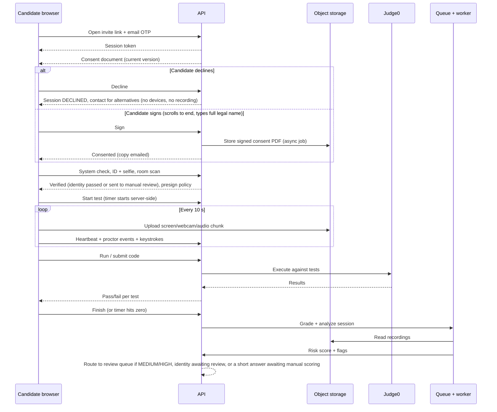

# Architecture

CodeProctor is a modular monolith API with separate workers, so it runs on one VM for the pilot and splits into services later without a rewrite.

## System overview

&#91;embedded content: CodeProctor system architecture · 3 clients, 1 API, 6 backing services\]

Heavy media never passes through the API: browsers upload recording chunks straight to object storage with presigned URLs, and the Python worker analyzes them from there.

## Components

| Component | Responsibility | Tech |
| --- | --- | --- |
| Candidate app | Consent, system check, ID + room scan, coding UI, proctor SDK | Next.js, Monaco, MediaPipe, TF.js, MediaRecorder |
| Staff app | Question bank, tests, invitations, review, live view, reports | Next.js, TanStack Query, Socket.IO client |
| API | Auth, RBAC, business logic, grading orchestration, presigned URLs, WebSocket hub | NestJS, Prisma, Socket.IO |
| Code runner | Sandboxed execution of candidate code | Judge0 CE in Docker |
| Analysis worker | Voice activity, keystroke analytics, code similarity, risk scoring | Python, FastAPI, Silero VAD, OpenCV |
| Queue | Async jobs: grading, analysis, emails, retention cleanup | Redis + BullMQ |
| Database | All relational data; JSONB for event payloads | PostgreSQL 16 |
| Object storage | Recordings, ID images, room scans | S3-compatible object storage behind one S3-compatible interface, so only configuration differs between environments. Staging uses Cloudflare R2 with synthetic data only. Pilot and production use AWS S3 (ADR 0001 D-11, section 2.1). |
| Lockdown client | Kiosk mode, OS-level blocking, process checks (Phase 3) | Electron |

## Candidate session sequence



## Proctoring data flow

1. The proctor SDK runs detectors in the browser on webcam frames every second and on audio continuously.
2. Events are batched every 5 seconds and posted to `/candidate/session/events`; keystrokes every 2 seconds to `/candidate/session/keystrokes`.
3. The API validates, stores events in `proctor_events`, pushes HIGH events to reviewers on the live WebSocket channel.
4. After submission, the worker re-checks audio server-side, runs keystroke analytics and code similarity, and writes the risk score.
5. The review page streams video from object storage through signed URLs and aligns it with events by timestamp.

## Deployment

| Environment | Where | Notes |
| --- | --- | --- |
| Local | Docker Compose on developer machine | Postgres, Redis, Judge0, API, worker, web. Synthetic data only. The local object store (a dev bucket or a local S3-compatible service) is decided in ARC-03 or ARC-05 (review A-20). |
| Staging | One AWS EC2 x86 instance running Docker Compose: API, worker, Redis, Judge0 (ADR 0001, D-04). Object storage: Cloudflare R2. Postgres: Supabase or Neon free tier is allowed (D-11). Web: Cloudflare Pages. | Synthetic data only; never real candidate data (D-10). Caddy reverse proxy with automatic TLS. Red-team work (QA-02) runs here. |
| Pilot | Its own stack, separate from staging: its own AWS instance, database, storage bucket and secrets (D-10). Candidate data stays in AWS: the database and the recordings (AWS S3) sit alongside the compute (D-11). Web: Cloudflare Pages. | Real candidate data. Whether Postgres runs on RDS or on EC2, and the AWS S3 bucket settings, are decided in ARC-05. The task that builds this stack is DEP-03 (approved as PA-07, D-16). |
| Production | Same as the pilot: AWS compute, database and AWS S3, with web on Cloudflare Pages (D-11). It may split API, worker and Judge0 onto separate hosts. | Judge0 needs an x86 host with privileged containers and a cgroup setup its sandbox supports; confirm before choosing an instance type and OS image. RDS versus Postgres on EC2 and the AWS S3 settings: ARC-05. |

## Security architecture

- TLS everywhere; HSTS; strict Content Security Policy on the candidate app.
- Short-lived JWTs; candidate session token bound to the session ID and a device fingerprint.
- All proctor events signed with a per-session HMAC key issued at start, so forged event batches are rejected.
- Object storage buckets private (Cloudflare R2 on staging, AWS S3 on pilot and production, one S3-compatible interface); only presigned PUT (upload, 60 s) and GET (playback, 15 min) URLs.
- Judge0 isolated on a private network, no internet egress, resource limits per submission.
- Secrets in environment variables loaded from a vault (Doppler free tier or GitHub Actions secrets).
- Audit log is append-only; database role for the app cannot update, delete or truncate it (ADR 0006).
- Consent: no camera, microphone or screen access and no upload before the candidate signs the consent document; the signed PDF is stored in object storage (D-17).
- Face embeddings are never stored (ADR 0004).

## Repository layout

```
codeproctor/
  apps/
    web/            Next.js (candidate + staff)
    api/            NestJS API; src/generated/prisma holds the generated Prisma client (git-ignored)
    worker/         Python analysis worker
    lockdown/       Electron client (Phase 3)
  packages/
    proctor-sdk/    Browser detectors, recorder, event batching
    shared/         Types, zod schemas, constants
  infra/
    docker-compose.yml
    caddy/
    judge0/
    scripts/        Local-only scripts and their tests (ADR 0009 section 4.4): the localhost guard
                    (local-db-guard.mjs, assert-local-db.mjs), db-reset, dev-infra-reset and,
                    from DB-03, db-migrate and set-app-user-password.mjs; backup and restore (DB-07)
  prisma/
    schema.prisma
    migrations/
    seed.ts
  docs/             BRD, FSD, architecture, test cases
  .github/workflows/
  prisma.config.ts      Prisma CLI config: schema, migrations, seed, owner-role URL (ADR 0009)
  tsconfig.base.json    Strict compiler options every package extends
  tsconfig.json         Root type-check for prisma.config.ts and prisma/*.ts (the .mjs scripts are
                        linted, not type-checked)
```

## Toolchain

Pinned versions and the reasons for them are in ADR 0009.

| Tool | Version |
| --- | --- |
| Node.js | 24 LTS (`.nvmrc`); pnpm 12.8.1 through corepack |
| TypeScript | ~6.0 (typescript-eslint supports versions below 6.1) |
| Prisma | 7.10.x: `prisma.config.ts`, `prisma-client` generator, `@prisma/adapter-pg` |
| Python | 3.12 |
| PostgreSQL, Redis | 16; 8.8 (ADR 0001, D-09) |

**Local-only scripts (ADR 0009 section 4.4).** They are a policy backed by speed bumps, not a security boundary.
- **Database scripts.** `db:migrate`, `db:seed` and `db:reset` refuse any database URL that does not point at this machine.
- **`db:reset`.** It also refuses AI-agent sessions, and any port other than the one Docker Compose publishes for the local Postgres.
- **`dev:infra:reset`.** It stops the local stack and deletes its volumes. It refuses a Docker engine that is not local: `DOCKER_HOST` and the current Docker context must both be `unix://` sockets.
- **Who runs them.** Only a human runs `db:reset` and `dev:infra:reset`, at a terminal with a typed confirmation. Agents verify the refusals only through `pnpm test`.
- **Shared environments.** Staging and pilot use their own Compose project names, and their database credentials never exist on developer machines or in agent sessions (D-38).
