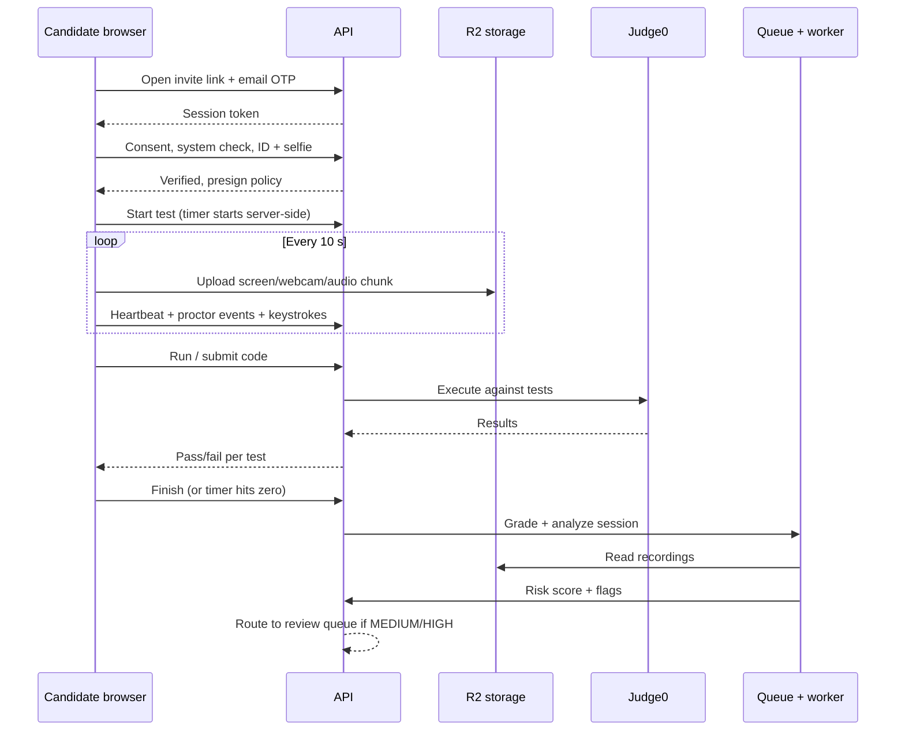

# Architecture

CodeProctor is a modular monolith API with separate workers, so it runs on one VM for the pilot and splits into services later without a rewrite.

## System overview

&#91;embedded content: CodeProctor system architecture · 3 clients, 1 API, 6 backing services\]

Heavy media never passes through the API: browsers upload recording chunks straight to R2 with presigned URLs, and the Python worker analyzes them from there.

## Components

| Component | Responsibility | Tech |
| --- | --- | --- |
| Candidate app | Consent, system check, ID + room scan, coding UI, proctor SDK | Next.js, Monaco, MediaPipe, TF.js, MediaRecorder |
| Staff app | Question bank, tests, invitations, review, live view, reports | Next.js, TanStack Query, Socket.IO client |
| API | Auth, RBAC, business logic, grading orchestration, presigned URLs, WebSocket hub | NestJS, Prisma, Socket.IO |
| Code runner | Sandboxed execution of candidate code | Judge0 CE in Docker |
| Analysis worker | Voice activity, keystroke analytics, code similarity, risk scoring | Python, FastAPI, Silero VAD, OpenCV |
| Queue | Async jobs: grading, analysis, emails, retention cleanup | Redis + BullMQ |
| Database | All relational data; JSONB for event payloads | PostgreSQL 16 |
| Object storage | Recordings, ID images, room scans | Cloudflare R2 |
| Lockdown client | Kiosk mode, OS-level blocking, process checks (Phase 3) | Electron |

## Candidate session sequence



## Proctoring data flow

1. The proctor SDK runs detectors in the browser on webcam frames every second and on audio continuously.
2. Events are batched every 5 seconds and posted to `/candidate/session/events`; keystrokes every 2 seconds to `/candidate/session/keystrokes`.
3. The API validates, stores events in `proctor_events`, pushes HIGH events to reviewers on the live WebSocket channel.
4. After submission, the worker re-checks audio server-side, runs keystroke analytics and code similarity, and writes the risk score.
5. The review page streams video from R2 through signed URLs and aligns it with events by timestamp.

## Deployment

| Environment | Where | Notes |
| --- | --- | --- |
| Local | Docker Compose on developer machine | Postgres, Redis, Judge0, API, worker, web |
| Staging / pilot | One AWS EC2 x86 instance running Docker Compose (ADR 0001, D-04). Where web, Postgres and media storage run (AWS services, or Cloudflare Pages, Supabase/Neon and R2) is decided in the deployment ADR (ARC-05). Whether the pilot gets its own stack is open (review A-14). | Caddy reverse proxy with automatic TLS |
| Production | Same layout on AWS, or split API, worker and Judge0 onto separate hosts | Judge0 needs an x86 host with privileged containers and a cgroup setup its sandbox supports; confirm before choosing an instance type and OS image |

## Security architecture

- TLS everywhere; HSTS; strict Content Security Policy on the candidate app.
- Short-lived JWTs; candidate session token bound to the session ID and a device fingerprint.
- All proctor events signed with a per-session HMAC key issued at start, so forged event batches are rejected.
- R2 buckets private; only presigned PUT (upload, 60 s) and GET (playback, 15 min) URLs.
- Judge0 isolated on a private network, no internet egress, resource limits per submission.
- Secrets in environment variables loaded from a vault (Doppler free tier or GitHub Actions secrets).
- Audit log is append-only; database role for the app cannot delete from it.

## Repository layout

```
codeproctor/
  apps/
    web/            Next.js (candidate + staff)
    api/            NestJS API
    worker/         Python analysis worker
    lockdown/       Electron client (Phase 3)
  packages/
    proctor-sdk/    Browser detectors, recorder, event batching
    shared/         Types, zod schemas, constants
  infra/
    docker-compose.yml
    caddy/
    judge0/
  prisma/
    schema.prisma
    migrations/
    seed.ts
  docs/             BRD, FSD, architecture, test cases
  .github/workflows/
```
