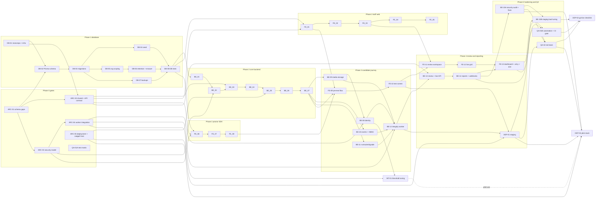

# CodeProctor build plan

Owner: Delivery Lead (from 2026-10-05). Last updated: 2026-10-05 (merge rule aligned with CLAUDE.md; sequencing decisions DL-01..DL-12 in status.md section 9b; COMP-01 and FAIR-01 added by the compliance decisions C-01..C-16, D-47). Earlier: 2026-10-01 (ARC-01 Phase B: D-16..D-23 applied, DEP-03 added; D-24..D-30: PA-01..PA-08 approved, INT-01 added, DEP owners set). Status of every task: see /docs/status.md.

Sources: CLAUDE.md, /docs/brd.md, /docs/fsd.md, /docs/architecture.md, /docs/database.md, /docs/test-cases.md, /docs/prompts/{database,backend,frontend,agents-qa-deploy}.md, .claude/agents/*.

Companion files: /docs/status.md (progress, risks, open questions), /docs/requirements-trace.md (BR/FR/NFR to task to TC), /docs/briefs/ (task briefs).

## 1. How to read this plan

- **Task IDs mirror the prompt steps.** `DB-n` = Database prompt Step n, `BE-n` = Backend prompt Step n, `FE-n` = Frontend prompt Step n, `QA-*` and `DEP-*` = agents-qa-deploy.md QA and Deploy prompts. `ARC-*` are architect gates that the PM routing rules require (schema, shared contracts, security) and that the prompts do not name. Database Step 0 (CLAUDE.md) is already done.
- **Splits beyond the prompts** (all approved 2026-10-01 by D-16, D-24 and D-25; see status.md "Change requests"): ARC-01..05 (gates), BE-15A/B (audit vs staging tuning, because tuning needs the staging VM from DEP-01), QA-01A/B (matrix and manual scripts can start early; automation and CI gate come last), PA-01 (baseline lint/type-check scripts and CI workflow, folded into DB-01), DEP-03 (pilot stack, approved as PA-07 by D-16), INT-01 (face-match threshold tuning, approved as PA-08 by D-24).
- **Breakdown of each step** is the Deliverables list in its task block (section 9). One task = one branch = one PR.
- **Relative size** S/M/L/XL is a PM judgment of effort relative to other tasks. The docs contain no effort or date data, so no durations are given.
- **Same-agent tasks run one after another** by default. The main session may run two instances of one agent on separate worktrees only if the branches touch disjoint files.
- **Branches:** `arch/<slug>`, `db/step-N`, `backend/step-N`, `frontend/step-N` (also used for the SDK steps 6-8, owned by proctor-sdk-engineer), `qa/<slug>`, `deploy/<slug>`.

## 2. Agent roster and mapping

Active agents are the files in `.claude/agents/`. The orchestrator prompt in agents-qa-deploy.md uses different names (see Open question Q-36). `.claude/agents-generated-backup/` holds the older generated set and is ignored by this plan.

| Orchestrator prompt name            | Active agent used here                                                       | Tasks                                                            |
| ----------------------------------- | ---------------------------------------------------------------------------- | ---------------------------------------------------------------- |
| (none)                              | architect                                                                    | ARC-01..05, plus PR review of schema, shared contracts, security |
| (database track)                    | db-engineer                                                                  | DB-01..DB-08                                                     |
| backend-core                        | backend-engineer                                                             | BE-01..BE-07                                                     |
| backend-media                       | backend-engineer (BE-09), integrity-engineer (BE-08)                         | BE-08, BE-09                                                     |
| backend-integrity                   | integrity-engineer (BE-10, BE-12), backend-engineer (BE-11)                  | BE-10..BE-12                                                     |
| backend-review                      | backend-engineer                                                             | BE-13, BE-14                                                     |
| hardening                           | backend-engineer (integrity-engineer for worker findings), architect reviews | BE-15A, BE-15B                                                   |
| frontend-staff                      | frontend-engineer                                                            | FE-01..FE-05                                                     |
| proctor-sdk                         | proctor-sdk-engineer                                                         | FE-06..FE-08                                                     |
| frontend-candidate, frontend-review | frontend-engineer                                                            | FE-09..FE-13                                                     |
| qa                                  | qa-engineer                                                                  | QA-01A, QA-01B, QA-02                                            |
| (none)                              | backend-engineer, architect review (D-26)                                    | DEP-01                                                           |
| (none)                              | backend-engineer, architect review (D-26)                                    | DEP-02                                                           |
| (none)                              | backend-engineer, architect review (D-26)                                    | DEP-03                                                           |
| (none)                              | integrity-engineer, architect review (D-24)                                  | INT-01                                                           |
| (none)                              | Out of scope for this build (D-13)                                           | FE-14                                                            |
| (every branch)                      | code-reviewer (read-only)                                                    | review gate on all tasks                                         |
| (this file)                         | Delivery Lead (from 2026-10-05; project-manager before)                      | plan, status, trace; briefs by project-manager                   |

## 3. Phases and milestones

| Phase                          | Goal                                                                                                                     | Tasks                                                                                                                   | Exit milestone                                                                                                                                                                                                                                                                                                                                                                                                           |
| ------------------------------ | ------------------------------------------------------------------------------------------------------------------------ | ----------------------------------------------------------------------------------------------------------------------- | ------------------------------------------------------------------------------------------------------------------------------------------------------------------------------------------------------------------------------------------------------------------------------------------------------------------------------------------------------------------------------------------------------------------------ |
| 0 Kickoff and contracts        | Schema questions answered, contracts written, repo has a first commit                                                    | ADR 0001 overall architecture (Accepted 2026-10-01), ARC-01, ARC-02, ARC-03, ARC-04, ARC-05 (Judge0 part first), QA-01A | M0: schema freeze list approved; contracts v0 published                                                                                                                                                                                                                                                                                                                                                                  |
| 1 Database track               | Monorepo, infra, Prisma schema, migrations, seed, org scoping, retention, backups, DB tests                              | DB-01..DB-08                                                                                                            | M1: Database track merged (gate for everything else)                                                                                                                                                                                                                                                                                                                                                                     |
| 2 Core backend, staff web, SDK | Auth, RBAC, question bank, Judge0, tests and invitations, session state machine; staff screens on MSW mocks; proctor SDK | BE-01..BE-07 ∥ FE-01..FE-05 ∥ FE-06..FE-08                                                                              | M2: BE-07 merged, SDK merged                                                                                                                                                                                                                                                                                                                                                                                             |
| 3 Candidate journey            | Media, identity, events, run/grade, integrity worker, candidate flow and test screen                                     | BE-09, BE-10, BE-11, BE-08, BE-12, FE-09, FE-10                                                                         | M3: candidate can complete a proctored test on seeded data; worker scores it                                                                                                                                                                                                                                                                                                                                             |
| 4 Review and reporting         | Review API, live gateway, reports, webhooks; review workspace, live grid, dashboard; staging environment                 | BE-13, BE-14, FE-11, FE-12, FE-13, DEP-01                                                                               | M4: reviewer journey works on staging; mocks removed                                                                                                                                                                                                                                                                                                                                                                     |
| 5 Hardening and QA             | Security review and fixes, load tuning, automated suite and CI gate, red team                                            | BE-15A, BE-15B, QA-01B, QA-02                                                                                           | M5: all 51 P1 TCs green or manual-signed; security review closed                                                                                                                                                                                                                                                                                                                                                         |
| 6 Go-live readiness            | Go-live checklist, pilot stack, threshold tuning and human decisions                                                     | DEP-02, DEP-03, INT-01, COMP-01, FAIR-01 (before the pilot exit review)                                                 | M6: checklist delivered; pilot stack built and verified with synthetic data; pilot entry blockers cleared (status.md B-05: owner-approved consent document and retention schedule, threshold tuning done, licence gate passing the two accepted models; for EU/UK candidates also the approved DPIA and processor transfer agreements). The owner is the approver (C-15). The pilot itself is human-run (BRD section 10) |
| Later phase (not this build)   | Electron lockdown client                                                                                                 | FE-14                                                                                                                   | Out of scope for this build (D-13, closes Q-41). Until it ships, the LOCKDOWN proctor profile must not be selectable (review A-30).                                                                                                                                                                                                                                                                                      |

## 4. Dependency graph

Solid edges are hard dependencies. Notes after the diagram explain soft dependencies (mocks allow early start).

**Soft dependencies (mock-enabled, final unmocking at the named task):**
FE-02 on BE-02; FE-03 on BE-03 and the org-settings endpoints (Q-16); FE-04 on BE-04/BE-05; FE-05 on BE-06 and candidate/status endpoints (Q-18); FE-09 on BE-08/BE-09; FE-10 on BE-10/BE-11; FE-11 and FE-12 on BE-13; FE-13 on BE-14 (FE-13 performs the final unmock sweep).

**Real couplings the prompts understate (see Q-38):** BE-08 needs BE-09's presign endpoint. BE-12 needs the worker scaffold from BE-08, StorageService from BE-09, events from BE-10 and submissions/state from BE-11. DB-05/DB-06 need a minimal NestJS module in apps/api before BE-01 runs (Q-39). BE-15B needs the staging VM from DEP-01 (Q-36 and Deploy prompts do not say when staging is built). BE-07 stores the signed consent PDF (D-17) through the storage interface; the real StorageService comes with BE-09, so the "PDF stored" part of TC-095 passes only after BE-09 merges (BE-07 tests it against the interface mock).

**Critical path** (about 22 sequential tasks, ARC-01 runs in parallel with DB-01):
DB-01 → DB-02 → DB-03 → DB-05 → DB-06 → DB-08 → BE-01 → BE-02 → BE-03 → BE-04 → BE-05 → BE-06 → BE-07 → BE-09 → BE-08 → BE-12 → BE-13 → BE-14 → BE-15A → BE-15B → QA-01B → DEP-02.
BE-11 and BE-10 run beside BE-09/BE-08 and must merge before BE-12. DEP-01 must finish before BE-15B, so it is a second near-critical chain (ARC-05, BE-12, FE-10 then DEP-01). Frontend and SDK lanes are shorter than the backend lane and are not critical unless a contract gate (ARC-02, ARC-03) slips.

## 5. Parallelism by wave

| Wave | Runs in parallel (different agents or disjoint files)                                                     | Waits for                                 |
| ---- | --------------------------------------------------------------------------------------------------------- | ----------------------------------------- |
| W0   | ARC-01 (ADRs 0002 to 0008 accepted 2026-10-01; branch awaiting review and merge), DB-01, QA-01A           | First commit on main (done)               |
| W1   | DB-02 → DB-03 (db-engineer); ARC-02 → ARC-03 → ARC-05 (Judge0 part) → ARC-04 (architect)                  | DB-01 merged; freeze list 0008 (accepted) |
| W1b  | After DB-03: DB-04 ∥ DB-05 ∥ DB-07; DB-06 after DB-05; then DB-08                                         | DB-03 merged                              |
| W2   | Backend lane BE-01..BE-07; staff web lane FE-01..FE-05; SDK lane FE-06..FE-08; architect reviews          | M1 (DB-08 merged), ARC-02, ARC-03         |
| W3   | backend-engineer BE-09 → BE-11; integrity-engineer BE-10 → BE-08 → BE-12; frontend-engineer FE-09 → FE-10 | BE-07 merged, SDK merged, ARC-04          |
| W4   | backend-engineer BE-13 → BE-14; frontend-engineer FE-11 → FE-12 → FE-13; DEP-01                           | BE-12 merged, FE-10 merged, ARC-05        |
| W5   | BE-15A ∥ QA-01B; then BE-15B, QA-02                                                                       | BE-14 and FE-13 merged; DEP-01            |
| W6   | DEP-02 ∥ DEP-03                                                                                           | M5; DEP-03 also needs ARC-05 and DEP-01   |

## 6. Gates

**Architect before work starts** (routing rule: schema, shared contracts, security).

| Task         | Gate                    | Why                                                                                                                                                                                                                                                                                      |
| ------------ | ----------------------- | ---------------------------------------------------------------------------------------------------------------------------------------------------------------------------------------------------------------------------------------------------------------------------------------- |
| DB-02        | ARC-01 (met 2026-10-01) | Schema decided (D-16..D-23); freeze list ADR 0008 accepted; DB-02 still waits for DB-01 to merge                                                                                                                                                                                         |
| ARC-02       | ARC-01                  | Event type list and identity/OTP decisions feed shared types                                                                                                                                                                                                                             |
| FE-01        | ARC-02                  | Typed client and MSW mocks need an API contract (no OpenAPI spec exists until BE-01)                                                                                                                                                                                                     |
| BE-02        | ARC-03                  | Auth token model, recovery-code storage                                                                                                                                                                                                                                                  |
| BE-03        | ARC-02                  | Permission matrix in packages/shared                                                                                                                                                                                                                                                     |
| BE-05        | ARC-05 (Judge0 part)    | Judge0 hosting and local dev feasibility (x86, cgroup, privileged)                                                                                                                                                                                                                       |
| BE-07        | ARC-03                  | Candidate token binding, HMAC key lifecycle, OTP storage, link semantics                                                                                                                                                                                                                 |
| BE-08, BE-12 | ARC-04                  | Worker job consumption, worker-to-API state changes, face-matching interface and model pinning (face model decided: AuraFace `glintr100.onnx` only, with MediaPipe detection and alignment, never an automatic rejection; D-05 revised 2026-10-01; licence flags in ADR 0001 section 12) |
| BE-09        | ARC-03                  | Object storage key layout for every object type, presign policy                                                                                                                                                                                                                          |
| BE-10        | ARC-02, ARC-03          | events.ts, canonical JSON and HMAC rules                                                                                                                                                                                                                                                 |
| BE-13        | ARC-02                  | /live contract including the candidate socket                                                                                                                                                                                                                                            |
| FE-06, FE-07 | ARC-02, ARC-03          | events.ts, signing rules, presign contract                                                                                                                                                                                                                                               |
| DEP-01       | ARC-05                  | AWS layout (D-04), web hosting choice, cookie domain plan                                                                                                                                                                                                                                |
| DEP-03       | ARC-05                  | Pilot layout: RDS or EC2 Postgres, AWS S3 settings, region, backups in AWS, roles per host                                                                                                                                                                                               |
| FE-14        | new ADR (later phase)   | Lockdown attestation design; out of scope for this build (D-13)                                                                                                                                                                                                                          |

**Architect at PR review** (in addition to code-reviewer): DB-02, DB-03, DB-05, DB-06, BE-02, BE-03, BE-07, BE-09, BE-10, BE-12, BE-15A, DEP-01, DEP-03, and any PR touching `prisma/` or `packages/shared`.

**Code-reviewer:** runs on every branch before it merges. Verdict APPROVE or APPROVE WITH NITS is required; REQUEST CHANGES sends the task back to its owner.

**Merge:** each session merges its own PR with an explicit `gh pr merge` once code-reviewer has no blockers and CI is green on the reviewed head, in dependency order; never auto-merge (CLAUDE.md "Working in parallel" rules 6, 8 and 9, which replace the earlier human-merge rule). The Delivery Lead updates status.md and the trace after the merge.

## 7. Global definition of done (applies to every task)

1. Lint, type-check and tests pass locally and in CI (root scripts and CI workflow from DB-01, PA-01 approved by D-25).
2. Every test name contains its FR and TC IDs (for example `TC-002 FR-101 locks account after 5 failures`).
3. Docs are updated in the same PR where behavior, contracts or schema changed. Docs and code disagree: stop and ask (CLAUDE.md).
4. No secrets, tokens, OTPs, HMAC keys or candidate media keys in logs, fixtures or commits.
5. The PR description lists FR IDs implemented, TC IDs covered, files changed, commands run with results, and any change to `packages/shared` or the OpenAPI spec.
6. code-reviewer verdict has no Blocking findings; architect review where section 6 requires it.
7. Conventional commit messages, small commits.
8. Status and trace updated by the Delivery Lead from the actual test run.

Per-task "Done when" lines below add to this list; they do not replace it.

## 8. Assignment table

Status values: Not started, In progress, In review, Changes requested, Done (merged), Blocked.

| ID      | Prompt step                                                       | Agent                                                             | Branch                                                                                | Depends on (hard)                                                                      | Review                    | Size | Status                   |
| ------- | ----------------------------------------------------------------- | ----------------------------------------------------------------- | ------------------------------------------------------------------------------------- | -------------------------------------------------------------------------------------- | ------------------------- | ---- | ------------------------ |
| ARC-01  | Gate: schema gaps (widened, D-03, D-08)                           | architect                                                         | arch/adr-schema-gaps                                                                  | human answers to finalize                                                              | human approves ADRs       | L    | Done (merged 2026-10-01) |
| ARC-02  | Gate: shared + API contract v0                                    | architect                                                         | arch/contracts-v0                                                                     | DB-01, ARC-01                                                                          | code-reviewer             | L    | Not started              |
| ARC-03  | Gate: security model                                              | architect                                                         | arch/adr-security-model                                                               | ARC-01                                                                                 | human approves ADRs       | M    | Not started              |
| ARC-04  | Gate: worker integration                                          | architect                                                         | arch/adr-worker-integration                                                           | ARC-01, ARC-03                                                                         | human approves ADRs       | S    | Not started              |
| ARC-05  | Gate: deployment + Judge0 host                                    | architect                                                         | arch/adr-deployment                                                                   | none (human-provisioned AWS x86 instance for spike)                                    | human approves ADRs       | M    | Not started              |
| DB-01   | Database Step 1                                                   | db-engineer                                                       | db/step-1                                                                             | none                                                                                   | code-reviewer             | M    | In progress              |
| DB-02   | Database Step 2                                                   | db-engineer                                                       | db/step-2                                                                             | DB-01, ARC-01                                                                          | architect + code-reviewer | L    | Not started              |
| DB-03   | Database Step 3                                                   | db-engineer                                                       | db/step-3                                                                             | DB-02                                                                                  | architect + code-reviewer | M    | Not started              |
| DB-04   | Database Step 4                                                   | db-engineer                                                       | db/step-4                                                                             | DB-03                                                                                  | code-reviewer             | L    | Not started              |
| DB-05   | Database Step 5                                                   | db-engineer                                                       | db/step-5                                                                             | DB-03                                                                                  | architect + code-reviewer | M    | Not started              |
| DB-06   | Database Step 6                                                   | db-engineer                                                       | db/step-6                                                                             | DB-05                                                                                  | architect + code-reviewer | M    | Not started              |
| DB-07   | Database Step 7                                                   | db-engineer                                                       | db/step-7                                                                             | DB-03                                                                                  | code-reviewer             | S    | Not started              |
| DB-08   | Database Step 8                                                   | db-engineer                                                       | db/step-8                                                                             | DB-03 (prompt order: DB-04..DB-07)                                                     | code-reviewer             | M    | Not started              |
| BE-01   | Backend Step 1                                                    | backend-engineer                                                  | backend/step-1                                                                        | DB-08                                                                                  | code-reviewer             | M    | Not started              |
| BE-02   | Backend Step 2                                                    | backend-engineer                                                  | backend/step-2                                                                        | BE-01, ARC-03                                                                          | architect + code-reviewer | L    | Not started              |
| BE-03   | Backend Step 3                                                    | backend-engineer                                                  | backend/step-3                                                                        | BE-02, ARC-02                                                                          | architect + code-reviewer | L    | Not started              |
| BE-04   | Backend Step 4                                                    | backend-engineer                                                  | backend/step-4                                                                        | BE-03                                                                                  | code-reviewer             | XL   | Not started              |
| BE-05   | Backend Step 5                                                    | backend-engineer                                                  | backend/step-5                                                                        | BE-04, ARC-05                                                                          | code-reviewer             | L    | Not started              |
| BE-06   | Backend Step 6                                                    | backend-engineer                                                  | backend/step-6                                                                        | BE-05 (real: BE-03, BE-04)                                                             | code-reviewer             | XL   | Not started              |
| BE-07   | Backend Step 7                                                    | backend-engineer                                                  | backend/step-7                                                                        | BE-06, ARC-03                                                                          | architect + code-reviewer | XL   | Not started              |
| BE-08   | Backend Step 8                                                    | integrity-engineer                                                | backend/step-8                                                                        | BE-07, BE-09, ARC-04                                                                   | code-reviewer             | L    | Not started              |
| BE-09   | Backend Step 9                                                    | backend-engineer                                                  | backend/step-9                                                                        | BE-07, ARC-03                                                                          | architect + code-reviewer | L    | Not started              |
| BE-10   | Backend Step 10                                                   | integrity-engineer                                                | backend/step-10                                                                       | BE-07, ARC-02, ARC-03                                                                  | architect + code-reviewer | L    | Not started              |
| BE-11   | Backend Step 11                                                   | backend-engineer                                                  | backend/step-11                                                                       | BE-07 (and BE-05)                                                                      | code-reviewer             | L    | Not started              |
| BE-12   | Backend Step 12                                                   | integrity-engineer                                                | backend/step-12                                                                       | BE-08, BE-09, BE-10, BE-11, ARC-04                                                     | architect + code-reviewer | XL   | Not started              |
| BE-13   | Backend Step 13                                                   | backend-engineer                                                  | backend/step-13                                                                       | BE-12, BE-09, BE-10, BE-03, ARC-02                                                     | code-reviewer             | XL   | Not started              |
| BE-14   | Backend Step 14                                                   | backend-engineer                                                  | backend/step-14                                                                       | BE-13, BE-09                                                                           | code-reviewer             | L    | Not started              |
| BE-15A  | Backend Step 15 (audit, fixes, k6 scripts)                        | backend-engineer                                                  | backend/step-15a                                                                      | BE-14                                                                                  | architect + code-reviewer | XL   | Not started              |
| BE-15B  | Backend Step 15 (staging tuning)                                  | backend-engineer                                                  | backend/step-15b                                                                      | BE-15A, DEP-01                                                                         | code-reviewer             | M    | Not started              |
| FE-01   | Frontend Step 1                                                   | frontend-engineer                                                 | frontend/step-1                                                                       | DB-08, ARC-02                                                                          | code-reviewer             | L    | Not started              |
| FE-02   | Frontend Step 2                                                   | frontend-engineer                                                 | frontend/step-2                                                                       | FE-01                                                                                  | code-reviewer             | M    | Not started              |
| FE-03   | Frontend Step 3                                                   | frontend-engineer                                                 | frontend/step-3                                                                       | FE-02                                                                                  | code-reviewer             | L    | Not started              |
| FE-04   | Frontend Step 4                                                   | frontend-engineer                                                 | frontend/step-4                                                                       | FE-03                                                                                  | code-reviewer             | XL   | Not started              |
| FE-05   | Frontend Step 5                                                   | frontend-engineer                                                 | frontend/step-5                                                                       | FE-04                                                                                  | code-reviewer             | L    | Not started              |
| FE-06   | Frontend Step 6                                                   | proctor-sdk-engineer                                              | frontend/step-6                                                                       | DB-08, ARC-02, ARC-03                                                                  | code-reviewer             | XL   | Not started              |
| FE-07   | Frontend Step 7                                                   | proctor-sdk-engineer                                              | frontend/step-7                                                                       | FE-06                                                                                  | code-reviewer             | L    | Not started              |
| FE-08   | Frontend Step 8                                                   | proctor-sdk-engineer                                              | frontend/step-8                                                                       | FE-07                                                                                  | code-reviewer             | XL   | Not started              |
| FE-09   | Frontend Step 9                                                   | frontend-engineer                                                 | frontend/step-9                                                                       | BE-07, FE-01, FE-08                                                                    | code-reviewer             | XL   | Not started              |
| FE-10   | Frontend Step 10                                                  | frontend-engineer                                                 | frontend/step-10                                                                      | FE-09                                                                                  | code-reviewer             | XL   | Not started              |
| FE-11   | Frontend Step 11                                                  | frontend-engineer                                                 | frontend/step-11                                                                      | FE-03, FE-10                                                                           | code-reviewer             | XL   | Not started              |
| FE-12   | Frontend Step 12                                                  | frontend-engineer                                                 | frontend/step-12                                                                      | FE-03, FE-10                                                                           | code-reviewer             | M    | Not started              |
| FE-13   | Frontend Step 13                                                  | frontend-engineer                                                 | frontend/step-13                                                                      | FE-09..FE-12, BE-14                                                                    | code-reviewer             | L    | Not started              |
| FE-14   | Frontend Step 14 (later phase, out of scope for this build, D-13) | TBD                                                               | frontend/step-14                                                                      | later-phase go-ahead, new ADR, BE-07, FE-10                                            | architect + code-reviewer | XL   | Out of scope             |
| QA-01A  | QA 1 (matrix and manual scripts)                                  | qa-engineer                                                       | qa/test-matrix                                                                        | none                                                                                   | code-reviewer             | M    | Not started              |
| QA-01B  | QA 1 (automation, CI gate, scans)                                 | qa-engineer                                                       | qa/automation-ci                                                                      | BE-14, FE-13, DEP-01                                                                   | code-reviewer             | XL   | Not started              |
| QA-02   | QA 2                                                              | qa-engineer                                                       | qa/red-team                                                                           | DEP-01, BE-15A, FE-13                                                                  | architect reads report    | L    | Not started              |
| DEP-01  | Deploy 1                                                          | backend-engineer (D-26)                                           | deploy/staging                                                                        | ARC-05, BE-12, FE-10                                                                   | architect + code-reviewer | XL   | Not started              |
| DEP-02  | Deploy 2                                                          | backend-engineer (D-26)                                           | deploy/go-live-checklist                                                              | BE-15B, QA-01B, QA-02, FE-13                                                           | architect                 | M    | Not started              |
| DEP-03  | Pilot stack (PA-07, D-16; no prompt step)                         | backend-engineer (D-26)                                           | deploy/pilot                                                                          | ARC-05, DEP-01, BE-15A, QA-02                                                          | architect + code-reviewer | L    | Not started              |
| INT-01  | Face-match threshold tuning (PA-08, D-24; no prompt step)         | integrity-engineer                                                | integrity/threshold-tuning                                                            | BE-08, ARC-04; owner-approved volunteer form (C-11), volunteers, model download (P-07) | architect + code-reviewer | M    | Not started              |
| COMP-01 | Compliance documents (C-03, C-05, C-09, C-11; no prompt step)     | Delivery Lead drafts, owner approves                              | dl/compliance-decisions                                                               | none to draft; FE-09 to load and link                                                  | owner                     | M    | In progress              |
| FAIR-01 | Optional demographic self-report (C-13; no prompt step)           | architect (ADR), db-engineer, backend-engineer, frontend-engineer | one branch per agent: arch/adr-fair-01, db/fair-01, backend/fair-01, frontend/fair-01 | ADR for separate storage, BE-07, FE-10                                                 | architect + code-reviewer | M    | Not started              |

Totals: 52 tasks (5 architect gates, 8 database, 16 backend, 1 integrity tuning, 14 frontend/SDK, 3 QA, 3 deploy, 1 compliance documents, 1 fairness monitoring). COMP-01 and FAIR-01 were added 2026-10-05 by the owner's compliance decisions (D-47).

## 9. Task catalogue

Format per task: owner, branch, depends on, can run in parallel with, FR/NFR covered, TCs, gates, deliverables (the breakdown of the prompt step), done-when. "PM-assigned" marks TCs that the prompts do not name for this step (Q-33).

### Phase 0: gates and kickoff

#### ARC-01: Schema readiness review

- Owner: architect. Branch: `arch/adr-schema-gaps`. Depends on: none to draft; human answers to finalize. Parallel with: DB-01, QA-01A. Size L (widened 2026-10-01, D-03 and D-08).
- Covers: FR-104, FR-105, FR-106, FR-203, FR-205, FR-301, FR-303, FR-403, FR-404, FR-406, FR-505, FR-609, FR-704, FR-801, FR-803, FR-804, FR-904, NFR-04, NFR-05. TCs informed: TC-005, TC-007, TC-008, TC-012, TC-021, TC-022, TC-024, TC-033, TC-036, TC-045, TC-048, TC-050, TC-063, TC-065, TC-072, TC-079, TC-094.
- Scope: Q-01..Q-17; Q-23 and Q-24 (pause and resume policy, moved from ARC-03, D-08); review findings A-01, A-02, A-03, A-04 (if a column is chosen), A-06, A-07, A-09 (retention hold during review and appeals), A-10, A-11, A-21 items 2 and 4, A-22, A-23 (review section 5 routing). A-01 (variant model) and A-03 (per-section timing) are decided first.
- Deliverables: ADRs 0002 to 0007 under /docs/adr/ (options, recommendation, affected agents); after human approval only, update /docs/database.md (DDL, ERD, table reference, data rules); schema freeze list ADR 0008 for DB-02 (approved deltas, or "none"); list of prompt amendments the human must apply to /docs/prompts/database.md.
- Done when: every item in scope is decided or explicitly deferred; database.md matches the ADRs; DB-02 unblocked in writing. Brief: /docs/briefs/ARC-01.md.
- Progress 2026-10-01: ADRs 0002 to 0007 accepted (D-16, amended by D-17..D-23); database.md updated (31 tables, 20 enums); freeze list ADR 0008 written; doc amendments applied. Awaiting review and merge.

#### ARC-02: Shared contracts and API contract v0

- Owner: architect. Branch: `arch/contracts-v0`. Depends on: DB-01, ARC-01.
- Covers: FR-103, FR-801, FR-903, FR-609, FR-608, FR-701. TCs: TC-004, TC-065 (shape only).
- Deliverables: `packages/shared` skeleton: `events.ts` (event types per ARC-01, severities, zod event and batch envelope with sequence and signature field, keystroke batch schema), permission-matrix type (routes to roles including a candidate pseudo-role), session state transition map from FSD section 3. `/docs/api-contract.md`: every endpoint in FSD section 4 plus the additions listed in Q-18/Q-19/Q-20/Q-22 (request/response shapes, RFC 7807 errors, pagination), WebSocket contract for /live and the candidate channel, internal worker-to-API endpoints (Q-21). ADR on contract ownership and OpenAPI generation (code-first from Nest, contract doc authoritative until BE-01 emits the spec).
- Done when: frontend-engineer can generate a typed client and MSW handlers from it; backend-engineer can start BE-03 from the matrix skeleton; PR notes list every shared-type change.

#### ARC-03: Security model ADRs

- Owner: architect. Branch: `arch/adr-security-model`. Depends on: ARC-01.
- Covers: FR-102, FR-104, FR-106, FR-601, FR-703, NFR-04. (Q-23 single-use link and resume, and Q-24 paused time, moved to ARC-01 ADR 0002 by D-08; ARC-03 applies them to token and key handling.) TCs informed: TC-005, TC-007, TC-021, TC-045, TC-047, TC-065, TC-071.
- Deliverables: ADRs for staff token model and TOTP enrollment gate; candidate session JWT (binding, device fingerprint, refresh via heartbeat, Q-25); HMAC key lifecycle (creation time, storage, delivery, reload recovery, Q-02), canonical JSON and replay rules (Q-26); AES-256-GCM key handling; object storage key layout and presign policy for every object type (Q-19); env/secret inventory used to finalize .env.example.
- Done when: BE-02, BE-07, BE-09, BE-10, FE-06 each have an unambiguous security spec.

#### ARC-04: Worker and async integration ADR

- Owner: architect. Branch: `arch/adr-worker-integration`. Depends on: ARC-01, ARC-03.
- Covers: FR-403, FR-803, FR-805, NFR-01. TCs informed: TC-033, TC-074, TC-075, TC-076.
- Deliverables: ADR on how the Python worker consumes BullMQ jobs (or alternative), how it reports results and state changes through an internal API (SessionStateService stays the only writer, Q-21, Q-22), service-to-service auth, DB access policy for the worker, worker scaffold layout, Python tooling (lint, type-check, pytest). Face model is decided (D-05, revised 2026-10-01): AuraFace `glintr100.onnx` only, MediaPipe for detection and alignment, no InsightFace model files, never an automatic rejection. The licence check is done (ADR 0001 section 12). ARC-04 defines the face-matching interface (detect and align, embed, compare, model id), a model manifest pinned by SHA-256 that rejects any other model file (flag F-1), and how low-confidence and failed matches reach manual review (ADR 0004). AI reference solutions are decided (D-12) and stored per ADR 0005; ARC-04 only defines how the worker reads them for similarity.
- Done when: BE-08 and BE-12 share one scaffold and one integration pattern.

#### ARC-05: Deployment architecture and Judge0 host feasibility

- Owner: architect. Branch: `arch/adr-deployment`. Depends on: none (needs a human-provisioned AWS x86 instance or CI runner for the spike).
- Covers: NFR-03, NFR-04, NFR-09, FR-503. TCs informed: TC-042, TC-043, TC-044, TC-093.
- Deliverables: Judge0 feasibility note on AWS (D-04: EC2 x86 instance type and OS image that run Judge0's sandbox, cgroup version, privileged containers; local dev on the developer's macOS machine versus a Linux runner) before BE-05. Then an ADR for the AWS layout of staging, pilot and production. Already decided: staging uses Cloudflare R2 with synthetic data only and may use Supabase or Neon; the pilot gets its own stack with its own instance, database, bucket and secrets (D-10); pilot and production keep the database and recordings in AWS alongside the compute, with recordings on AWS S3, and the web front end stays on Cloudflare Pages (D-11); storage stays behind one S3-compatible interface (ADR 0001 section 2.1). The ADR decides: RDS versus Postgres on EC2; AWS S3 bucket settings (SSE-S3 or SSE-KMS, versioning off or short noncurrent expiry, Block Public Access, CORS, lifecycle); region; where pilot and production backups go; Next.js on Cloudflare Pages with middleware and CSP nonces (R-08); domain plan so the SameSite=Strict refresh cookie works across web and API origins (Q-44); secrets vault choice; whether the migration role can create `app_user` on the chosen host, or provisioning creates it first (Q-15, ADR 0006 section 7.5).
- Done when: BE-05 knows where its integration tests run; DEP-01 has a signed-off layout.

#### QA-01A: Test matrix and manual scripts

- Owner: qa-engineer. Branch: `qa/test-matrix`. Depends on: none (docs only). Parallel with: everything in Phase 0 and 1.
- Covers: all 72 TCs (TC-095..TC-099 added 2026-10-01).
- Deliverables: /docs/test-matrix.md (TC ID, level, planned test file, owner task, status) using the owner tasks in /docs/requirements-trace.md; /docs/manual-tests.md with exact steps for hardware or people cases (TC-036, TC-056, TC-057, TC-058, TC-059, TC-060, TC-064, TC-063 offline check, TC-034).
- Done when: every TC ID appears once in the matrix with a level and owner; no application code touched.

### Phase 1: Database track

#### DB-01: Monorepo and local infrastructure

- Owner: db-engineer. Branch: `db/step-1`. Depends on: none. Parallel with: ARC-01, QA-01A.
- Covers: NFR-04 (secret placeholders), enabler for all. TCs: none.
- Deliverables: pnpm workspace with apps/web, apps/api, apps/worker (Python placeholder), apps/lockdown (empty placeholder), packages/proctor-sdk, packages/shared, infra/ (docker-compose.yml, caddy/, judge0/ placeholders), prisma/ folder, .github/workflows/; each package builds. `infra/docker-compose.yml` with postgres:16 (named volume, healthcheck), redis:8.8 (healthcheck, `noeviction` policy for BullMQ; AGPLv3 option per ADR 0001), adminer. `.env.example` with DATABASE_URL, REDIS_URL and placeholders for every secret the docs imply. Root scripts `dev:infra`, `db:migrate`, `db:seed`, `db:reset`. PA-01 (approved, D-25): root `lint`, `typecheck`, `test` scripts, strict tsconfig base, ESLint with `no-explicit-any`, baseline CI workflow. `.gitignore` additions.
- Done when: `pnpm install`, `pnpm -r build` pass; `pnpm dev:infra` shows all containers healthy; `psql $DATABASE_URL -c 'select 1'` works. Brief: /docs/briefs/DB-01.md.

#### DB-02: Prisma schema

- Owner: db-engineer. Branch: `db/step-2`. Depends on: DB-01, ARC-01. Gate: architect before start and at PR.
- Covers: data model for all FRs; FR-105, FR-704 columns. TCs: none directly (DB-08 verifies).
- Deliverables: `prisma/schema.prisma` matching /docs/database.md: 31 models, 20 enums, unique constraints (including composite (id, org_id)), foreign keys with documented ON DELETE (22 CASCADE, 1 SET NULL, 3 composite), indexes, snake_case mappings, native types. Every delta in ADR 0008 ticked; nothing else. A TODO list of DDL features Prisma cannot express, for DB-03. Prisma 7 set-up (ADR 0009): datasource without `url`, `prisma-client` generator into `apps/api/src/generated/prisma`, `@prisma/client` and `@prisma/adapter-pg` at the CLI's exact version plus `pg` in apps/api, one client factory, `db:generate` script and CI step. Rework note from the DB-01 review: move `declaration: true` out of `tsconfig.base.json` into `packages/shared` and `packages/proctor-sdk` only, because emitting declarations from apps/api code that exposes Prisma client types risks TS2742.
- Done when: `pnpm prisma validate`, `pnpm prisma format` and `pnpm db:generate` pass; model, enum, index and FK counts checked against the DDL (`migrate diff --from-empty --to-schema`). Brief: /docs/briefs/DB-02.md.

#### DB-03: Migrations

- Owner: db-engineer. Branch: `db/step-3`. Depends on: DB-02. Gate: architect at PR.
- Covers: FR-105 (append-only audit log), NFR-05, NFR-04. TCs: none in test-cases.md; verified in DB-08.
- Deliverables: `init` migration (extensions first, 12 CHECK constraints, partial indexes on sessions(risk_band) and sessions(retention_anchor_at), users.updated_at trigger, 5 identity columns); `audit_append_only` migration that creates `app_user` if it does not exist, with no password, then grants, sets default privileges and REVOKEs UPDATE/DELETE/TRUNCATE on audit_logs (ADR 0006 section 7, D-35; ADR 0008 section 8); `infra/scripts/set-app-user-password.mjs` for the local password, behind the localhost guard (ADR 0009 section 4.4); `DATABASE_URL` switched to `app_user`. No roles.sql, no compose init.
- Done when: `pnpm db:migrate` applies both migrations on the existing local volume and `prisma migrate deploy` applies them to a throwaway container; as `app_user`, `DELETE FROM audit_logs` and `TRUNCATE audit_logs` fail with permission denied; the owner runs `pnpm db:reset` once and records it (agents never run it). Brief: /docs/briefs/DB-03.md.

#### DB-04: Seed data

- Owner: db-engineer. Branch: `db/step-4`. Depends on: DB-03.
- Covers: enabler; dev data for FR-201..FR-205, FR-301, FR-303, FR-801, FR-804, FR-902. TCs: none.
- Deliverables: idempotent `prisma/seed.ts` per the prompt (1 org with a placeholder consent text, 4 staff users with argon2id, 6 coding questions with 3 samples, 8 hidden tests and 3 variants each plus per-variant test data and 6 synthetic AI reference rows each, 1 MCQ, 1 short answer, 2 tests with sequential sections, 5 candidates with sessions in different states including DECLINED, 3 completed sessions with signed consents, events and batches, risk in each band, one completed review); guard that refuses to run the default password outside development (Q-28). The seed reads only `DATABASE_URL` or `MIGRATION_DATABASE_URL`, both checked by the localhost guard. If a `shadowDatabaseUrl` is ever configured in `prisma.config.ts`, the guard must check it too (ADR 0009 section 4.4).
- Done when: `pnpm db:seed` twice without errors; per-table counts printed. Note: reference solutions are unverified until BE-05 runs validation over the seed (added to BE-05 done-when).

#### DB-05: Data-access helpers and org scoping

- Owner: db-engineer. Branch: `db/step-5`. Depends on: DB-03. Gate: architect at PR. Parallel with: DB-04, DB-07.
- Covers: NFR-04, FR-103. TCs: TC-008.
- Deliverables: minimal NestJS module structure in apps/api if BE-01 has not run (Q-39); PrismaService built with the DB-02 client factory (`@prisma/adapter-pg`, `DATABASE_URL` as `app_user`; ADR 0009) and a smoke test that the generated client loads under the Nest build; client extension (`$extends`; Prisma 7 has no `$use`) enforcing org filter and throwing without org context; request-scoped OrgContext; unit tests proving org A cannot read org B (TC-008), including tables scoped through declared scope paths (ADR 0006) and a test that fails if any model has neither org_id nor a scope path. If not already done, split apps/api into `tsconfig.json` (no emit; covers src, test and config files, so type-aware lint finds them) and `tsconfig.build.json` (emit, src only); the first of DB-05, DB-08 and BE-01 to run does it.
- Done when: tests pass and TC-008 is named in them.

#### DB-06: Retention and erasure services

- Compliance additions (2026-10-05, C-04, C-06, C-17, C-26, C-27; tests for each rule; the hub amends ADR 0004 §5 and §8 (PR #48) and the owner accepts it before DB-06 builds these): results deleted 1 year after the test, leaving anonymised statistics; face images capped at 90 days whatever retention_days says; a legal-hold hook (OQ-10); consent records get their own 3-year clock and are deleted at its end; recordings, ID images, selfies, re-check frames and keystroke data keep the 90-day default; erasure follows the approved NFR-05 wording; see OQ-1 (consent proof on erasure).
- Owner: db-engineer. Branch: `db/step-6`. Depends on: DB-05. Gate: architect at PR.
- Covers: FR-704, NFR-05, BR-13. TCs: TC-072, TC-094.
- Deliverables: RetentionService (eligibility from `retention_anchor_at` + retention days, NULL anchor = hold; returns keys; nulls keys and deletes keystroke batches in one transaction after deletion; consent records and PDFs kept; one audit_logs row per session), CandidateErasureService per D-19 (records `erasure_requested_at`; waits while a review or appeal is open when the org setting `erasure.holdWhileReviewOrAppealOpen` is on, default on, and the candidate is told; then deletes all objects including consent PDFs, deletes media, identity, event and keystroke rows, blanks code and answers, anonymizes the candidate, keeps only anonymized scores), the erasure-hold setting and its default, storage interface injected and mocked. Rules: database.md Data rules and ADR 0004.
- Done when: unit tests for both services including TC-072 and TC-094 (immediate erasure and the open-appeal hold).

#### DB-07: Backups and restore

- Owner: db-engineer. Branch: `db/step-7`. Depends on: DB-03. Parallel with: DB-04, DB-05.
- Covers: NFR-03 (recoverability), BO-6. TCs: none.
- Deliverables: `infra/scripts/backup.sh` (pg_dump custom format, gzip, upload through the S3-compatible interface to the backup bucket from env (R2 on staging, AWS S3 on pilot and production), prune backups older than 14 days), `infra/scripts/restore.sh`, scheduled nightly GitHub Actions workflow using repository secrets. A local `restore.sh` run starts with the localhost guard (`node infra/scripts/assert-local-db.mjs`). Staging and pilot backups and restores run only in GitHub Actions or on the server, where their credentials live (D-38).
- Done when: local backup then restore into a new database with matching row counts.

#### DB-08: Database verification

- Owner: db-engineer. Branch: `db/step-8`. Depends on: DB-03 (prompt order: DB-04..DB-07).
- Covers: FR-105, NFR-05. TCs: none in test-cases.md (supports TC-002 audit, TC-072).
- Deliverables: Jest + Testcontainers suite: migrations apply to a fresh container with `prisma migrate deploy`, never `migrate reset` or `db push` (ADR 0009); every table, enum and index exists; CHECK constraints reject bad data (duration_minutes 1, window_end before window_start, risk_score 101); cascade deletes as documented; audit_logs append-only for `app_user`. If not already done, split apps/api into `tsconfig.json` (no emit; src, test and config files) and `tsconfig.build.json` (see DB-05).
- Done when: `pnpm test:db` passes locally and in CI. Merging DB-08 closes milestone M1.

### Phase 2: core backend (backend-engineer lane)

#### BE-01: API foundation

- Owner: backend-engineer. Branch: `backend/step-1`. Depends on: DB-08.
- Covers: NFR-01, NFR-04, NFR-09. TCs: none directly.
- Deliverables: NestJS app with zod-validated config, pino logging with per-request trace ID, RFC 7807 exception filter, helmet, CORS limited to web origin, throttler (global, stricter on /auth and /candidate), Swagger at /api/docs (off in production), /health (Postgres, Redis), graceful shutdown, `/api/v1` prefix, Jest + Supertest + Testcontainers.
  - **tsconfig split:** if not already done, split apps/api into `tsconfig.json` and `tsconfig.build.json` (see DB-05).
  - **TS1272:** `isolatedModules` (from `tsconfig.base.json`) together with Nest's `emitDecoratorMetadata` raises TS1272 when a type-only symbol, such as an interface or a type alias, is imported normally and used in a decorated constructor. Import those with `import type`, and keep injected classes as value imports.
- Done when: `pnpm --filter api test` passes; /health returns ok with infra up; OpenAPI spec generated.

#### BE-02: Staff authentication

- Owner: backend-engineer. Branch: `backend/step-2`. Depends on: BE-01, ARC-03. Parallel with: FE-02 (mocks).
- Covers: FR-101, FR-102, FR-104, FR-107 (D-22). TCs: TC-001, TC-002, TC-003, TC-005, TC-098.
- Deliverables: POST /auth/login (argon2id, lockout 5 failures for 15 min, generic errors); TOTP enroll, verify, hashed recovery codes; enforce for SUPER_ADMIN and REVIEWER; 15 min access JWT; 7 day refresh cookie (httpOnly, Secure, SameSite=Strict), hashed, rotated, reuse revokes family (family_id); POST /auth/refresh, /auth/2fa/verify, /auth/logout; self-service password reset (POST /auth/password/forgot with a generic response, POST /auth/password/reset with a single-use 30-minute token; revokes all families; TOTP still required; ADR 0003 section 6).
- Done when: the five TCs pass as named tests; no tokens, reset tokens or TOTP secrets in logs.

#### BE-03: RBAC and audit logging

- Owner: backend-engineer. Branch: `backend/step-3`. Depends on: BE-02, ARC-02.
- Covers: FR-103, FR-105, NFR-05 (erasure entry point). TCs: TC-004, TC-006, TC-008; TC-094 (endpoint half; the service is DB-06).
- Deliverables: `@Roles()`, `@Public()`, global RolesGuard deny-by-default; permission matrix in packages/shared plus a test that fails if any controller route is missing; AuditInterceptor with `@Audited(action, entityType)`; SUPER_ADMIN user management (invite through a set-password link, change role, deactivate); SUPER_ADMIN candidate erasure endpoint that calls DB-06's CandidateErasureService (NFR-05, D-19; shape in ARC-02).
- Done when: TC-004, TC-006, TC-008 pass; matrix completeness test passes.

#### BE-04: Question bank

- Owner: backend-engineer. Branch: `backend/step-4`. Depends on: BE-03.
- Covers: FR-201, FR-202, FR-203, FR-204, FR-205. TCs: TC-010, TC-011, TC-013, TC-014.
- Deliverables: QuestionsModule CRUD, versioning with immutable published versions, test cases, variants with params schema and Mustache renderer, per-variant test data (variant_test_cases, ADR 0007), MCQ and short-answer `answer_spec` (canonical answer plus accepted variants, D-23), filters and pagination; AI reference solution authoring API (add, list, supersede; Python, JavaScript and Java only; publish gate of 2 distinct assistants per language; ADR 0005, D-20); candidate-facing serializer that never exposes hidden tests, reference solutions, AI reference solutions, `answer_spec` or variant params; POST /questions/:id/validate enqueuing a per-variant validation job against a stubbed execution interface, with `validation_report`.
- Done when: the four TCs pass (TC-011 needs a candidate fetch endpoint, see Q-18).

#### BE-05: Code execution with Judge0

- Owner: backend-engineer. Branch: `backend/step-5`. Depends on: BE-04, ARC-05.
- Covers: FR-503, FR-203 (publish gate), NFR-01. TCs: TC-042, TC-043, TC-044, TC-012.
- Deliverables: Judge0 CE in infra/docker-compose.yml on an internal network with no egress; ExecutionService (language map, batch submit, poll with backoff, per-question limits, output normalization); validate job wired; publish requires passing validation.
- Done when: TC-042/043/044 integration tests pass against local Judge0 (or the agreed Linux runner, R-01); TC-012 passes; validation run over all seeded questions passes (PM addition to catch bad seed data, R-11).

#### BE-06: Tests, invitations and email

- Compliance additions (2026-10-05, C-31): the MailPort adapter is Amazon SES in us-east-1, with no Resend.
- Compliance additions (2026-10-05, C-02): accommodations gain "no face match / no identity check"; every recruiter change to accommodations writes an audit row, with tests for both. The new accommodation key changes the shared accommodations contract, so the hub records it in an ADR (ADR 0010 or 0007 amendment) before BE-06 builds it.
- Owner: backend-engineer. Branch: `backend/step-6`. Depends on: BE-05 (real: BE-03, BE-04).
- Covers: FR-301, FR-302, FR-303, FR-304, FR-305, FR-106 (token generation). TCs: TC-020, TC-022, TC-023, TC-024.
- Deliverables: TestsModule (sequential sections with limits not exceeding the duration, fixed and random-pick rules, profile STANDARD or STRICT, pass score); InvitationsModule (32-byte token, SHA-256 hash stored, window, accommodations zod schema with allowedAssistiveTools; creates the INVITED session); bulk CSV with row report; BullMQ `email` queue with Resend provider behind an interface (templates: invitation, reminder 24 h before window_end, OTP, results, otp-lockout, consent-copy with the signed PDF (D-17), password-reset (D-22), staff-invite, erasure-delayed (D-19)); expiry job moving unstarted sessions to EXPIRED (ADR 0002).
- Done when: the four TCs pass as named tests.

#### BE-07: Candidate session and state machine

- Owner: backend-engineer. Branch: `backend/step-7`. Depends on: BE-06, ARC-03. Gate: architect at PR.
- Covers: FR-106, FR-401, FR-303, FR-305, FR-505, FR-609, FR-301 (assignment and sections). TCs: TC-021, TC-030 (API side), TC-047, TC-007 (PM-assigned), TC-095 and TC-096 (API side), TC-097.
- Deliverables: POST /candidate/session/start (token + email OTP 6 digits, 10 min; 30-min block only before the test starts; during a test no lockout, RESUME_OTP_FAILED event, proctor alert and 30 s cooldown, D-21); candidate JWT with auth_epoch; table-driven SessionStateService as the only writer of sessions.status (map in ADR 0002, including DECLINED); consent document per session (D-17): GET document, sign with typed full legal name and server timestamp, decline (DECLINED, no recording), PDF rendering job storing the signed PDF in object storage and the consent-copy email, refusal of unapproved texts where `REQUIRE_LEGAL_APPROVED_CONSENT` is set; on IN_PROGRESS: used_at, assign questions with test_question_id, pick variants, session_sections, deadline_at with accommodations, generate and encrypt HMAC key (per ARC-03), return once; resume rules L-1..L-5; heartbeat endpoint; repeatable job logging DISCONNECTED after 60 s.
- Done when: TC-021, TC-030, TC-047, TC-007, TC-095, TC-096, TC-097 pass and every allowed and forbidden transition has a unit test. Merging BE-07 closes milestone M2 for the backend lane.

### Phase 3: candidate journey

#### BE-09: Media storage (S3-compatible)

- Owner: backend-engineer. Branch: `backend/step-9`. Depends on: BE-07, ARC-03. Gate: architect at PR. Parallel with: BE-10, FE-09.
- Covers: FR-701, FR-703, FR-704 (scheduling), FR-404 (ROOM_SCAN storage). TCs: TC-070 (API side), TC-071, TC-072.
- Deliverables: StorageService (AWS SDK v3 behind one S3-compatible interface: R2 on staging, AWS S3 on pilot and production; private buckets; ADR 0001 section 2.1); POST /candidate/session/media/presign (PUT 60 s, content type and size enforced, media_chunks pending with segment, ADR 0004) and confirm call with HEAD check; staff playlist endpoint (GET signed URLs 15 min grouped by stream and segment); presign for non-webm objects per ARC-03 (Q-19); daily BullMQ schedule for RetentionService.
- Done when: TC-070 (API), TC-071, TC-072 pass.

#### BE-10: Proctor events and keystroke ingestion

- Owner: integrity-engineer. Branch: `backend/step-10`. Depends on: BE-07, ARC-02, ARC-03. Gate: architect at PR. Parallel with: BE-09.
- Covers: FR-801, FR-601, FR-604, FR-608. TCs: TC-050 (API), TC-055 (API), TC-065.
- Deliverables: POST /candidate/session/events (up to 100 events, shared zod schema, server-assigned severity, HMAC-SHA256 over canonical JSON, batch sequence stored in proctor_event_batches: idempotent retry, reject bad signature and replay; ADR 0005); HIGH events to Redis `live:{orgId}`; state changes for FULLSCREEN_EXIT and SCREEN_SHARE_STOPPED with paused_ms and deadline handling per ARC-01 ADR 0002 (Q-24); POST /candidate/session/keystrokes with the same scheme into keystroke_batches.
- Done when: TC-050, TC-055, TC-065 pass; no HMAC keys in logs.

#### BE-11: Run, submit and grading

- Owner: backend-engineer. Branch: `backend/step-11`. Depends on: BE-07 (and BE-05). Parallel with: BE-08, BE-10.
- Covers: FR-502, FR-504, FR-505, FR-506, FR-205 (scoring). TCs: TC-040, TC-041, TC-045, TC-046, TC-048, TC-014 (scoring half), TC-099 (API side).
- Deliverables: POST run (variant sample tests, open section only, Redis rate limit 1 per 5 s per session, RUN submission, autosave final_code); PUT draft (code or answer); POST submit (variant hidden tests, points x weight ratio, FR-506); POST finish; section deadline job; scheduled auto-submit past deadline_at; MCQ scoring and short-answer scoring (normalized exact match plus accepted variants; non-match goes to MANUAL_PENDING, never 0; D-23); manual scoring endpoint for the review UI (correct or incorrect, audited) and total_score recomputation; on SUBMITTED enqueue grade-session then analyze-session; GRADED transition per ARC-04 (Q-22); server time only.
- Done when: the six TCs pass as named tests.

#### BE-08: Identity verification service

- Compliance additions (2026-10-05, C-02, C-08): the API does not call the face match when the invitation's accommodation says so (OQ-3). Recording the waiver needs a value that `identity_check_status` does not have, so the hub records it in an ADR first (schema change under ADR 0008). The reviewer display belongs to BE-13 and FE-11. Periodic re-check frames follow C-08.
- Owner: integrity-engineer. Branch: `backend/step-8`. Depends on: BE-07, BE-09, ARC-04. Parallel with: BE-11.
- Covers: FR-403, FR-606 (FACE_MISMATCH re-check), FR-704 (embedding deletion). TCs: TC-033, TC-034 (PM-assigned, server half).
- Deliverables: POST /candidate/session/identity (object storage keys, enqueues face-match, returns job ID) and GET status; worker scaffold (FastAPI, job consumer per ARC-04); face embedding with the model approved in ARC-04; configurable threshold; one retry then manual approval, never auto-reject; manual approval path per ADR 0004 (identity_checks status enum, manual decision fields); embeddings never stored; fixture images under a permissive licence.
- Done when: TC-033 passes with fixtures; ruff, type-check and pytest pass in apps/worker.

#### BE-12: Integrity analysis worker

- Owner: integrity-engineer. Branch: `backend/step-12`. Depends on: BE-08, BE-09, BE-10, BE-11, ARC-04. Gate: architect at PR.
- Covers: FR-802, FR-803, FR-804, FR-805, FR-607 (server re-check). TCs: TC-061 (server side), TC-073, TC-074, TC-075, TC-076.
- Deliverables: Silero VAD audio pass and speaker-change heuristic (source='SERVER'); keystroke timeline analytics (PASTE_BURST over 80 chars in 1 s, TYPING_ANOMALY, idle-then-complete); code normalization and winnowing fingerprints against other submissions and stored AI reference answers; risk score with org-configurable weights and bands and documented defaults (Q-09) in /docs/integrity-config.md; state change through the internal API; accommodations respected; unit tests with synthetic true and false positive data; thresholds configurable.
- Done when: TC-061, TC-073, TC-074, TC-075, TC-076 pass; false-positive report handed to the PM. Merging BE-12 closes the backend part of M3.

#### FE-09: Candidate pre-test flow

- Compliance additions (2026-10-05): load only an owner-approved consent version, and keep the placeholder guard (C-09); a required 18+ confirmation (C-30); the decline screen shows the recruiter's contact (C-02); link the retention and destruction schedule from the consent step and the candidate portal (C-05).
- Owner: frontend-engineer. Branch: `frontend/step-9`. Depends on: BE-07, FE-01, FE-08. Parallel with: BE-09..BE-12.
- Covers: FR-401, FR-402, FR-403, FR-404, FR-405, FR-406, FR-605 (start blocked), FR-106 (OTP step and resume), NFR-06, NFR-07. TCs: TC-030, TC-031, TC-032 (PM-assigned), TC-033 (UI), TC-034, TC-035, TC-036 (PM-assigned), TC-095 and TC-096 (UI side).
- Deliverables: stepper under /t/[token]: welcome and rules (information only), OTP, consent document (D-17: full document with version, Sign enabled only after scrolling to the end, typed full legal name, "copy emailed" confirmation, Decline path with the org's contact and no device access; accessible to keyboard and screen-reader users), system check, identity with liveness, room scan, STRICT QR side camera, practice question, final checklist and Start; resume and OTP cooldown messages (D-21); declined and already-used pages; calm copy, fix-it hints, WCAG 2.1 AA.
- Done when: Playwright tests for TC-030, TC-031, TC-032, TC-095, TC-096 pass; axe clean; no device access before signing, verified in the network log.

#### FE-10: Candidate test screen

- Owner: frontend-engineer. Branch: `frontend/step-10`. Depends on: FE-09 (soft BE-10, BE-11).
- Covers: FR-501..FR-506 (UI), FR-601, FR-603, FR-608, FR-903 (candidate side). TCs: TC-040, TC-041, TC-046, TC-050, TC-051, TC-052; PM-assigned TC-045, TC-053, TC-054, TC-055, TC-062 (capture), TC-063.
- Deliverables: question panel, Monaco editor with AI suggestions off, paste and drop disabled, output panel, navigator, server-synced timer; autosave every 10 s with indicator; Run cooldown, Submit, Finish; lock overlays (fullscreen exit, share stopped, side camera lost, focus lost, proctor pause; only the proctor pause stops the timer); section timer, open-section navigator and "Finish section" (ADR 0002); proctor message toast via the candidate channel (Q-20); warning counter; keystroke capture using the SDK signing API; MCQ and short-answer answering (ADR 0007).
- Done when: Playwright tests for the six TCs pass; MSW mocks replaced for merged endpoints. Merging FE-10 closes milestone M3 for the frontend lane.

### Phase 2: staff web lane (frontend-engineer, runs alongside BE-01..BE-07)

#### FE-01: Web app foundation

- Owner: frontend-engineer. Branch: `frontend/step-1`. Depends on: DB-08, ARC-02.
- Covers: NFR-04 (CSP), NFR-06. TCs: none directly.
- Deliverables: Next.js App Router strict TS, Tailwind, shadcn/ui, light and dark theme; route groups (staff) /admin/_, (candidate) /t/[token]/_, (public); openapi-typescript + openapi-fetch client, TanStack Query, react-hook-form + zod from packages/shared, error boundary, toasts, MSW; CSP middleware with nonces (connect-src limited to API and the environment's object storage endpoint).
- Done when: `pnpm --filter web build` passes; Lighthouse accessibility 95+ on the empty shell.

#### FE-02: Staff authentication screens

- Owner: frontend-engineer. Branch: `frontend/step-2`. Depends on: FE-01 (soft BE-02).
- Covers: FR-101, FR-102, FR-104, FR-107 (D-22). TCs: TC-001, TC-002 (UI message), TC-003, TC-098 (UI).
- Deliverables: login, 2FA enrollment (QR, manual key, recovery codes download), 2FA verify, locked-account message, logout; forgot-password page (same confirmation whatever the email) and set-password page used by reset links and staff invites (token exchanged once, never stored or logged, Referrer-Policy no-referrer); access token in memory only; silent refresh via cookie; `useAuth`, `<RequireRole>`.
- Done when: Playwright tests for the four TCs pass.

#### FE-03: Staff shell and navigation

- Owner: frontend-engineer. Branch: `frontend/step-3`. Depends on: FE-02.
- Covers: FR-103, FR-804 (settings UI), FR-704 (retention setting), FR-401 (consent documents), NFR-05 (erasure). TCs: none.
- Deliverables: sidebar, top bar, breadcrumbs, role-based hiding from the shared matrix; SUPER_ADMIN settings (users, retention days, erasure hold while a review or appeal is open (D-19), risk weights and thresholds, consent documents with versions, current version, placeholder and Legal-approval state (D-17), decline contact); candidate erasure action with its waiting state; one DataTable component.
- Done when: axe clean; settings pages work against mocks or real endpoints (Q-16).

#### FE-04: Question bank UI

- Owner: frontend-engineer. Branch: `frontend/step-4`. Depends on: FE-03.
- Covers: FR-201, FR-202, FR-203, FR-204, FR-205. TCs: TC-012 (UI), TC-010 (PM-assigned UI smoke).
- Deliverables: list with filters and search; tabbed editor (statement with preview and Mustache placeholders, languages and starter code, reference solution, test cases table, variants with schema-validated params, preview and per-variant test data overrides (ADR 0007), answer tab for MCQ keys and short-answer accepted variants (D-23), AI reference solutions tab: add, list and supersede solutions from two assistants for Python, JavaScript and Java with a refresh-due badge (ADR 0005, D-20), limits); Validate with per-variant per-test results; Publish gated by passing validation and the AI-solution gate; version history read-only.
- Done when: Playwright for TC-012 passes.

#### FE-05: Tests and invitations UI

- Owner: frontend-engineer. Branch: `frontend/step-5`. Depends on: FE-04.
- Covers: FR-301, FR-302, FR-303, FR-304, FR-305. TCs: TC-023 and TC-024 (PM-assigned UI).
- Deliverables: test builder (sections drag reorder, explained as sequential with optional limits that cannot exceed the duration, fixed and random rules, duration, profile selector STANDARD or STRICT with plain-language explanations, pass score); invite dialog (single or CSV with row preview, window, accommodations including allowed assistive tools); candidates page with status timeline following the state machine, including DECLINED and EXPIRED (needs endpoints from Q-18).
- Done when: Playwright happy path for invite and CSV preview passes.

### Phase 2: proctor SDK lane (proctor-sdk-engineer)

#### FE-06: Proctor SDK, browser lock and event pipeline

- Owner: proctor-sdk-engineer. Branch: `frontend/step-6`. Depends on: DB-08, ARC-02, ARC-03.
- Covers: FR-601, FR-602, FR-603, FR-604, FR-605, FR-609, FR-610. TCs (PM-assigned, unit plus manual demo): TC-050, TC-051, TC-052, TC-053, TC-054, TC-055, TC-056, TC-064, TC-065 (client signing), TC-063 (heartbeat).
- Deliverables: ProctorSession class with detector plug-ins; monitors (fullscreen, visibility/focus with durations, clipboard/drop/contextmenu blocking, shortcut blocking, devtools heuristic, multi-screen check with fallback, virtual camera by label, screen share with displaySurface check and ended watcher); EventQueue (5 s or 100 events, Web Crypto HMAC-SHA256, monotonic sequence, backoff, IndexedDB persistence); heartbeat every 10 s; public signing API also usable for keystroke batches (Q-26); capability flags for unsupported checks; /dev/proctor demo page.
- Done when: Vitest passes; demo page shows each monitor; Chrome and Edge compatibility table in the PR.

#### FE-07: Proctor SDK, recording pipeline

- Owner: proctor-sdk-engineer. Branch: `frontend/step-7`. Depends on: FE-06.
- Covers: FR-701, FR-702, NFR-08. TCs: TC-063 (manual, result documented in PR), TC-070 (client side, PM-assigned).
- Deliverables: SCREEN, WEBCAM, AUDIO recorders (webm VP8/Opus, low bitrates), 10 s chunks, presign then PUT then confirm, IndexedDB buffer cap 200 MB with backoff and resume after reload, concurrency 2 with back-pressure, recorder health API.
- Done when: offline test (TC-063) documented; no chunk loss on a 45 s drop.

#### FE-08: Proctor SDK, in-browser AI detectors

- Owner: proctor-sdk-engineer. Branch: `frontend/step-8`. Depends on: FE-07.
- Covers: FR-606, FR-607, FR-305 (disabled detectors never run). TCs (PM-assigned; most are manual): TC-057, TC-058, TC-059, TC-060, TC-061 (client).
- Deliverables: detectors in a Web Worker or OffscreenCanvas (face, gaze, COCO-SSD objects, periodic identity re-check via API, browser VAD), HIGH-event snapshots uploaded via presign with evidenceKey, configurable thresholds, self-hosted model files, calibration screen in /dev/proctor; CPU usage measured and reported.
- Done when: threshold and debounce tests on fixtures pass; CPU figures in the PR; manual scripts from QA-01A exercised.

### Phase 4: review, reporting, staging

#### BE-13: Review and live proctoring API

- Compliance additions (2026-10-05, C-28): GRADED always goes to UNDER_REVIEW, with no auto-clear; results are hidden from recruiters, CSV export and webhooks until the verdict; a fast review path API (summary and one-click verdict) for the LOW band; record opened-to-verdict time per review (R-21). Waits for the hub's FR-805, fsd.md §3 and ADR 0002 change.
- Owner: backend-engineer. Branch: `backend/step-13`. Depends on: BE-12, BE-09, BE-10, BE-03, ARC-02.
- Covers: FR-901, FR-902, FR-903, FR-904, FR-805 (queue). TCs: TC-078, TC-079, TC-080; TC-077, TC-062, TC-006, TC-008 re-verified on review endpoints.
- Deliverables: GET /review/queue (including sessions waiting for an identity decision or manual scoring), GET /review/sessions/:id bundle, PATCH /review/flags/:id, identity decision endpoint (ADR 0004), POST /review/sessions/:id/verdict (every HIGH flag decided, identity decision recorded, every short answer scored), appeals with signed link, different-reviewer assignment and new_verdict on overturn (ADR 0002), proctor pause credit capped by maxProctorPauseMinutes, Socket.IO /live gateway with staff JWT, Redis adapter, proctor:pause and proctor:message emitted to the candidate channel, audit on every review read.
- Done when: TC-078, TC-079, TC-080 pass; scale-out test with two API instances.

#### BE-14: Reports and integrations

- Owner: backend-engineer. Branch: `backend/step-14`. Depends on: BE-13, BE-09.
- Covers: FR-1001, FR-1002, FR-1003. TCs: TC-081.
- Deliverables: server-side PDF report stored in object storage with signed link; dashboard metrics endpoint (SQL aggregates); org-configured webhooks (HMAC-signed, exponential backoff, delivery log, private-IP block deferred to BE-15A); CSV export; events session.completed and session.reviewed.
- Done when: TC-081 passes (signed webhook delivered).

#### FE-11: Review workspace

- Compliance additions (2026-10-05, C-28): a fast review path for LOW-band sessions (summary view, one-click verdict, timeline available); every session must be reviewed before its results show anywhere.
- Owner: frontend-engineer. Branch: `frontend/step-11`. Depends on: FE-03, FE-10 (soft BE-13).
- Covers: FR-901, FR-902, FR-608 (replay), FR-403 (manual identity decision), FR-205 (manual scoring, D-23). TCs: TC-062, TC-077, TC-078, TC-099 (UI side).
- Deliverables: queue with band badges and filters (including identity review and manual scoring); synchronized screen, webcam and side-camera players on one master clock with segment-aware playback; events timeline with seek; keystroke replay 1x-16x with PASTE_BURST highlights; run diffs; test results; identity panel with ID image, selfie and webcam frames and the MATCH / NO_MATCH / INCONCLUSIVE decision; manual scoring panel for short answers (mark correct or incorrect with note); flag panel and verdict form gated on HIGH flags, the identity decision and manual scoring; keyboard navigation (j/k, space).
- Done when: Playwright tests for the four TCs pass; replay reproduces final code exactly (TC-062).

#### FE-12: Live proctoring

- Owner: frontend-engineer. Branch: `frontend/step-12`. Depends on: FE-03, FE-10 (soft BE-13).
- Covers: FR-903. TCs: TC-079.
- Deliverables: /admin/live grid with thumbnails refreshed every 10 s, live feed, amber/red cards, side panel with message, pause, resume; Socket.IO auto-reconnect.
- Done when: TC-079 passes end to end (overlay within 2 s).

#### FE-13: Dashboard, reports and polish

- Owner: frontend-engineer. Branch: `frontend/step-13`. Depends on: FE-09..FE-12, BE-14.
- Covers: FR-1001, FR-1002, FR-1003 (CSV), NFR-06. TCs: TC-092.
- Deliverables: Recharts dashboard; report download; CSV export; axe in Playwright on every page; keyboard-only and screen-reader walkthrough; end-to-end candidate journey suite on seeded staging; final MSW removal sweep.
- Done when: TC-092 passes; no mocks remain for merged endpoints.

#### DEP-01: Staging on AWS

- Owner: backend-engineer, architect review (D-26). Branch: `deploy/staging`. Depends on: ARC-05, BE-12, FE-10. Gate: architect at PR.
- Covers: NFR-03, NFR-04, NFR-09, FR-703 (storage encryption settings), BO-5. TCs: none directly (supports TC-090, TC-093).
- Deliverables: staging only, synthetic data only (D-10). Infra for the AWS EC2 x86 host (api, worker, redis, judge0 with its db and redis, caddy); Cloudflare R2 media bucket with CORS for browser PUT (D-11; ADR 0001 section 2.1); Postgres on Supabase or Neon free tier or as ARC-05 decides; web on Cloudflare Pages; `app_user` created by the `audit_append_only` migration, its password set at provisioning from the vault (ADR 0006 section 7.4); GitHub Actions build, push to GHCR, SSH deploy with zero-downtime restart, `prisma migrate deploy` with `MIGRATION_DATABASE_URL` held only by the deploy job (never `migrate reset` or `db push`, ADR 0009); staging database credentials live only in GitHub Actions secrets and on the server, never on developer machines or in agent sessions (D-38); Compose runs under its own project name `codeproctor-staging`, never the local `codeproctor` (ADR 0009 section 4.4, SF5); smoke tests; CloudWatch (C-32; Sentry removed); uptime checks on /health; /docs/runbook.md; seed guard verified (Q-28). The pilot stack is not part of DEP-01 (it is DEP-03).
- Done when: smoke tests green on staging; runbook steps exercised once.

### Phase 5: hardening, QA, go-live

#### BE-15A: Security review and fixes

- Owner: backend-engineer (integrity-engineer for worker items). Branch: `backend/step-15a`. Depends on: BE-14. Gate: architect at PR.
- Covers: NFR-01..NFR-09 review, NFR-04, NFR-05. TCs: TC-008 re-run; prepares TC-090, TC-091, TC-093.
- Deliverables: /docs/security-review.md (finding and fix per item); dependency audit, CI secret scanning, input size limits, strict CORS, webhook SSRF protection, raw-SQL review, rate limits on every public route, log redaction; k6 scripts for 200 concurrent candidates (heartbeats, events, keystrokes, presign, runs) with the request mix from the real SDK cadence (R-02).
- Done when: every finding closed or accepted in writing; k6 scripts run locally.

#### BE-15B: Staging load tuning

- Owner: backend-engineer. Branch: `backend/step-15b`. Depends on: BE-15A, DEP-01.
- Covers: NFR-01, NFR-02. TCs: TC-090, TC-091.
- Deliverables: tuning changes and k6 result reports on the staging VM until API p95 is under 300 ms for 200 candidates and code run p95 under 5 s for 50 concurrent runs.
- Done when: TC-090 and TC-091 pass on staging.

#### QA-01B: Automation, CI gate and scans

- Owner: qa-engineer. Branch: `qa/automation-ci`. Depends on: BE-14, FE-13, DEP-01.
- Covers: all TCs; NFR-04, NFR-06. TCs: fills every automatable gap; TC-092 re-run; TC-093 (PM-assigned, ZAP baseline on staging).
- Deliverables: test-matrix statuses from real runs; missing P1 then P2 then P3 automated tests, each named with its TC ID; CI job that fails on any P1 failure and prints coverage per module; ZAP baseline result.
- Done when: matrix shows a level, file and status for all 72 TCs; all 51 P1 TCs pass or have a signed manual result.

#### QA-02: Red team of anti-cheating controls

- Owner: qa-engineer. Branch: `qa/red-team`. Depends on: DEP-01, BE-15A, FE-13.
- Covers: FR-601..FR-610, FR-801..FR-805. TCs: TC-036, TC-053, TC-054, TC-064, TC-065 re-attempted adversarially.
- Deliverables: /docs/red-team-report.md (method, detected, event, proposed fix) and an issue per undetected method; includes forged batches, key extraction from the browser, SDK tampering, blocked uploads, clock edits.
- Done when: every attempt recorded; architect has triaged undetected methods.

#### DEP-02: Production readiness review

- Owner: backend-engineer, architect review (D-26). Branch: `deploy/go-live-checklist`. Depends on: BE-15B, QA-01B, QA-02, FE-13.
- Covers: NFR-01..NFR-09, BRD section 7 and 10, BO-5, BO-6. TCs: none new.
- Deliverables: /docs/go-live-checklist.md covering staging free-tier limits and pilot and production AWS costs against 3-month usage and the approved budget (BO-5), DPAs per provider, consent sign-off, retention verified, backup restore verified, load and security results, accessibility audit, incident contacts, and the list of human decisions. Face-match threshold (D-05): **pilot entry gate:** the threshold is tuned on a demographically diverse test set before any real candidate is face-matched; **go-live (pilot exit) item:** before production, review the pilot's false-match and false-non-match rates and how many identity checks went to manual review, broken down across groups where that can lawfully be done, and adjust the threshold if needed. **Pilot entry blockers:** as listed in status.md B-05 (owner-approved, C-15; updated 2026-10-05 by C-01..C-16). Also on the checklist, but not designated pilot entry blockers by the owner: Legal confirmation of the provisional erasure-hold rule (D-19); a DPA with the email provider, because it receives the signed consent PDF. No production deploy.
- Done when: checklist delivered to the human.

#### DEP-03: Pilot stack

- Compliance additions (2026-10-05): one US AWS region for all data, us-east-1 (C-03); SES sending with a server-only IAM role (C-31); logs shipped to CloudWatch, with log group retention set (C-32, OQ-9); the licence gate passes only the two accepted pinned model files (C-10); every processor has a DPA with SCCs, or DPF certification, before the first EU/UK candidate (C-03).
- Owner: backend-engineer, architect review (D-26). Branch: `deploy/pilot`. Depends on: ARC-05, DEP-01, BE-15A, QA-02. Gate: ARC-05 before start; architect at PR. Approved as PA-07 by D-16 (2026-10-01). No prompt step.
- Covers: NFR-03, NFR-04, NFR-05, FR-703, BO-5, BO-6, BRD section 10 (pilot). TCs: none new (smoke tests; TC-093 baseline re-run against the pilot stack recommended).
- Deliverables: the pilot environment, separate from staging (D-10, D-11): its own AWS x86 instance (api, worker, redis, judge0, caddy); Postgres in AWS (RDS or EC2 per ARC-05); an AWS S3 recordings bucket with the ARC-05 settings (encryption, versioning off or short noncurrent expiry, Block Public Access, CORS for browser PUT; ADR 0001 section 2.1); pilot-only secrets in the vault; `app_user` from the `audit_append_only` migration with a pilot-only password set at provisioning (ADR 0006 section 7.4); pilot database credentials live only in GitHub Actions secrets and on the server, never on developer machines or in agent sessions (D-38); Compose runs under its own project name `codeproctor-pilot` (ADR 0009 section 4.4, SF5); backups kept in AWS; web on Cloudflare Pages pointed at the pilot API; `REQUIRE_LEGAL_APPROVED_CONSENT=true`; no seed accounts (Q-28 guard); runbook section.
- Pilot entry blockers (the task can be built before they clear, but no real candidate may start until they do): see status.md B-05. In short: the owner-approved consent document in `consent_texts` with `legal_approved_at` set (the owner is the approver, C-09 and C-15); the published retention schedule (C-05); the face-match threshold tuned on the volunteer set (D-05, C-11, C-12, INT-01); the licence gate passing the two accepted models (C-10); for EU/UK candidates also the approved DPIA and processor transfer agreements (C-03). The e-signature format is confirmed (C-07).
- Done when: smoke tests pass with synthetic data, and that data is then wiped; the seed guard is proven; no staging secret or bucket is reused; the API refuses an unapproved consent text; the pilot entry blockers are recorded as cleared by the owner.

#### INT-01: Face-match threshold tuning

- Owner: integrity-engineer, architect review. Branch: `integrity/threshold-tuning`. Depends on: BE-08 (face-matching interface and model pinning), ARC-04. Approved as PA-08 by D-24 (2026-10-01). No prompt step.
- Covers: FR-403, NFR-05, BO-4, BO-6; D-05 pilot entry criterion; D-18 test set. TCs: none directly (supports TC-033).
- Deliverables: the internal test set from volunteers who sign the separate short consent (D-18): ID-style photo and selfie pairs per volunteer, plus impostor pairs; optional self-reported demographic data stored apart from the images, outside the CodeProctor database, and deleted after tuning; an offline evaluation script that calls the worker's face-matching interface with the pinned AuraFace model; false-match and false-non-match rates across thresholds, broken down by group on the volunteers' explicit consent (C-12, which replaces the earlier wording "only where Legal confirms a lawful basis"); a recommended threshold and its expected manual-review rate; /docs/face-threshold-report.md. Fallback: a licensed dataset whose licence allows commercial use and biometric processing (ADR 0001 section 12). No production data.
- Human inputs: the owner-approved volunteer consent form (C-11; draft in /docs/compliance/volunteer-consent-form.md); volunteers; the model download (P-07). The per-group breakdown is allowed on the volunteers' explicit consent (C-12). The ID photo is cropped to the portrait on upload and the original deleted (form section 2).
- Done when: the threshold is set in system configuration; the owner accepts the report; demographic data is deleted and the deletion recorded. Clears B-05 item 3.

#### COMP-01: Compliance documents

- Owner: Delivery Lead drafts; Harsh Trivedi approves (C-15). Branch: `dl/compliance-decisions` (PR #44). Added 2026-10-05 (D-47). No prompt step.
- Deliverables, in this order: volunteer consent form (C-11, first, because recruiting takes time); retention and destruction schedule (C-05); consent document (C-09); DPIA with an automated-decision-law assessment (C-03, C-14); processor register with DPA/SCC/DPF status (C-03).
- Done when: the owner approves each document; the consent document and retention schedule are loaded and linked by the frontend (FE-09); B-05 items 1, 2, 5 and 6 are cleared.

#### FAIR-01: Optional demographic self-report

- Owner (one branch and PR per agent, in this order): architect (ADR for separate storage and access, under ADR 0008), then db-engineer (schema and deletion with session data), backend-engineer (API, aggregate report with a minimum group of 10), frontend-engineer (post-test form with its own consent and "prefer not to say"). Added 2026-10-05 (C-13, D-47). No prompt step.
- Covers: brd.md section 7 (flag rates monitored across groups); the new FR the hub adds; new TCs from QA.
- Rules (C-13): asked after the test; separate explicit consent; stored apart from the session; never shown to reviewers or recruiters; never used in scoring or decisions; aggregate only, with a minimum group of 10; deleted with the session data.
- Done when: in place and tested before the pilot exit review (not needed for pilot start).

#### FE-14: Lockdown desktop client (later phase, out of scope for this build)

- Owner: TBD. Branch: `frontend/step-14`. Depends on: a later-phase go-ahead, new ADR on attestation, BE-07, FE-10. Not scheduled in this build (D-13, 2026-10-01).
- Covers: FR-1101, FR-1102, FR-1103 (client half; the server challenge endpoint has no backend step), BR-11. TCs: none exist.
- Deliverables per frontend.md Step 14 and /docs/lockdown.md with honest limitations.
- Done when: not in this build. Q-41 closed by D-13.

## 10. Change control

- Scope beyond the docs goes to "Change requests" in /docs/status.md and waits for a human.
- Contract changes (schema, packages/shared, OpenAPI) require an architect ADR and a note in the PR description.
- Schema is frozen after ARC-01 and DB-03; a later schema change needs a new ADR and a forward-only migration.
