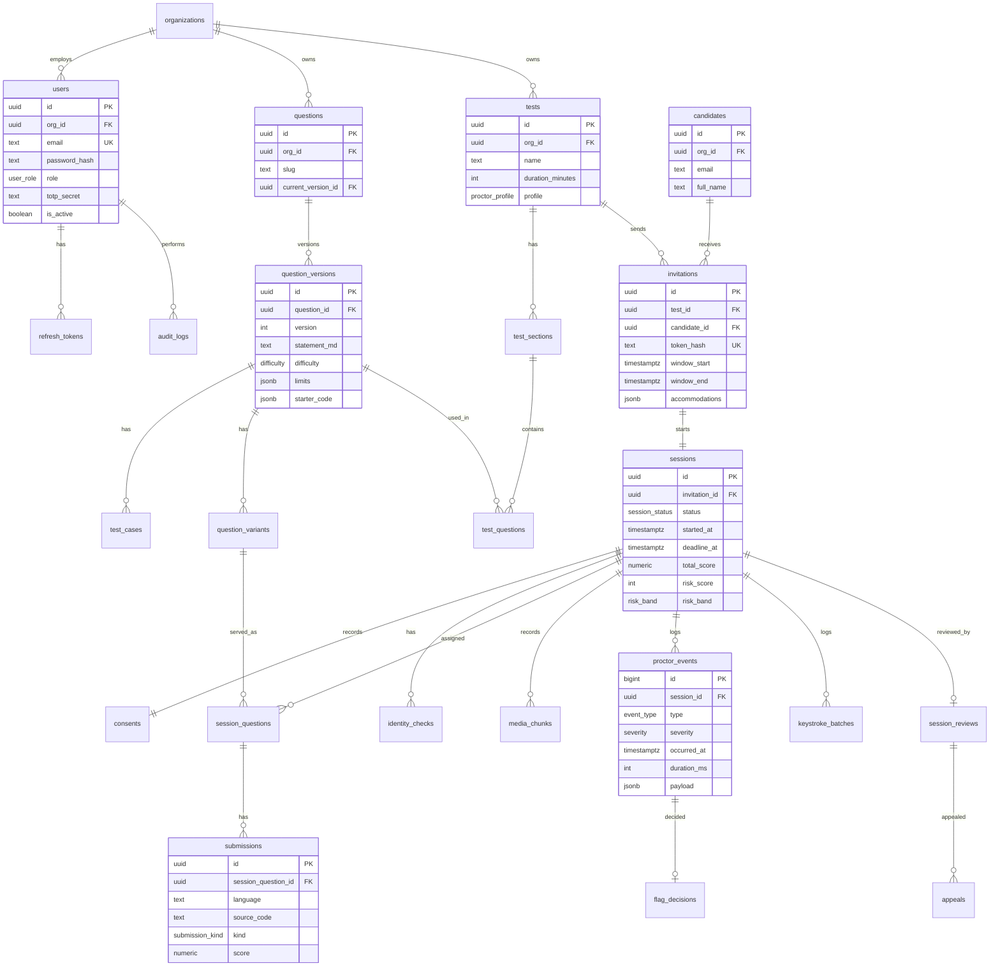

# Database design

PostgreSQL 16 holds 24 tables in five groups: identity, content, delivery, proctoring and review. Large media lives in R2; the database stores only object keys. Prisma is the ORM; the SQL below is the reference the Prisma schema must match.

## Entity-relationship diagram



## Table reference

| Group | Table | Purpose |
| --- | --- | --- |
| Identity | organizations | Tenant; settings such as retention days |
| Identity | users | Staff accounts, role, 2FA |
| Identity | refresh\_tokens | Rotating refresh tokens, revocation |
| Identity | audit\_logs | Append-only log of staff actions |
| Content | questions | Stable question identity |
| Content | question\_versions | Immutable versions with statement, limits, starter code, reference solution |
| Content | test\_cases | Sample and hidden cases with weights |
| Content | question\_variants | Parameter sets producing equivalent variants |
| Delivery | tests | Test templates and proctoring profile |
| Delivery | test\_sections | Timed sections inside a test |
| Delivery | test\_questions | Fixed question or random-pick rule per section |
| Delivery | candidates | Candidate identity (no password) |
| Delivery | invitations | One-time links, window, accommodations |
| Delivery | sessions | One test attempt; status, timing, scores, risk |
| Delivery | session\_questions | The exact variant served to this candidate |
| Delivery | submissions | Every run and submit with results |
| Proctoring | consents | Consent text version, timestamp, IP |
| Proctoring | identity\_checks | ID and selfie keys, face match score, room scan key |
| Proctoring | media\_chunks | Recording chunk keys per stream |
| Proctoring | proctor\_events | Detected events with severity and evidence |
| Proctoring | keystroke\_batches | Compressed editor event batches for replay |
| Review | session\_reviews | Reviewer, verdict, notes |
| Review | flag\_decisions | Confirm or dismiss per event |
| Review | appeals | Candidate appeals and outcome |

## Reference DDL (PostgreSQL 16)

```sql
CREATE EXTENSION IF NOT EXISTS pgcrypto;
CREATE EXTENSION IF NOT EXISTS citext;

CREATE TYPE user_role        AS ENUM ('SUPER_ADMIN','RECRUITER','AUTHOR','REVIEWER');
CREATE TYPE difficulty       AS ENUM ('EASY','MEDIUM','HARD');
CREATE TYPE question_type    AS ENUM ('CODING','MCQ','SHORT_ANSWER');
CREATE TYPE proctor_profile  AS ENUM ('STANDARD','STRICT','LOCKDOWN');
CREATE TYPE session_status   AS ENUM ('INVITED','OPENED','CONSENTED','VERIFIED','IN_PROGRESS','PAUSED','SUBMITTED','GRADED','UNDER_REVIEW','COMPLETED','EXPIRED','APPEALED');
CREATE TYPE submission_kind  AS ENUM ('RUN','SUBMIT');
CREATE TYPE media_stream     AS ENUM ('SCREEN','WEBCAM','AUDIO','SIDE_CAMERA','ROOM_SCAN');
CREATE TYPE severity         AS ENUM ('LOW','MEDIUM','HIGH');
CREATE TYPE risk_band        AS ENUM ('LOW','MEDIUM','HIGH');
CREATE TYPE verdict          AS ENUM ('CLEAN','SUSPICIOUS','VIOLATION');
CREATE TYPE flag_decision    AS ENUM ('CONFIRMED','DISMISSED');
CREATE TYPE appeal_status    AS ENUM ('OPEN','UPHELD','OVERTURNED');
CREATE TYPE event_type AS ENUM (
  'FULLSCREEN_EXIT','TAB_SWITCH','FOCUS_LOST','PASTE_ATTEMPT','COPY_ATTEMPT','RIGHT_CLICK',
  'DEVTOOLS_OPEN','SCREEN_SHARE_STOPPED','MULTI_MONITOR','VIRTUAL_CAMERA',
  'NO_FACE','MULTIPLE_FACES','FACE_MISMATCH','GAZE_AWAY','PHONE_DETECTED','BOOK_DETECTED',
  'SPEECH_DETECTED','MULTIPLE_VOICES','DISCONNECTED','RECONNECTED',
  'PASTE_BURST','TYPING_ANOMALY','CODE_SIMILARITY','AI_LIKENESS','PROHIBITED_PROCESS','PROCTOR_PAUSE','PROCTOR_MESSAGE');

CREATE TABLE organizations (
  id              uuid PRIMARY KEY DEFAULT gen_random_uuid(),
  name            text NOT NULL,
  retention_days  int  NOT NULL DEFAULT 90 CHECK (retention_days BETWEEN 7 AND 730),
  settings        jsonb NOT NULL DEFAULT '{}',
  created_at      timestamptz NOT NULL DEFAULT now()
);

CREATE TABLE users (
  id                uuid PRIMARY KEY DEFAULT gen_random_uuid(),
  org_id            uuid NOT NULL REFERENCES organizations(id),
  email             citext NOT NULL UNIQUE,
  full_name         text NOT NULL,
  password_hash     text NOT NULL,
  role              user_role NOT NULL,
  totp_secret_enc   text,
  totp_enabled      boolean NOT NULL DEFAULT false,
  failed_logins     int NOT NULL DEFAULT 0,
  locked_until      timestamptz,
  is_active         boolean NOT NULL DEFAULT true,
  created_at        timestamptz NOT NULL DEFAULT now(),
  updated_at        timestamptz NOT NULL DEFAULT now()
);

CREATE TABLE refresh_tokens (
  id           uuid PRIMARY KEY DEFAULT gen_random_uuid(),
  user_id      uuid NOT NULL REFERENCES users(id) ON DELETE CASCADE,
  token_hash   text NOT NULL UNIQUE,
  expires_at   timestamptz NOT NULL,
  revoked_at   timestamptz,
  replaced_by  uuid REFERENCES refresh_tokens(id),
  created_at   timestamptz NOT NULL DEFAULT now()
);

CREATE TABLE audit_logs (
  id           bigint GENERATED ALWAYS AS IDENTITY PRIMARY KEY,
  org_id       uuid NOT NULL REFERENCES organizations(id),
  actor_id     uuid REFERENCES users(id),
  action       text NOT NULL,
  entity_type  text NOT NULL,
  entity_id    text,
  ip           inet,
  metadata     jsonb NOT NULL DEFAULT '{}',
  created_at   timestamptz NOT NULL DEFAULT now()
);
CREATE INDEX ON audit_logs (org_id, created_at DESC);

CREATE TABLE questions (
  id                  uuid PRIMARY KEY DEFAULT gen_random_uuid(),
  org_id              uuid NOT NULL REFERENCES organizations(id),
  slug                text NOT NULL,
  type                question_type NOT NULL DEFAULT 'CODING',
  tags                text[] NOT NULL DEFAULT '{}',
  current_version_id  uuid,
  is_archived         boolean NOT NULL DEFAULT false,
  created_by          uuid REFERENCES users(id),
  created_at          timestamptz NOT NULL DEFAULT now(),
  UNIQUE (org_id, slug)
);

CREATE TABLE question_versions (
  id                  uuid PRIMARY KEY DEFAULT gen_random_uuid(),
  question_id         uuid NOT NULL REFERENCES questions(id) ON DELETE CASCADE,
  version             int NOT NULL,
  title               text NOT NULL,
  statement_md        text NOT NULL,
  difficulty          difficulty NOT NULL,
  allowed_languages   text[] NOT NULL,
  limits              jsonb NOT NULL DEFAULT '{"cpu_ms":2000,"wall_ms":5000,"memory_kb":262144}',
  starter_code        jsonb NOT NULL DEFAULT '{}',
  reference_solution  jsonb NOT NULL DEFAULT '{}',
  mcq_options         jsonb,
  is_published        boolean NOT NULL DEFAULT false,
  validated_at        timestamptz,
  created_at          timestamptz NOT NULL DEFAULT now(),
  UNIQUE (question_id, version)
);
ALTER TABLE questions ADD CONSTRAINT fk_current_version
  FOREIGN KEY (current_version_id) REFERENCES question_versions(id);

CREATE TABLE test_cases (
  id                   uuid PRIMARY KEY DEFAULT gen_random_uuid(),
  question_version_id  uuid NOT NULL REFERENCES question_versions(id) ON DELETE CASCADE,
  input                text NOT NULL,
  expected_output      text NOT NULL,
  is_hidden            boolean NOT NULL DEFAULT true,
  weight               numeric(6,2) NOT NULL DEFAULT 1,
  position             int NOT NULL
);

CREATE TABLE question_variants (
  id                   uuid PRIMARY KEY DEFAULT gen_random_uuid(),
  question_version_id  uuid NOT NULL REFERENCES question_versions(id) ON DELETE CASCADE,
  params               jsonb NOT NULL,
  rendered_statement   text NOT NULL,
  is_active            boolean NOT NULL DEFAULT true
);

CREATE TABLE tests (
  id                uuid PRIMARY KEY DEFAULT gen_random_uuid(),
  org_id            uuid NOT NULL REFERENCES organizations(id),
  name              text NOT NULL,
  description       text,
  duration_minutes  int NOT NULL CHECK (duration_minutes BETWEEN 5 AND 480),
  profile           proctor_profile NOT NULL DEFAULT 'STANDARD',
  pass_score        numeric(6,2),
  settings          jsonb NOT NULL DEFAULT '{}',
  created_by        uuid REFERENCES users(id),
  created_at        timestamptz NOT NULL DEFAULT now()
);

CREATE TABLE test_sections (
  id               uuid PRIMARY KEY DEFAULT gen_random_uuid(),
  test_id          uuid NOT NULL REFERENCES tests(id) ON DELETE CASCADE,
  title            text NOT NULL,
  position         int NOT NULL,
  time_limit_min   int
);

CREATE TABLE test_questions (
  id                   uuid PRIMARY KEY DEFAULT gen_random_uuid(),
  section_id           uuid NOT NULL REFERENCES test_sections(id) ON DELETE CASCADE,
  question_version_id  uuid REFERENCES question_versions(id),
  random_rule          jsonb,
  points               numeric(6,2) NOT NULL DEFAULT 100,
  position             int NOT NULL,
  CHECK (question_version_id IS NOT NULL OR random_rule IS NOT NULL)
);

CREATE TABLE candidates (
  id          uuid PRIMARY KEY DEFAULT gen_random_uuid(),
  org_id      uuid NOT NULL REFERENCES organizations(id),
  email       citext NOT NULL,
  full_name   text NOT NULL,
  external_ref text,
  created_at  timestamptz NOT NULL DEFAULT now(),
  UNIQUE (org_id, email)
);

CREATE TABLE invitations (
  id              uuid PRIMARY KEY DEFAULT gen_random_uuid(),
  test_id         uuid NOT NULL REFERENCES tests(id),
  candidate_id    uuid NOT NULL REFERENCES candidates(id),
  token_hash      text NOT NULL UNIQUE,
  window_start    timestamptz NOT NULL,
  window_end      timestamptz NOT NULL,
  accommodations  jsonb NOT NULL DEFAULT '{}',
  sent_at         timestamptz,
  used_at         timestamptz,
  created_by      uuid REFERENCES users(id),
  created_at      timestamptz NOT NULL DEFAULT now(),
  CHECK (window_end > window_start)
);

CREATE TABLE sessions (
  id               uuid PRIMARY KEY DEFAULT gen_random_uuid(),
  invitation_id    uuid NOT NULL UNIQUE REFERENCES invitations(id),
  status           session_status NOT NULL DEFAULT 'OPENED',
  hmac_key_enc     text NOT NULL,
  device_info      jsonb NOT NULL DEFAULT '{}',
  client_kind      text NOT NULL DEFAULT 'WEB',
  started_at       timestamptz,
  deadline_at      timestamptz,
  paused_ms        bigint NOT NULL DEFAULT 0,
  submitted_at     timestamptz,
  total_score      numeric(8,2),
  risk_score       int CHECK (risk_score BETWEEN 0 AND 100),
  risk_band        risk_band,
  last_heartbeat   timestamptz,
  created_at       timestamptz NOT NULL DEFAULT now()
);
CREATE INDEX ON sessions (status);
CREATE INDEX ON sessions (risk_band) WHERE status IN ('GRADED','UNDER_REVIEW');

CREATE TABLE session_questions (
  id                   uuid PRIMARY KEY DEFAULT gen_random_uuid(),
  session_id           uuid NOT NULL REFERENCES sessions(id) ON DELETE CASCADE,
  question_version_id  uuid NOT NULL REFERENCES question_versions(id),
  variant_id           uuid REFERENCES question_variants(id),
  position             int NOT NULL,
  points               numeric(6,2) NOT NULL,
  score                numeric(6,2),
  final_code           text,
  final_language       text
);

CREATE TABLE submissions (
  id                   uuid PRIMARY KEY DEFAULT gen_random_uuid(),
  session_question_id  uuid NOT NULL REFERENCES session_questions(id) ON DELETE CASCADE,
  kind                 submission_kind NOT NULL,
  language             text NOT NULL,
  source_code          text NOT NULL,
  results              jsonb NOT NULL DEFAULT '[]',
  passed               int NOT NULL DEFAULT 0,
  total                int NOT NULL DEFAULT 0,
  score                numeric(6,2),
  created_at           timestamptz NOT NULL DEFAULT now()
);
CREATE INDEX ON submissions (session_question_id, created_at);

CREATE TABLE consents (
  id               uuid PRIMARY KEY DEFAULT gen_random_uuid(),
  session_id       uuid NOT NULL UNIQUE REFERENCES sessions(id) ON DELETE CASCADE,
  consent_version  text NOT NULL,
  accepted_at      timestamptz NOT NULL DEFAULT now(),
  ip               inet,
  user_agent       text
);

CREATE TABLE identity_checks (
  id               uuid PRIMARY KEY DEFAULT gen_random_uuid(),
  session_id       uuid NOT NULL REFERENCES sessions(id) ON DELETE CASCADE,
  id_image_key     text,
  selfie_key       text,
  room_scan_key    text,
  face_match_score numeric(5,4),
  liveness_passed  boolean,
  status           text NOT NULL DEFAULT 'PENDING',
  created_at       timestamptz NOT NULL DEFAULT now()
);

CREATE TABLE media_chunks (
  id            bigint GENERATED ALWAYS AS IDENTITY PRIMARY KEY,
  session_id    uuid NOT NULL REFERENCES sessions(id) ON DELETE CASCADE,
  stream        media_stream NOT NULL,
  seq           int NOT NULL,
  object_key    text NOT NULL,
  started_at    timestamptz NOT NULL,
  duration_ms   int NOT NULL,
  size_bytes    bigint,
  uploaded_at   timestamptz,
  UNIQUE (session_id, stream, seq)
);

CREATE TABLE proctor_events (
  id            bigint GENERATED ALWAYS AS IDENTITY PRIMARY KEY,
  session_id    uuid NOT NULL REFERENCES sessions(id) ON DELETE CASCADE,
  type          event_type NOT NULL,
  severity      severity NOT NULL,
  source        text NOT NULL DEFAULT 'CLIENT',
  occurred_at   timestamptz NOT NULL,
  duration_ms   int,
  confidence    numeric(5,4),
  payload       jsonb NOT NULL DEFAULT '{}',
  evidence_key  text,
  created_at    timestamptz NOT NULL DEFAULT now()
);
CREATE INDEX ON proctor_events (session_id, occurred_at);
CREATE INDEX ON proctor_events (session_id, severity);

CREATE TABLE keystroke_batches (
  id            bigint GENERATED ALWAYS AS IDENTITY PRIMARY KEY,
  session_id    uuid NOT NULL REFERENCES sessions(id) ON DELETE CASCADE,
  session_question_id uuid REFERENCES session_questions(id),
  seq           int NOT NULL,
  started_at    timestamptz NOT NULL,
  events        jsonb NOT NULL,
  UNIQUE (session_id, seq)
);

CREATE TABLE session_reviews (
  id           uuid PRIMARY KEY DEFAULT gen_random_uuid(),
  session_id   uuid NOT NULL UNIQUE REFERENCES sessions(id) ON DELETE CASCADE,
  reviewer_id  uuid NOT NULL REFERENCES users(id),
  verdict      verdict,
  notes        text,
  started_at   timestamptz NOT NULL DEFAULT now(),
  completed_at timestamptz
);

CREATE TABLE flag_decisions (
  id           uuid PRIMARY KEY DEFAULT gen_random_uuid(),
  event_id     bigint NOT NULL UNIQUE REFERENCES proctor_events(id) ON DELETE CASCADE,
  reviewer_id  uuid NOT NULL REFERENCES users(id),
  decision     flag_decision NOT NULL,
  note         text,
  decided_at   timestamptz NOT NULL DEFAULT now()
);

CREATE TABLE appeals (
  id                 uuid PRIMARY KEY DEFAULT gen_random_uuid(),
  session_review_id  uuid NOT NULL REFERENCES session_reviews(id),
  reason             text NOT NULL,
  status             appeal_status NOT NULL DEFAULT 'OPEN',
  assigned_to        uuid REFERENCES users(id),
  resolution_note    text,
  created_at         timestamptz NOT NULL DEFAULT now(),
  resolved_at        timestamptz
);

-- Append-only audit log: the application role may insert and select, never update or delete
-- REVOKE UPDATE, DELETE ON audit_logs FROM app_user;
```

## Data rules

- Every table except `audit_logs` is scoped by organization through its parent chain; every API query filters by the caller's `org_id`.
- `question_versions` rows are immutable once `is_published` is true; edits create a new version.
- Retention job: for sessions older than `organizations.retention_days`, delete R2 objects referenced by `media_chunks` and `identity_checks`, then null the keys and log the deletion in `audit_logs`.
- `proctor_events` and `keystroke_batches` grow fastest; partition by month when they pass roughly 10 million rows.
