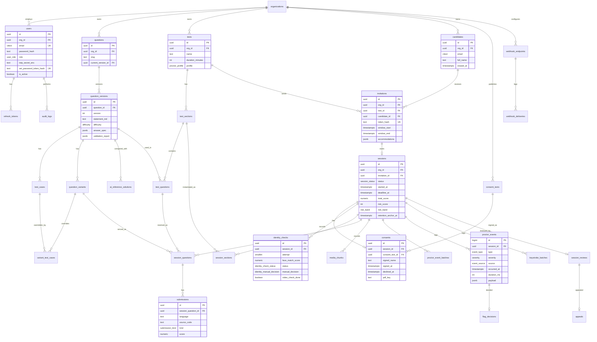

# Database design

PostgreSQL 16 holds 31 tables in six groups: identity, content, delivery, proctoring, review and integrations, with 20 enum types. Large media lives in object storage (Cloudflare R2 on staging, AWS S3 on pilot and production, behind one S3-compatible interface); the database stores only object keys. Prisma 7 is the ORM (ADR 0009); the SQL below is the reference the Prisma schema must match.

Updated 2026-10-01 by ARC-01 Phase B. The changes come from ADRs 0002 to 0007 (accepted by D-16) and decisions D-17 to D-23. /docs/adr/0008-schema-freeze-list.md lists every delta against the original design (commit 7f5c6b9). Updated 2026-10-02: the roles and grants comment follows D-35 (ADR 0006 section 7); no table, column or enum changed.

Updated 2026-10-06 for D-54, which accepted the ADR 0004 section 9 amendment, ADR 0013 and ADR 0015:
- **Schema deltas:** the enum values `session_status` ERASED, `appeal_status` CLOSED_ERASED and `identity_check_status` WAIVED; three `identity_checks` video-check columns with one foreign key and two CHECK constraints; one partial index on `audit_logs`; and `REVOKE DELETE, TRUNCATE ON sessions`. There are no new tables or enum types.
- **Data rules:** the retention tiers, R-9 and R-10, the amended erasure, and the identity-check waiver.
- **Comments:** `batch_seq`, `hmac_key_enc` and `device_info` follow ADR 0013.
- **Built status (2026-10-06).** None of these deltas is on main yet. The migrations are in open PRs #91 (ADR 0004 section 9: `session_status_erased`, `appeal_status_closed_erased`, `retention_marker_index_and_no_session_delete`) and #100 (ADR 0015: `identity_check_waived_enum`, `identity_check_waiver_columns`); the timestamps in their names change when they are rebased (FU-DB-168), so only the suffixes are cited here. Their SQL matches the DDL below.
- **Delta list.** ADR 0008 §11 (post-freeze deltas) is still to be written by the hub. Until then, ADR 0004 section 9 and ADR 0015 section 4 are the delta source.

## Entity-relationship diagram

The diagram shows the main relationships and a few key columns. The reference DDL below is authoritative.



## Table reference

| Group | Table | Purpose |
| --- | --- | --- |
| Identity | organizations | Tenant; retention days, settings, current consent document |
| Identity | users | Staff accounts, role, 2FA, recovery codes, invite and password-reset token |
| Identity | refresh\_tokens | Rotating refresh tokens grouped in families, revocation |
| Identity | audit\_logs | Append-only log of staff actions (IDs only in metadata) |
| Content | questions | Stable question identity |
| Content | question\_versions | Immutable versions with statement, limits, starter code, reference solution, answer key, validation report |
| Content | test\_cases | Test slots: sample or hidden, weight, default input and output |
| Content | question\_variants | Parameter sets producing equivalent variants |
| Content | variant\_test\_cases | Per-variant input and expected output for a test slot |
| Content | ai\_reference\_solutions | AI assistant answers kept for similarity checks only, never grading |
| Delivery | tests | Test templates and proctoring profile |
| Delivery | test\_sections | Timed sections inside a test, run in order |
| Delivery | test\_questions | Fixed question or random-pick rule per section |
| Delivery | candidates | Candidate identity (no password); erasure state |
| Delivery | invitations | One-time links, window, accommodations |
| Delivery | sessions | One test attempt; status, timing, pauses, scores, risk, retention anchor |
| Delivery | session\_sections | Server-enforced start and deadline of each section in a session |
| Delivery | session\_questions | The exact question, variant and test question served; answer and scoring state |
| Delivery | submissions | Every run and submit with results |
| Proctoring | consent\_texts | Versioned consent documents per organization, with Legal approval |
| Proctoring | consents | One signed or declined consent document per session, with signed PDF key |
| Proctoring | identity\_checks | One row per ID and selfie attempt: keys, face match score, status, manual review; or one WAIVED row with the recruiter's video check (ADR 0015) |
| Proctoring | media\_chunks | Recording chunk keys per stream and segment |
| Proctoring | proctor\_event\_batches | Accepted signed event batches, for replay protection |
| Proctoring | proctor\_events | Detected events with severity and evidence |
| Proctoring | keystroke\_batches | Signed editor event batches for replay |
| Review | session\_reviews | Reviewer, verdict, notes |
| Review | flag\_decisions | Confirm or dismiss per event |
| Review | appeals | Candidate appeal and its outcome |
| Integrations | webhook\_endpoints | Org-configured webhook URLs with encrypted secrets |
| Integrations | webhook\_deliveries | Webhook delivery attempts (no payload stored) |

## Reference DDL (PostgreSQL 16)

```sql
CREATE EXTENSION IF NOT EXISTS pgcrypto;
CREATE EXTENSION IF NOT EXISTS citext;

CREATE TYPE user_role        AS ENUM ('SUPER_ADMIN','RECRUITER','AUTHOR','REVIEWER');
CREATE TYPE difficulty       AS ENUM ('EASY','MEDIUM','HARD');
CREATE TYPE question_type    AS ENUM ('CODING','MCQ','SHORT_ANSWER');
CREATE TYPE proctor_profile  AS ENUM ('STANDARD','STRICT');  -- LOCKDOWN returns with the lockdown client (ADR 0007 §8)
CREATE TYPE session_status   AS ENUM ('INVITED','OPENED','CONSENTED','VERIFIED','IN_PROGRESS','PAUSED','SUBMITTED','GRADED','UNDER_REVIEW','COMPLETED','EXPIRED','APPEALED','DECLINED',
                                      'ERASED');  -- terminal, no exit (ADR 0004 §9.5; own migration, PR #91)
CREATE TYPE submission_kind  AS ENUM ('RUN','SUBMIT');
CREATE TYPE media_stream     AS ENUM ('SCREEN','WEBCAM','AUDIO','SIDE_CAMERA','ROOM_SCAN');
CREATE TYPE severity         AS ENUM ('LOW','MEDIUM','HIGH');
CREATE TYPE risk_band        AS ENUM ('LOW','MEDIUM','HIGH');
CREATE TYPE verdict          AS ENUM ('CLEAN','SUSPICIOUS','VIOLATION');
CREATE TYPE flag_decision    AS ENUM ('CONFIRMED','DISMISSED');
CREATE TYPE appeal_status    AS ENUM ('OPEN','UPHELD','OVERTURNED',
                                      'CLOSED_ERASED');  -- closed by erasure, no outcome (ADR 0004 §9.5; own migration, PR #91)
CREATE TYPE event_type AS ENUM (
  'FULLSCREEN_EXIT','TAB_SWITCH','FOCUS_LOST','PASTE_ATTEMPT','COPY_ATTEMPT','RIGHT_CLICK',
  'DEVTOOLS_OPEN','SCREEN_SHARE_STOPPED','MULTI_MONITOR','VIRTUAL_CAMERA',
  'NO_FACE','MULTIPLE_FACES','FACE_MISMATCH','GAZE_AWAY','PHONE_DETECTED','BOOK_DETECTED',
  'SPEECH_DETECTED','MULTIPLE_VOICES','DISCONNECTED','RECONNECTED',
  'PASTE_BURST','TYPING_ANOMALY','CODE_SIMILARITY','AI_LIKENESS','PROCTOR_PAUSE','PROCTOR_MESSAGE',
  'SIDE_CAMERA_DISCONNECTED','SIDE_CAMERA_RECONNECTED','DROP_ATTEMPT','CUT_ATTEMPT','SHORTCUT_BLOCKED',
  'EXTENSION_INTERFERENCE','FULLSCREEN_RESTORED','SCREEN_SHARE_RESUMED','PROCTOR_RESUME',
  'IDLE_THEN_COMPLETE','DETECTOR_UNAVAILABLE','IDENTITY_MANUAL_REVIEW','RESUME_OTP_FAILED');
CREATE TYPE pause_reason             AS ENUM ('FULLSCREEN_EXIT','SCREEN_SHARE_STOPPED','SIDE_CAMERA_LOST','PROCTOR');
CREATE TYPE client_kind              AS ENUM ('WEB');
CREATE TYPE event_source             AS ENUM ('CLIENT','SERVER');
CREATE TYPE identity_check_status    AS ENUM ('PENDING','PASSED','LOW_CONFIDENCE','MANUAL_REVIEW','REVIEWED',
                                              'WAIVED');  -- not a rejection (ADR 0015 §4; own migration, PR #100)
CREATE TYPE identity_review_reason   AS ENUM ('BELOW_THRESHOLD','NO_FACE','MULTIPLE_FACES','LIVENESS_NOT_CONFIRMED','MATCH_ERROR');
CREATE TYPE identity_manual_decision AS ENUM ('MATCH','NO_MATCH','INCONCLUSIVE');
CREATE TYPE question_scoring         AS ENUM ('AUTO','MANUAL_PENDING','MANUAL');

-- ---------- Identity ----------

CREATE TABLE organizations (
  id                       uuid PRIMARY KEY DEFAULT gen_random_uuid(),
  name                     text NOT NULL,
  retention_days           int  NOT NULL DEFAULT 90 CHECK (retention_days BETWEEN 7 AND 730),  -- main tier; face images capped at 90 (Data rules); 7..365 is an open owner question (ADR 0004 §9.10 Q5)
  settings                 jsonb NOT NULL DEFAULT '{}',  -- shape: OrgSettings in packages/shared
  current_consent_text_id  uuid,                          -- FK added after consent_texts
  created_at               timestamptz NOT NULL DEFAULT now()
);

CREATE TABLE users (
  id                       uuid PRIMARY KEY DEFAULT gen_random_uuid(),
  org_id                   uuid NOT NULL REFERENCES organizations(id),
  email                    citext NOT NULL UNIQUE,
  full_name                text NOT NULL,
  password_hash            text,                          -- NULL until an invited user sets a password
  role                     user_role NOT NULL,
  totp_secret_enc          text,
  totp_enabled             boolean NOT NULL DEFAULT false,
  recovery_code_hashes     text[] NOT NULL DEFAULT '{}',  -- SHA-256 hex of unused recovery codes
  set_password_token_hash  text UNIQUE,                   -- SHA-256 of the invite or reset token; cleared on use
  set_password_expires_at  timestamptz,
  failed_logins            int NOT NULL DEFAULT 0,
  locked_until             timestamptz,
  is_active                boolean NOT NULL DEFAULT true,
  created_at               timestamptz NOT NULL DEFAULT now(),
  updated_at               timestamptz NOT NULL DEFAULT now(),
  CHECK (password_hash IS NOT NULL OR set_password_token_hash IS NOT NULL)
);
CREATE INDEX ON users (org_id);

CREATE TABLE refresh_tokens (
  id           uuid PRIMARY KEY DEFAULT gen_random_uuid(),
  user_id      uuid NOT NULL REFERENCES users(id) ON DELETE CASCADE,
  family_id    uuid NOT NULL,
  token_hash   text NOT NULL UNIQUE,
  expires_at   timestamptz NOT NULL,
  revoked_at   timestamptz,
  replaced_by  uuid REFERENCES refresh_tokens(id),
  created_at   timestamptz NOT NULL DEFAULT now()
);
CREATE INDEX ON refresh_tokens (user_id);
CREATE INDEX ON refresh_tokens (family_id);

CREATE TABLE audit_logs (
  id           bigint GENERATED ALWAYS AS IDENTITY PRIMARY KEY,
  org_id       uuid NOT NULL REFERENCES organizations(id),
  actor_id     uuid REFERENCES users(id),
  action       text NOT NULL,
  entity_type  text NOT NULL,
  entity_id    text,
  ip           inet,
  metadata     jsonb NOT NULL DEFAULT '{}',   -- IDs and action names only (ADR 0001 C-3)
  created_at   timestamptz NOT NULL DEFAULT now()
);
CREATE INDEX ON audit_logs (org_id, created_at DESC);
-- Retention completion markers (ADR 0004 §9.2; PR #91). Only the three RetentionService actions are indexed.
CREATE INDEX audit_logs_retention_marker_idx ON audit_logs (action, entity_id)
  WHERE action IN ('RETENTION_FACE_DONE','RETENTION_MEDIA_DONE','RETENTION_RESULTS_DONE');

-- ---------- Content ----------

CREATE TABLE questions (
  id                  uuid PRIMARY KEY DEFAULT gen_random_uuid(),
  org_id              uuid NOT NULL REFERENCES organizations(id),
  slug                text NOT NULL,
  type                question_type NOT NULL DEFAULT 'CODING',
  tags                text[] NOT NULL DEFAULT '{}',
  current_version_id  uuid,
  is_archived         boolean NOT NULL DEFAULT false,
  created_by          uuid REFERENCES users(id),
  created_at          timestamptz NOT NULL DEFAULT now(),
  UNIQUE (org_id, slug)
);

CREATE TABLE question_versions (
  id                  uuid PRIMARY KEY DEFAULT gen_random_uuid(),
  question_id         uuid NOT NULL REFERENCES questions(id) ON DELETE CASCADE,
  version             int NOT NULL,
  title               text NOT NULL,
  statement_md        text NOT NULL,          -- may contain Mustache placeholders rendered per variant
  difficulty          difficulty NOT NULL,
  allowed_languages   text[] NOT NULL,
  limits              jsonb NOT NULL DEFAULT '{"cpu_ms":2000,"wall_ms":5000,"memory_kb":262144}',
  starter_code        jsonb NOT NULL DEFAULT '{}',  -- may contain Mustache placeholders
  reference_solution  jsonb NOT NULL DEFAULT '{}',  -- may contain Mustache placeholders
  answer_spec         jsonb,                  -- MCQ options and key, or SHORT_ANSWER accepted answers; never sent to candidates
  is_published        boolean NOT NULL DEFAULT false,
  validated_at        timestamptz,
  validation_report   jsonb,                  -- per-variant, per-test result of the last validation
  created_at          timestamptz NOT NULL DEFAULT now(),
  UNIQUE (question_id, version)
);
ALTER TABLE questions ADD CONSTRAINT fk_current_version
  FOREIGN KEY (current_version_id) REFERENCES question_versions(id);

CREATE TABLE test_cases (
  id                   uuid PRIMARY KEY DEFAULT gen_random_uuid(),
  question_version_id  uuid NOT NULL REFERENCES question_versions(id) ON DELETE CASCADE,
  input                text NOT NULL,         -- default input; a variant may override it
  expected_output      text NOT NULL,         -- default output; a variant may override it
  is_hidden            boolean NOT NULL DEFAULT true,
  weight               numeric(6,2) NOT NULL DEFAULT 1,
  position             int NOT NULL
);
CREATE INDEX ON test_cases (question_version_id);

CREATE TABLE question_variants (
  id                   uuid PRIMARY KEY DEFAULT gen_random_uuid(),
  question_version_id  uuid NOT NULL REFERENCES question_versions(id) ON DELETE CASCADE,
  params               jsonb NOT NULL,
  rendered_statement   text NOT NULL,
  is_active            boolean NOT NULL DEFAULT true
);
CREATE INDEX ON question_variants (question_version_id);

CREATE TABLE variant_test_cases (
  variant_id       uuid NOT NULL REFERENCES question_variants(id) ON DELETE CASCADE,
  test_case_id     uuid NOT NULL REFERENCES test_cases(id) ON DELETE CASCADE,
  input            text NOT NULL,
  expected_output  text NOT NULL,
  PRIMARY KEY (variant_id, test_case_id)
);
CREATE INDEX ON variant_test_cases (test_case_id);

CREATE TABLE ai_reference_solutions (
  id                  uuid PRIMARY KEY DEFAULT gen_random_uuid(),
  question_version_id uuid NOT NULL REFERENCES question_versions(id) ON DELETE CASCADE,
  variant_id          uuid REFERENCES question_variants(id) ON DELETE CASCADE,  -- NULL = base statement
  assistant           text NOT NULL,       -- product name, for example 'ChatGPT', 'Claude'
  model_label         text NOT NULL,       -- model or version label as the assistant shows it
  language            text NOT NULL,       -- python, javascript or java (D-20; list in packages/shared)
  solution_code       text NOT NULL,
  prompt_text         text,
  collected_at        timestamptz NOT NULL,
  collected_by        uuid NOT NULL REFERENCES users(id),
  superseded_at       timestamptz,
  created_at          timestamptz NOT NULL DEFAULT now()
);
CREATE INDEX ON ai_reference_solutions (question_version_id);

-- ---------- Delivery ----------

CREATE TABLE tests (
  id                uuid PRIMARY KEY DEFAULT gen_random_uuid(),
  org_id            uuid NOT NULL REFERENCES organizations(id),
  name              text NOT NULL,
  description       text,
  duration_minutes  int NOT NULL CHECK (duration_minutes BETWEEN 5 AND 480),
  profile           proctor_profile NOT NULL DEFAULT 'STANDARD',
  pass_score        numeric(6,2),
  settings          jsonb NOT NULL DEFAULT '{}',
  created_by        uuid REFERENCES users(id),
  created_at        timestamptz NOT NULL DEFAULT now(),
  UNIQUE (id, org_id)
);
CREATE INDEX ON tests (org_id);

CREATE TABLE test_sections (
  id               uuid PRIMARY KEY DEFAULT gen_random_uuid(),
  test_id          uuid NOT NULL REFERENCES tests(id) ON DELETE CASCADE,
  title            text NOT NULL,
  position         int NOT NULL,
  time_limit_min   int                      -- NULL = no own limit; sections run in position order
);
CREATE INDEX ON test_sections (test_id);

CREATE TABLE test_questions (
  id                   uuid PRIMARY KEY DEFAULT gen_random_uuid(),
  section_id           uuid NOT NULL REFERENCES test_sections(id) ON DELETE CASCADE,
  question_version_id  uuid REFERENCES question_versions(id),
  random_rule          jsonb,
  points               numeric(6,2) NOT NULL DEFAULT 100,
  position             int NOT NULL,
  CHECK (question_version_id IS NOT NULL OR random_rule IS NOT NULL)
);
CREATE INDEX ON test_questions (section_id);

CREATE TABLE candidates (
  id                    uuid PRIMARY KEY DEFAULT gen_random_uuid(),
  org_id                uuid NOT NULL REFERENCES organizations(id),
  email                 citext NOT NULL,
  full_name             text NOT NULL,
  external_ref          text,
  erasure_requested_at  timestamptz,       -- pending request; only sessions under review or appeal wait (ADR 0004 §9.5, C-06)
  erased_at             timestamptz,       -- set when the row is anonymised (erasure or R-10)
  created_at            timestamptz NOT NULL DEFAULT now(),
  UNIQUE (org_id, email),
  UNIQUE (id, org_id)
);

CREATE TABLE invitations (
  id              uuid PRIMARY KEY DEFAULT gen_random_uuid(),
  org_id          uuid NOT NULL REFERENCES organizations(id),
  test_id         uuid NOT NULL,
  candidate_id    uuid NOT NULL,
  token_hash      text NOT NULL UNIQUE,
  window_start    timestamptz NOT NULL,
  window_end      timestamptz NOT NULL,
  accommodations  jsonb NOT NULL DEFAULT '{}',  -- shape: accommodationsSchema in packages/shared (ADR 0015 §4, §5)
  sent_at         timestamptz,
  used_at         timestamptz,              -- set when the session starts (VERIFIED -> IN_PROGRESS)
  created_by      uuid REFERENCES users(id),
  created_at      timestamptz NOT NULL DEFAULT now(),
  CHECK (window_end > window_start),
  UNIQUE (id, org_id),
  FOREIGN KEY (test_id, org_id)      REFERENCES tests (id, org_id),
  FOREIGN KEY (candidate_id, org_id) REFERENCES candidates (id, org_id)
);
CREATE INDEX ON invitations (test_id);
CREATE INDEX ON invitations (candidate_id);

CREATE TABLE sessions (
  id                   uuid PRIMARY KEY DEFAULT gen_random_uuid(),
  org_id               uuid NOT NULL REFERENCES organizations(id),
  invitation_id        uuid NOT NULL UNIQUE,
  status               session_status NOT NULL DEFAULT 'INVITED',
  hmac_key_enc         text,                      -- set at VERIFIED -> IN_PROGRESS; nulled at ingest close and at erasure (ADR 0013)
  auth_epoch           int NOT NULL DEFAULT 0,    -- incremented on each OTP login and by the erasure fence; one active device
  device_info          jsonb NOT NULL DEFAULT '{}',  -- { systemCheck?, capabilities, recorder?, storageSweep? } (ADR 0013); erasure clears it
  client_kind          client_kind NOT NULL DEFAULT 'WEB',
  started_at           timestamptz,
  deadline_at          timestamptz,
  paused_ms            bigint NOT NULL DEFAULT 0, -- credited (proctor) pause time only
  pause_reasons        pause_reason[] NOT NULL DEFAULT '{}',
  proctor_paused_at    timestamptz,
  submitted_at         timestamptz,
  total_score          numeric(8,2),
  risk_score           int CHECK (risk_score BETWEEN 0 AND 100),
  risk_band            risk_band,
  last_heartbeat       timestamptz,
  retention_anchor_at  timestamptz,               -- NULL = hold for the main and results tiers; never for the face tier (Data rules)
  report_key           text,                      -- nulled at R-10 (1 year) or erasure, not at retention_days
  report_generated_at  timestamptz,
  created_at           timestamptz NOT NULL DEFAULT now(),
  FOREIGN KEY (invitation_id, org_id) REFERENCES invitations (id, org_id)
);
CREATE INDEX ON sessions (status);
CREATE INDEX ON sessions (org_id, status);
CREATE INDEX ON sessions (risk_band) WHERE status IN ('GRADED','UNDER_REVIEW');
CREATE INDEX ON sessions (retention_anchor_at) WHERE retention_anchor_at IS NOT NULL;

CREATE TABLE session_sections (
  session_id     uuid NOT NULL REFERENCES sessions(id) ON DELETE CASCADE,
  section_id     uuid NOT NULL REFERENCES test_sections(id),
  position       int  NOT NULL,
  time_limit_ms  bigint,                    -- after accommodations; NULL = shares the session time
  started_at     timestamptz,
  deadline_at    timestamptz,               -- never later than sessions.deadline_at
  ended_at       timestamptz,
  PRIMARY KEY (session_id, section_id),
  UNIQUE (session_id, position)
);

CREATE TABLE session_questions (
  id                   uuid PRIMARY KEY DEFAULT gen_random_uuid(),
  session_id           uuid NOT NULL REFERENCES sessions(id) ON DELETE CASCADE,
  test_question_id     uuid NOT NULL REFERENCES test_questions(id),
  question_version_id  uuid NOT NULL REFERENCES question_versions(id),
  variant_id           uuid REFERENCES question_variants(id),
  position             int NOT NULL,
  points               numeric(6,2) NOT NULL,
  score                numeric(6,2),
  scoring              question_scoring NOT NULL DEFAULT 'AUTO',
  scored_by            uuid REFERENCES users(id),
  scored_at            timestamptz,
  scoring_note         text,
  final_code           text,
  final_language       text,
  answer               jsonb,                -- MCQ option IDs or short-answer text
  CHECK ((scoring = 'MANUAL') = (scored_by IS NOT NULL AND scored_at IS NOT NULL))
);
CREATE INDEX ON session_questions (session_id);

CREATE TABLE submissions (
  id                   uuid PRIMARY KEY DEFAULT gen_random_uuid(),
  session_question_id  uuid NOT NULL REFERENCES session_questions(id) ON DELETE CASCADE,
  kind                 submission_kind NOT NULL,
  language             text NOT NULL,
  source_code          text NOT NULL,
  results              jsonb NOT NULL DEFAULT '[]',
  passed               int NOT NULL DEFAULT 0,
  total                int NOT NULL DEFAULT 0,
  score                numeric(6,2),
  created_at           timestamptz NOT NULL DEFAULT now()
);
CREATE INDEX ON submissions (session_question_id, created_at);

-- ---------- Proctoring ----------

CREATE TABLE consent_texts (
  id                 uuid PRIMARY KEY DEFAULT gen_random_uuid(),
  org_id             uuid NOT NULL REFERENCES organizations(id),
  version            text NOT NULL,
  body_md            text NOT NULL,           -- the consent document; a marked placeholder until Legal approves
  legal_approved_at  timestamptz,             -- NULL = placeholder; refused where Legal approval is required
  legal_approved_by  text,
  created_by         uuid REFERENCES users(id),
  created_at         timestamptz NOT NULL DEFAULT now(),
  UNIQUE (org_id, version)
);
ALTER TABLE organizations ADD CONSTRAINT fk_current_consent_text
  FOREIGN KEY (current_consent_text_id) REFERENCES consent_texts(id);

CREATE TABLE consents (
  id                uuid PRIMARY KEY DEFAULT gen_random_uuid(),
  session_id        uuid NOT NULL UNIQUE REFERENCES sessions(id) ON DELETE CASCADE,
  consent_text_id   uuid NOT NULL REFERENCES consent_texts(id),
  signed_name       text,                     -- full legal name typed by the candidate
  signed_at         timestamptz,              -- server time of signing
  declined_at       timestamptz,              -- server time of declining
  age_confirmed_at  timestamptz,              -- server time of the 18+ confirmation (C-30, D-55); set at sign, NULL on decline and on rows before C-30
  ip                inet,
  user_agent        text,
  pdf_key           text,                     -- signed PDF in object storage; kept through erasure, deleted with the row at R-9 (3 years)
  pdf_generated_at  timestamptz,
  copy_emailed_at   timestamptz,
  CHECK ((signed_at IS NULL) <> (declined_at IS NULL)),
  CHECK (signed_at IS NULL OR signed_name IS NOT NULL),
  CONSTRAINT consents_age_confirmed_check CHECK (signed_at IS NULL OR age_confirmed_at IS NOT NULL) NOT VALID  -- enforced for new and updated rows; rows signed before C-30 are not touched (ADR 0008 section 11)
);

CREATE TABLE identity_checks (
  id               uuid PRIMARY KEY DEFAULT gen_random_uuid(),
  session_id       uuid NOT NULL REFERENCES sessions(id) ON DELETE CASCADE,
  attempt          smallint NOT NULL DEFAULT 1 CHECK (attempt BETWEEN 1 AND 2),
  id_image_key     text,
  selfie_key       text,
  face_match_score numeric(5,4),
  model_id         text,                      -- face model and file hash that produced the score
  threshold        numeric(5,4),              -- threshold in force when scored
  liveness_passed  boolean,                   -- client-reported
  status           identity_check_status NOT NULL DEFAULT 'PENDING',
  review_reason    identity_review_reason,
  manual_decision  identity_manual_decision,
  reviewed_by      uuid REFERENCES users(id),
  reviewed_at      timestamptz,
  review_note      text,
  video_check_done boolean,                   -- recruiter's video ID check on a WAIVED row; NULL = not recorded (ADR 0015, PR #100)
  video_check_by   uuid REFERENCES users(id), -- NO ACTION; not org-composite, the service checks the org (as reviewed_by)
  video_check_at   timestamptz,
  created_at       timestamptz NOT NULL DEFAULT now(),
  UNIQUE (session_id, attempt),
  CHECK ((status = 'REVIEWED') = (manual_decision IS NOT NULL AND reviewed_by IS NOT NULL AND reviewed_at IS NOT NULL)),
  -- A WAIVED row is attempt 1 and carries no identity data (ADR 0015 §4).
  CONSTRAINT identity_checks_waived_check CHECK (status <> 'WAIVED' OR (
    attempt = 1 AND id_image_key IS NULL AND selfie_key IS NULL AND face_match_score IS NULL
    AND model_id IS NULL AND threshold IS NULL AND liveness_passed IS NULL AND review_reason IS NULL
    AND manual_decision IS NULL AND reviewed_by IS NULL AND reviewed_at IS NULL AND review_note IS NULL)),
  -- The video check is all or nothing, and only a WAIVED row carries one.
  CONSTRAINT identity_checks_video_check_check CHECK (
    (video_check_done IS NULL) = (video_check_by IS NULL)
    AND (video_check_done IS NULL) = (video_check_at IS NULL)
    AND (video_check_done IS NULL OR status = 'WAIVED'))
);

CREATE TABLE media_chunks (
  id            bigint GENERATED ALWAYS AS IDENTITY PRIMARY KEY,
  session_id    uuid NOT NULL REFERENCES sessions(id) ON DELETE CASCADE,
  stream        media_stream NOT NULL,
  segment       int NOT NULL DEFAULT 0,      -- new segment on each recorder restart; lowest seq holds the WebM header
  seq           int NOT NULL,                -- monotonic per stream across segments
  object_key    text,                        -- NULL after retention or erasure
  started_at    timestamptz NOT NULL,
  duration_ms   int NOT NULL,
  size_bytes    bigint,
  uploaded_at   timestamptz,
  deleted_at    timestamptz,
  UNIQUE (session_id, stream, seq)
);

CREATE TABLE proctor_event_batches (
  session_id   uuid NOT NULL REFERENCES sessions(id) ON DELETE CASCADE,
  seq          int  NOT NULL,
  signature    bytea NOT NULL,               -- HMAC-SHA256 as received
  event_count  smallint NOT NULL,
  received_at  timestamptz NOT NULL DEFAULT now(),
  PRIMARY KEY (session_id, seq)
);

CREATE TABLE proctor_events (
  id            bigint GENERATED ALWAYS AS IDENTITY PRIMARY KEY,
  session_id    uuid NOT NULL REFERENCES sessions(id) ON DELETE CASCADE,
  batch_seq     int,                         -- NULL for SERVER events and unsigned system-check findings (ADR 0013)
  type          event_type NOT NULL,
  severity      severity NOT NULL,           -- assigned by the server from the type
  source        event_source NOT NULL DEFAULT 'CLIENT',
  occurred_at   timestamptz NOT NULL,
  duration_ms   int,
  confidence    numeric(5,4),
  payload       jsonb NOT NULL DEFAULT '{}',
  evidence_key  text,
  created_at    timestamptz NOT NULL DEFAULT now()
);
CREATE INDEX ON proctor_events (session_id, occurred_at);
CREATE INDEX ON proctor_events (session_id, severity);

CREATE TABLE keystroke_batches (
  id            bigint GENERATED ALWAYS AS IDENTITY PRIMARY KEY,
  session_id    uuid NOT NULL REFERENCES sessions(id) ON DELETE CASCADE,
  session_question_id uuid REFERENCES session_questions(id),
  seq           int NOT NULL,
  signature     bytea NOT NULL,              -- HMAC-SHA256 as received
  started_at    timestamptz NOT NULL,
  events        jsonb NOT NULL,              -- plain JSON; compression is HTTP-level only
  UNIQUE (session_id, seq)
);

-- ---------- Review ----------

CREATE TABLE session_reviews (
  id           uuid PRIMARY KEY DEFAULT gen_random_uuid(),
  session_id   uuid NOT NULL UNIQUE REFERENCES sessions(id) ON DELETE CASCADE,
  reviewer_id  uuid NOT NULL REFERENCES users(id),
  verdict      verdict,
  notes        text,
  started_at   timestamptz NOT NULL DEFAULT now(),
  completed_at timestamptz
);
CREATE INDEX ON session_reviews (reviewer_id);

CREATE TABLE flag_decisions (
  id           uuid PRIMARY KEY DEFAULT gen_random_uuid(),
  event_id     bigint NOT NULL UNIQUE REFERENCES proctor_events(id) ON DELETE CASCADE,
  reviewer_id  uuid NOT NULL REFERENCES users(id),
  decision     flag_decision NOT NULL,
  note         text,
  decided_at   timestamptz NOT NULL DEFAULT now()
);

CREATE TABLE appeals (
  id                 uuid PRIMARY KEY DEFAULT gen_random_uuid(),
  session_review_id  uuid NOT NULL UNIQUE REFERENCES session_reviews(id),
  reason             text NOT NULL,
  status             appeal_status NOT NULL DEFAULT 'OPEN',
  new_verdict        verdict,                 -- the verdict after an overturned appeal
  assigned_to        uuid REFERENCES users(id),
  resolution_note    text,
  created_at         timestamptz NOT NULL DEFAULT now(),
  resolved_at        timestamptz,
  CHECK ((status = 'OVERTURNED') = (new_verdict IS NOT NULL))
);
CREATE INDEX ON appeals (assigned_to);

-- ---------- Integrations ----------

CREATE TABLE webhook_endpoints (
  id          uuid PRIMARY KEY DEFAULT gen_random_uuid(),
  org_id      uuid NOT NULL REFERENCES organizations(id),
  url         text NOT NULL,
  events      text[] NOT NULL,               -- 'session.completed', 'session.reviewed'
  secret_enc  text NOT NULL,                 -- AES-256-GCM, like totp_secret_enc
  is_active   boolean NOT NULL DEFAULT true,
  created_by  uuid REFERENCES users(id),
  created_at  timestamptz NOT NULL DEFAULT now()
);

CREATE TABLE webhook_deliveries (
  id           bigint GENERATED ALWAYS AS IDENTITY PRIMARY KEY,
  endpoint_id  uuid NOT NULL REFERENCES webhook_endpoints(id) ON DELETE CASCADE,
  event        text NOT NULL,
  session_id   uuid REFERENCES sessions(id) ON DELETE SET NULL,
  attempt      int NOT NULL,
  status_code  int,
  error        text,
  created_at   timestamptz NOT NULL DEFAULT now()
);
CREATE INDEX ON webhook_deliveries (endpoint_id, created_at DESC);

-- ---------- Roles and grants (ADR 0006 section 7, D-35) ----------
-- The audit_append_only migration creates app_user if it does not exist (LOGIN, no password;
-- NOSUPERUSER NOCREATEDB NOCREATEROLE NOREPLICATION NOBYPASSRLS), then grants. No migration holds a
-- password: it is set outside migrations, per environment (ADR 0006 section 7.4).
-- Exact SQL: ADR 0006 section 7.2. In summary:
-- GRANT USAGE ON SCHEMA public TO app_user;
-- GRANT SELECT, INSERT, UPDATE, DELETE ON ALL TABLES IN SCHEMA public TO app_user;
-- GRANT USAGE, SELECT ON ALL SEQUENCES IN SCHEMA public TO app_user;
-- ALTER DEFAULT PRIVILEGES IN SCHEMA public GRANT SELECT, INSERT, UPDATE, DELETE ON TABLES TO app_user;
-- ALTER DEFAULT PRIVILEGES IN SCHEMA public GRANT USAGE, SELECT ON SEQUENCES TO app_user;
-- REVOKE UPDATE, DELETE, TRUNCATE ON audit_logs FROM app_user;
-- REVOKE ALL ON _prisma_migrations FROM app_user;
-- REVOKE DELETE, TRUNCATE ON sessions FROM app_user;   -- ADR 0004 §9.3, PR #91: sessions rows are never deleted
-- A later migration that repeats GRANT ... ON ALL TABLES re-grants DELETE on sessions, so the DB test asserts
-- has_table_privilege('app_user', 'sessions', 'DELETE') and 'TRUNCATE' are both false.
```

## Data rules

**Org scoping (ADR 0006).**
- These tables carry `org_id`: users, questions, tests, candidates, invitations, sessions, audit_logs, consent_texts and webhook_endpoints.
- Every other table is scoped through a declared parent path to one of them, for example `proctor_events` through `sessions`.
- Every API query filters by the caller's `org_id`.
- Every foreign ID in a create or update payload is loaded through the org-scoped client first; a miss returns 404.
- Composite foreign keys keep invitations and sessions inside one organization.
- Staff references such as `identity_checks.reviewed_by` and `video_check_by` are plain foreign keys to `users`. The service checks that the user belongs to the session's organization (ADR 0004 §1, ADR 0015 §4).

**Immutability.**
- `question_versions` rows are immutable once `is_published` is true; edits create a new version.
- `consent_texts` rows are immutable once a consent references them.
- `ai_reference_solutions` rows are append-only; a refresh inserts rows and sets `superseded_at`.

**Session state.** Only SessionStateService writes `sessions.status`, following the transition map in fsd.md section 3 (ADR 0002).
- ERASED is terminal and has no exit transition, so an ERASED session can never be appealed (ADR 0004 §9.5). The ADR 0002 amendment that adds it is still owed (ADR 0004 §9.9 row 20).
- `sessions` rows are never deleted by any retention, results or erasure job. `consents.session_id` is `ON DELETE CASCADE`, so deleting a session would delete the consent proof that R-9 keeps. The database enforces it: `app_user` has no DELETE or TRUNCATE on `sessions` (ADR 0004 §9.3). Test teardown and seed cleanup delete sessions as the migration owner.
- **Session-job writers (ADR 0004 §9.5 step 4).** SERVICE writers (grading and its reconciler, analysis, the `face-recheck` outcome, `server-event`, report generation, webhooks) take the `sessions` row lock first through `SessionJobProcessor.withLiveSession`, which calls `SessionStateService.guardLive` (its only other direct caller is the STAFF `proctorResume` method, ADR 0013 5.7). On ERASED they write nothing, objects included.
  - Erasure-compatible jobs use `withAnySession`, which takes the same lock but does not stop on ERASED. They are ingest close, the sweeps, `evidence-expire`, the erasure re-run and the consent-PDF job.
  - After `guardLive`, transactions stay short and make no external call, apart from one bounded object write (NFR-01).

**Lock order (ADR 0004 §9.4, ADR 0015 §6).** Locks are always taken in this order:
1. the per-candidate advisory lock `pg_advisory_xact_lock(hashtext('codeproctor/candidate-erasure'), hashtext(candidate_id::text))`, taken only by R-10 and erasure, before any row lock;
2. the `sessions` row lock (`guardLive`, or `lockForAccommodation`, which locks a session in any status);
3. `invitations`.

Row creation (invite inserts `invitations` before `sessions`) is exempt.

**Consent (D-17).**
- Each session has at most one `consents` row: a signed or a declined consent document.
- The server sets `signed_at` or `declined_at` from its own clock.
- Nothing touches camera, microphone or screen, and nothing uploads, before `signed_at` is set.
- Pilot and production refuse a `consent_texts` row whose `legal_approved_at` is NULL.

**Biometrics (ADR 0004, C-18).** Face embeddings are never stored, in the database, Redis, job payloads or on disk. Only the score, `model_id` and `threshold` are kept on `identity_checks`.

**Identity-check waiver (ADR 0015, C-19, C-25).**
- **Two settings.** "No identity check" is `invitations.accommodations.identityCheckWaiver` = `{ reasonCode, reasonNote? }`, with `reasonCode` one of `REFUSED_BIOMETRIC_PROCESSING`, `CANNOT_COMPLETE_ID_CHECK` or `OTHER`. `reasonNote` (1..500 characters) is allowed and required only for `OTHER`. "Face detectors off" is `FACE` in `accommodations.disabledDetectors`. Both are jsonb keys, with no DDL.
- **The WAIVED row is authoritative.** The waiver is one `identity_checks` row with `status = 'WAIVED'` and `attempt = 1`, carrying no images, match result, liveness or review (CHECK `identity_checks_waived_check`). The gate, presign refusals, review panel, reports and the candidate projection read the row, not the jsonb key. The two are written in one transaction.
  - Only the invite and accommodations routes write WAIVED, never a SERVICE-scope writer.
  - Removal deletes only `status = 'WAIVED'` rows.
- **Invariant.** The waiver key is present exactly when a WAIVED row exists. It holds only for sessions that are neither ERASED nor past R-10.
- **Video check.** `video_check_done`, `video_check_by` and `video_check_at` are all set or all NULL, and only on a WAIVED row (CHECK `identity_checks_video_check_check`). `video_check_by` comes only from the authenticated user.
- **Writers of `accommodations`** are the PATCH, redact-note, erasure, R-10 and R-4. Each takes `lockForAccommodation` on the session first. It then writes with a compare-and-set on the raw value read in the same transaction: `updateMany({ where: { id, accommodations: { equals: <raw> } } })`. Zero rows changed means an unlisted writer exists, which raises an alert.
- **What the jobs do.**
  - R-4 removes `reasonNote` and sets `reasonNoteRemoved: true`.
  - Erasure and R-10 delete the `identity_checks` rows. They replace `identityCheckWaiver` with the server-only `identityCheckWaived: true`, which keeps no reason.
  - Whether they also clear the rest of the object (`notes`) is open owner question OQ-12.
- **Who reads it.** The reason and `notes` are never in the CANDIDATE read allowlist, a staff DTO other than the audited accommodations GET, a report, a webhook or a log.

**Retention job (ADR 0004 §5 and §9, C-04, C-26, C-27, C-35).**
- *Anchor (R-1).* `retention_anchor_at` is set when a session becomes COMPLETED, EXPIRED or DECLINED, and by the erasure fence.
  - COMPLETED: the latest of `submitted_at`, the verdict time and, for a VIOLATION verdict, verdict time + 7 days.
  - EXPIRED or DECLINED: the time of that transition.
  - APPEALED sets it back to NULL; resolving the appeal sets it to the appeal's `resolved_at`.
  - ERASED: the erasure fence keeps an existing anchor and otherwise sets the fence time.
- *Hold (R-2).* A NULL anchor means hold: the main and results tiers never select the session. Every UNDER_REVIEW or APPEALED session, and every session with an OPEN appeal, is held. DECLINED and ERASED sessions are not held. The job selects by anchor, never by status. A CLOSED_ERASED appeal counts as closed.
- *Tiers.* Each tier selects sessions, not keys: those eligible on its clock with no completion marker for the tier. It lists the tier's prefixes with ListObjectsV2 (every page), deletes with DeleteObjects, and then, in one transaction, nulls the columns and writes the marker. Keys follow ADR 0013 5.7.

  | Tier | Eligible when | Deletes objects | Then, in one transaction |
  | --- | --- | --- | --- |
  | Face | face clock + LEAST(`retention_days`, 90 days); no hold applies | `identity/` and `evidence/sealed/` under the session prefix | Null `identity_checks.id_image_key` and `selfie_key`, and `proctor_events.evidence_key` where `type = 'FACE_MISMATCH'`; marker `RETENTION_FACE_DONE` |
  | Main (R-3, R-4) | anchor + `retention_days` | The whole session prefix except `reports/` | Null `media_chunks.object_key` (all streams, ROOM_SCAN included) and set `deleted_at`; null the remaining `identity_checks` keys and `proctor_events.evidence_key`; delete the `keystroke_batches` rows; remove the waiver `reasonNote` (ADR 0015); marker `RETENTION_MEDIA_DONE` |
  | Results (R-10) | anchor + 1 year | The whole session prefix, `reports/` included; it does not wait for the earlier markers | Null every key the earlier tiers null, plus `sessions.report_key`; the R-10 data steps below; marker `RETENTION_RESULTS_DONE` |

- *Face clock.* The face clock is `COALESCE(sessions.submitted_at, latest capture, terminal transition time, sessions.created_at)`. Neither a review hold nor a longer `retention_days` extends the face tier.
  - Latest capture is the newest `identity_checks.created_at`, or the newest FACE_MISMATCH `occurred_at`.
  - Terminal transition time is `retention_anchor_at` for a session that was never submitted. `updated_at` is never used.
  - `created_at` is the last fallback, for an orphan identity object with no row.
- *Markers.* The marker is the per-session audit row (`entity_type = 'session'`, `entity_id = sessions.id::text`) with action `RETENTION_FACE_DONE`, `RETENTION_MEDIA_DONE` or `RETENTION_RESULTS_DONE`. It replaces the one audit row per session of R-4.
  - It is written only after verified deletion: every page listed, every DeleteObjects call returned no `Errors`, and a fresh listing is empty. Otherwise the tier writes no marker and changes no column, and it retries the next day. After 3 failed days it raises one deduplicated alert.
  - Only RetentionService writes these actions (`RETENTION_MARKER_ACTIONS`, enforced by a lint and a test). `ERASURE_EMAIL_SENT`, `ERASURE_EMAIL_FAILED` and `ERASURE_COMPLETED` are reserved to the email worker and the erasure service in the same way.
  - The "eligible and no marker" check is a `NOT EXISTS` served by `audit_logs_retention_marker_idx`.
  - "Results purged" is derived from the `RETENTION_RESULTS_DONE` marker, never from a NULL verdict or from a session with no `submissions` rows.
- *Object versioning.* Before each run, and at startup, RetentionService checks the bucket. It fails closed unless versioning was never enabled, or a whole-bucket lifecycle rule expires noncurrent versions within 1 day. Staging on R2 may skip the check by configuration (ADR 0004 §9.2).
- *Results (R-10, C-26).* At anchor + 1 year, the job runs the erasure data steps for the session, except the consent record:
  - delete the `media_chunks`, `identity_checks`, `proctor_events` (with their `flag_decisions`), `proctor_event_batches`, `keystroke_batches` and `submissions` rows;
  - blank `session_questions.final_code` and `answer`;
  - null `session_reviews.notes` and `session_questions.scoring_note`;
  - clear `sessions.device_info`;
  - reduce the waiver (ADR 0015);
  - null `sessions.total_score`, `risk_score` and `risk_band`, `session_questions.score` and `session_reviews.verdict`, and delete the `appeals` row (option (a) of ADR 0004 §9.4, subject to ADR 0004 §9.10 Q4, the multi-session case, which is still open).
  - The `sessions` row (status, timestamps, invitation) and the audit rows remain. Statistics are counts. Score and pass-rate statistics use only sessions still inside their year.
  - Appeal creation refuses a review whose verdict is NULL or whose 7-day window, counted from `session_reviews.completed_at`, has passed.
  - Once no session of the candidate still has results, R-10 anonymises the `candidates` row as erasure does, and sends no email. It leaves a candidate with a pending erasure request to the erasure run.
  - The daily job alerts on a session that is still non-terminal 30 days after `window_end`, and on one that has been UNDER_REVIEW or APPEALED for more than 60 days.
- *Consent records (R-9, C-04, C-17).* A signed consent record is eligible at `signed_at + interval '3 years'`. The record is version, signed name, timestamp, IP, user agent and the signed PDF.
  - The job deletes the objects under `orgs/{orgId}/consents/{sessionId}/`. It deletes the `consents` row only after the same verified deletion as the tiers; otherwise it keeps the row and retries the next day. It writes one audit row with IDs only.
  - It skips a record whose own session is UNDER_REVIEW or APPEALED, or has an OPEN appeal.
  - Declined consents use 3 years from `declined_at`. This is provisional, pending open owner question OQ-11.
  - The period is a system constant, not an org setting.
  - There is no legal hold yet (open owner question OQ-10).
- *Kept with no clock (stated exactly, not as "nothing else").* The `sessions` row and the audit rows (IDs only); the structural rows `invitations`, `session_reviews` (reviewer and timestamps), `session_questions` and `webhook_deliveries`; the anonymised `candidates` row; and `invitations.accommodations`: its setting flags, and its free-text `notes` and the waiver reduction, which stay open under OQ-12 (ADR 0004 section 9.10).

**Erasure on request (ADR 0004 R-6 and §9.5, C-06, C-17).** Erasure completes within 30 days of the request, or within 30 days after an open review or appeal closes, whichever is later. The candidate is told about any delay.
- **Request.** A SUPER_ADMIN request sets `candidates.erasure_requested_at`. New invitations for that candidate are refused with 409 `CANDIDATE_ERASURE_PENDING`.
- **Hold.** A session that is UNDER_REVIEW or APPEALED, or has an OPEN appeal, waits, and the candidate is told (`erasure-delayed`). The candidate's other sessions are erased at once. When the last review or appeal closes, the hold-close job erases each formerly held session. The hold is the org setting `settings.erasure.holdWhileReviewOrAppealOpen` (default true).
  - With the setting false, held sessions are fenced too, and the review ends. An open appeal moves to CLOSED_ERASED (audited).
- **Fence.** Erasure fences every non-held session of the candidate, terminal ones included, through `SessionStateService` and `closeIngest`:
  - it bumps `sessions.auth_epoch`, which invalidates the candidate token;
  - it moves the session to ERASED;
  - it closes ingest with no grace;
  - it keeps or sets the anchor.
  - After the fence, no drafts, presigns, submissions, events or appeals are accepted.
- **Objects.** Erasure deletes and verifies the whole session prefix, `reports/` included, and nulls the keys, `sessions.report_key` included. It never writes `RETENTION_*_DONE` markers. It does not delete the consent prefix: R-9 does.
- **Rows.**
  - Delete the candidate's `media_chunks`, `identity_checks`, `proctor_events` (with their `flag_decisions`), `proctor_event_batches` and `keystroke_batches`.
  - Blank `submissions.source_code` and `results`, and `session_questions.final_code` and `answer`.
  - Null `session_reviews.notes`, `session_questions.scoring_note` and `appeals.resolution_note`, and set `appeals.reason` to 'Erased' (the column is NOT NULL).
  - Clear `sessions.device_info`.
  - Reduce the waiver in `invitations.accommodations` (ADR 0015; under `lockForAccommodation` in the org job scope).
  - Leave the `consents` row and PDF as they are until R-9.
- **Re-run.** At the fence time + 60 s + `STORAGE_SWEEP_MARGIN_SECONDS`, a delayed job repeats the prefix delete and the idempotent row steps for the candidate's ERASED sessions only. It verifies that no object or erased row remains, and retries daily with the 3-day alert. `ERASURE_COMPLETED` (with the request id `{candidateId}_{epoch seconds of erasure_requested_at}` in its metadata) is written only when every session of the candidate is ERASED and verified.
- **Email.** After `ERASURE_COMPLETED`, the `erasure-completed` email is sent unless an `ERASURE_EMAIL_SENT` row with this request id exists. The worker writes `ERASURE_EMAIL_SENT` or `ERASURE_EMAIL_FAILED`. The payload carries the candidate id only.
- **Anonymise.** The `candidates` row is anonymised in place (email `erased+<id>@invalid`, full_name 'Erased', external_ref NULL, `erased_at` set) at the first of:
  - `ERASURE_EMAIL_SENT`;
  - a recorded manual notice (audited);
  - day 28 of the C-06 deadline.

  A day-25 alert asks a person to tell the candidate if neither exists.
- **What remains.** Scores, risk scores and verdicts remain until R-10 deletes them (anchor + 1 year, counted from the erasure fence for an erased session), pseudonymised while the consent proof exists, and anonymised once R-9 deletes it (3 years).
- **Access after erasure.** From the first fence, everyone except the email worker and SUPER_ADMIN sees the candidate as "Erased", through one read projection, `CandidateProjection.forViewer()`. Only SUPER_ADMIN reads an erased candidate's consent record and PDF, and each read is audited.
  - `signed_name`, `ip`, `user_agent` and the PDF never reach review, recruiter, export, report or webhook paths.
  - System readers of `consents` go through `ConsentRetentionRepository` with a fixed `select`. The R-9 job and the R-7 re-application read ids and keys only. The consent-PDF renderer reads its own session's record.

**Backups (R-7).**
- Backups are kept 14 days.
- After a restore, erasures made after the backup date are re-applied from the erasure list kept outside the database backup. Re-application runs the full fence (epoch bump, ERASED, CLOSED_ERASED) and keeps the consent proof (C-17).
  - The list records, for each request, whether the candidate was notified and anonymised. A restore wipes the `ERASURE_*` audit rows, so re-application reads the list, not the database.
  - Waiver-note redactions (ADR 0015) are recorded by invitation id on the same list and re-applied in the same run.
- R-4, R-9, R-10 and the face tier are anchored and idempotent. Restored rows without a marker are found and deleted on the next daily run.

**Logging.** Object keys, tokens, OTPs, HMAC keys and signatures are never logged.

**Growth.** `proctor_events` and `keystroke_batches` grow fastest; partition them by month when they pass roughly 10 million rows.
